## SignalP-6.0 - Results
### Summary of 313 predicted sequences from Other
Predictions list. Use the instruction page for more detailed description of the output page.

Download:

[JSON Summary](output.json)

[Prediction summary](prediction_results.txt)

[Processed entries fasta](processed_entries.fasta)

[Processed entries gff3](output.gff3)

### Predicted Proteins
#### tournament_wt_1

**Prediction:** Other

| Protein type   |   Other |   Signal Peptide (Sec/SPI) |   Lipoprotein signal peptide (Sec/SPII) |   TAT signal peptide (Tat/SPI) |   TAT Lipoprotein signal peptide (Tat/SPII) |   Pilin-like signal peptide (Sec/SPIII) |
|----------------|---------|----------------------------|-----------------------------------------|--------------------------------|---------------------------------------------|-----------------------------------------|
| Likelihood     |  0.9988 |                     0.0012 |                                       0 |                              0 |                                           0 |                                       0 |
**Download: ** [PNG](output_tournament_wt_1_plot.png) / [EPS](output_tournament_wt_1_plot.eps) /  [Tabular](output_tournament_wt_1_plot.txt)

  

 ***

#### tournament_wt_2

**Prediction:** Other

| Protein type   |   Other |   Signal Peptide (Sec/SPI) |   Lipoprotein signal peptide (Sec/SPII) |   TAT signal peptide (Tat/SPI) |   TAT Lipoprotein signal peptide (Tat/SPII) |   Pilin-like signal peptide (Sec/SPIII) |
|----------------|---------|----------------------------|-----------------------------------------|--------------------------------|---------------------------------------------|-----------------------------------------|
| Likelihood     |  0.9984 |                     0.0016 |                                       0 |                              0 |                                           0 |                                       0 |
**Download: ** [PNG](output_tournament_wt_2_plot.png) / [EPS](output_tournament_wt_2_plot.eps) /  [Tabular](output_tournament_wt_2_plot.txt)

  

 ***

#### tournament_wt_3

**Prediction:** Other

| Protein type   |   Other |   Signal Peptide (Sec/SPI) |   Lipoprotein signal peptide (Sec/SPII) |   TAT signal peptide (Tat/SPI) |   TAT Lipoprotein signal peptide (Tat/SPII) |   Pilin-like signal peptide (Sec/SPIII) |
|----------------|---------|----------------------------|-----------------------------------------|--------------------------------|---------------------------------------------|-----------------------------------------|
| Likelihood     |       1 |                          0 |                                       0 |                              0 |                                           0 |                                       0 |
**Download: ** [PNG](output_tournament_wt_3_plot.png) / [EPS](output_tournament_wt_3_plot.eps) /  [Tabular](output_tournament_wt_3_plot.txt)

  

 ***

#### tournament_wt_4

**Prediction:** Other

| Protein type   |   Other |   Signal Peptide (Sec/SPI) |   Lipoprotein signal peptide (Sec/SPII) |   TAT signal peptide (Tat/SPI) |   TAT Lipoprotein signal peptide (Tat/SPII) |   Pilin-like signal peptide (Sec/SPIII) |
|----------------|---------|----------------------------|-----------------------------------------|--------------------------------|---------------------------------------------|-----------------------------------------|
| Likelihood     |       1 |                          0 |                                       0 |                              0 |                                           0 |                                       0 |
**Download: ** [PNG](output_tournament_wt_4_plot.png) / [EPS](output_tournament_wt_4_plot.eps) /  [Tabular](output_tournament_wt_4_plot.txt)

  

 ***

#### tournament_wt_5

**Prediction:** Other

| Protein type   |   Other |   Signal Peptide (Sec/SPI) |   Lipoprotein signal peptide (Sec/SPII) |   TAT signal peptide (Tat/SPI) |   TAT Lipoprotein signal peptide (Tat/SPII) |   Pilin-like signal peptide (Sec/SPIII) |
|----------------|---------|----------------------------|-----------------------------------------|--------------------------------|---------------------------------------------|-----------------------------------------|
| Likelihood     |  0.9997 |                     0.0003 |                                       0 |                              0 |                                           0 |                                       0 |
**Download: ** [PNG](output_tournament_wt_5_plot.png) / [EPS](output_tournament_wt_5_plot.eps) /  [Tabular](output_tournament_wt_5_plot.txt)

  

 ***

#### tournament_wt_6

**Prediction:** Other

| Protein type   |   Other |   Signal Peptide (Sec/SPI) |   Lipoprotein signal peptide (Sec/SPII) |   TAT signal peptide (Tat/SPI) |   TAT Lipoprotein signal peptide (Tat/SPII) |   Pilin-like signal peptide (Sec/SPIII) |
|----------------|---------|----------------------------|-----------------------------------------|--------------------------------|---------------------------------------------|-----------------------------------------|
| Likelihood     |  0.9999 |                     0.0001 |                                       0 |                              0 |                                           0 |                                       0 |
**Download: ** [PNG](output_tournament_wt_6_plot.png) / [EPS](output_tournament_wt_6_plot.eps) /  [Tabular](output_tournament_wt_6_plot.txt)

  

 ***

#### tournament_wt_7

**Prediction:** Other

| Protein type   |   Other |   Signal Peptide (Sec/SPI) |   Lipoprotein signal peptide (Sec/SPII) |   TAT signal peptide (Tat/SPI) |   TAT Lipoprotein signal peptide (Tat/SPII) |   Pilin-like signal peptide (Sec/SPIII) |
|----------------|---------|----------------------------|-----------------------------------------|--------------------------------|---------------------------------------------|-----------------------------------------|
| Likelihood     |  1.0001 |                          0 |                                       0 |                              0 |                                           0 |                                       0 |
**Download: ** [PNG](output_tournament_wt_7_plot.png) / [EPS](output_tournament_wt_7_plot.eps) /  [Tabular](output_tournament_wt_7_plot.txt)

  

 ***

#### tournament_wt_8

**Prediction:** Other

| Protein type   |   Other |   Signal Peptide (Sec/SPI) |   Lipoprotein signal peptide (Sec/SPII) |   TAT signal peptide (Tat/SPI) |   TAT Lipoprotein signal peptide (Tat/SPII) |   Pilin-like signal peptide (Sec/SPIII) |
|----------------|---------|----------------------------|-----------------------------------------|--------------------------------|---------------------------------------------|-----------------------------------------|
| Likelihood     |  0.9998 |                     0.0002 |                                       0 |                              0 |                                           0 |                                       0 |
**Download: ** [PNG](output_tournament_wt_8_plot.png) / [EPS](output_tournament_wt_8_plot.eps) /  [Tabular](output_tournament_wt_8_plot.txt)

 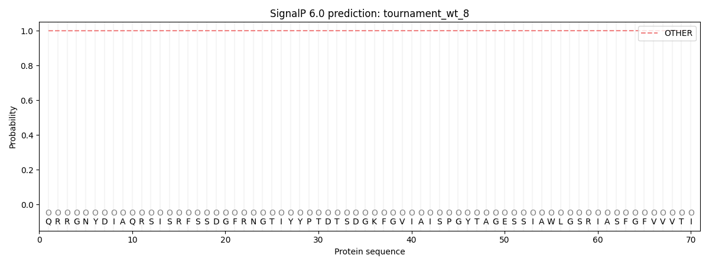 

 ***

#### tournament_wt_9

**Prediction:** Other

| Protein type   |   Other |   Signal Peptide (Sec/SPI) |   Lipoprotein signal peptide (Sec/SPII) |   TAT signal peptide (Tat/SPI) |   TAT Lipoprotein signal peptide (Tat/SPII) |   Pilin-like signal peptide (Sec/SPIII) |
|----------------|---------|----------------------------|-----------------------------------------|--------------------------------|---------------------------------------------|-----------------------------------------|
| Likelihood     |  0.9897 |                     0.0102 |                                  0.0001 |                              0 |                                           0 |                                  0.0001 |
**Download: ** [PNG](output_tournament_wt_9_plot.png) / [EPS](output_tournament_wt_9_plot.eps) /  [Tabular](output_tournament_wt_9_plot.txt)

  

 ***

#### tournament_wt_10

**Prediction:** Other

| Protein type   |   Other |   Signal Peptide (Sec/SPI) |   Lipoprotein signal peptide (Sec/SPII) |   TAT signal peptide (Tat/SPI) |   TAT Lipoprotein signal peptide (Tat/SPII) |   Pilin-like signal peptide (Sec/SPIII) |
|----------------|---------|----------------------------|-----------------------------------------|--------------------------------|---------------------------------------------|-----------------------------------------|
| Likelihood     |       1 |                          0 |                                       0 |                              0 |                                           0 |                                       0 |
**Download: ** [PNG](output_tournament_wt_10_plot.png) / [EPS](output_tournament_wt_10_plot.eps) /  [Tabular](output_tournament_wt_10_plot.txt)

  

 ***

#### tournament_wt_11

**Prediction:** Other

| Protein type   |   Other |   Signal Peptide (Sec/SPI) |   Lipoprotein signal peptide (Sec/SPII) |   TAT signal peptide (Tat/SPI) |   TAT Lipoprotein signal peptide (Tat/SPII) |   Pilin-like signal peptide (Sec/SPIII) |
|----------------|---------|----------------------------|-----------------------------------------|--------------------------------|---------------------------------------------|-----------------------------------------|
| Likelihood     |  0.9939 |                      0.006 |                                       0 |                              0 |                                           0 |                                       0 |
**Download: ** [PNG](output_tournament_wt_11_plot.png) / [EPS](output_tournament_wt_11_plot.eps) /  [Tabular](output_tournament_wt_11_plot.txt)

  

 ***

#### tournament_wt_12

**Prediction:** Other

| Protein type   |   Other |   Signal Peptide (Sec/SPI) |   Lipoprotein signal peptide (Sec/SPII) |   TAT signal peptide (Tat/SPI) |   TAT Lipoprotein signal peptide (Tat/SPII) |   Pilin-like signal peptide (Sec/SPIII) |
|----------------|---------|----------------------------|-----------------------------------------|--------------------------------|---------------------------------------------|-----------------------------------------|
| Likelihood     |  0.9991 |                     0.0009 |                                       0 |                              0 |                                           0 |                                       0 |
**Download: ** [PNG](output_tournament_wt_12_plot.png) / [EPS](output_tournament_wt_12_plot.eps) /  [Tabular](output_tournament_wt_12_plot.txt)

  

 ***

#### tournament_wt_13

**Prediction:** Other

| Protein type   |   Other |   Signal Peptide (Sec/SPI) |   Lipoprotein signal peptide (Sec/SPII) |   TAT signal peptide (Tat/SPI) |   TAT Lipoprotein signal peptide (Tat/SPII) |   Pilin-like signal peptide (Sec/SPIII) |
|----------------|---------|----------------------------|-----------------------------------------|--------------------------------|---------------------------------------------|-----------------------------------------|
| Likelihood     |  1.0001 |                          0 |                                       0 |                              0 |                                           0 |                                       0 |
**Download: ** [PNG](output_tournament_wt_13_plot.png) / [EPS](output_tournament_wt_13_plot.eps) /  [Tabular](output_tournament_wt_13_plot.txt)

 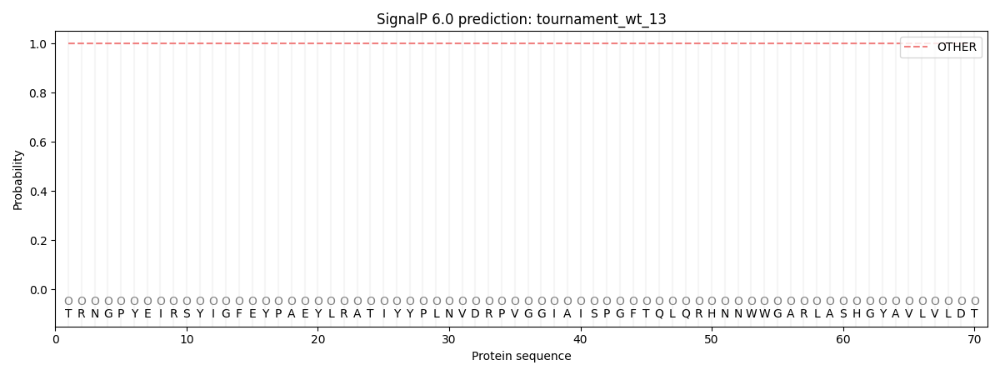 

 ***

#### tournament_wt_14

**Prediction:** Other

| Protein type   |   Other |   Signal Peptide (Sec/SPI) |   Lipoprotein signal peptide (Sec/SPII) |   TAT signal peptide (Tat/SPI) |   TAT Lipoprotein signal peptide (Tat/SPII) |   Pilin-like signal peptide (Sec/SPIII) |
|----------------|---------|----------------------------|-----------------------------------------|--------------------------------|---------------------------------------------|-----------------------------------------|
| Likelihood     |       1 |                          0 |                                       0 |                              0 |                                           0 |                                       0 |
**Download: ** [PNG](output_tournament_wt_14_plot.png) / [EPS](output_tournament_wt_14_plot.eps) /  [Tabular](output_tournament_wt_14_plot.txt)

  

 ***

#### tournament_wt_15

**Prediction:** Other

| Protein type   |   Other |   Signal Peptide (Sec/SPI) |   Lipoprotein signal peptide (Sec/SPII) |   TAT signal peptide (Tat/SPI) |   TAT Lipoprotein signal peptide (Tat/SPII) |   Pilin-like signal peptide (Sec/SPIII) |
|----------------|---------|----------------------------|-----------------------------------------|--------------------------------|---------------------------------------------|-----------------------------------------|
| Likelihood     |  0.9977 |                     0.0023 |                                       0 |                              0 |                                           0 |                                       0 |
**Download: ** [PNG](output_tournament_wt_15_plot.png) / [EPS](output_tournament_wt_15_plot.eps) /  [Tabular](output_tournament_wt_15_plot.txt)

  

 ***

#### tournament_wt_16

**Prediction:** Other

| Protein type   |   Other |   Signal Peptide (Sec/SPI) |   Lipoprotein signal peptide (Sec/SPII) |   TAT signal peptide (Tat/SPI) |   TAT Lipoprotein signal peptide (Tat/SPII) |   Pilin-like signal peptide (Sec/SPIII) |
|----------------|---------|----------------------------|-----------------------------------------|--------------------------------|---------------------------------------------|-----------------------------------------|
| Likelihood     |  1.0001 |                          0 |                                       0 |                              0 |                                           0 |                                       0 |
**Download: ** [PNG](output_tournament_wt_16_plot.png) / [EPS](output_tournament_wt_16_plot.eps) /  [Tabular](output_tournament_wt_16_plot.txt)

  

 ***

#### tournament_wt_17

**Prediction:** Other

| Protein type   |   Other |   Signal Peptide (Sec/SPI) |   Lipoprotein signal peptide (Sec/SPII) |   TAT signal peptide (Tat/SPI) |   TAT Lipoprotein signal peptide (Tat/SPII) |   Pilin-like signal peptide (Sec/SPIII) |
|----------------|---------|----------------------------|-----------------------------------------|--------------------------------|---------------------------------------------|-----------------------------------------|
| Likelihood     |       1 |                          0 |                                       0 |                              0 |                                           0 |                                       0 |
**Download: ** [PNG](output_tournament_wt_17_plot.png) / [EPS](output_tournament_wt_17_plot.eps) /  [Tabular](output_tournament_wt_17_plot.txt)

  

 ***

#### tournament_wt_18

**Prediction:** Other

| Protein type   |   Other |   Signal Peptide (Sec/SPI) |   Lipoprotein signal peptide (Sec/SPII) |   TAT signal peptide (Tat/SPI) |   TAT Lipoprotein signal peptide (Tat/SPII) |   Pilin-like signal peptide (Sec/SPIII) |
|----------------|---------|----------------------------|-----------------------------------------|--------------------------------|---------------------------------------------|-----------------------------------------|
| Likelihood     |  1.0001 |                          0 |                                       0 |                              0 |                                           0 |                                       0 |
**Download: ** [PNG](output_tournament_wt_18_plot.png) / [EPS](output_tournament_wt_18_plot.eps) /  [Tabular](output_tournament_wt_18_plot.txt)

  

 ***

#### tournament_wt_19

**Prediction:** Other

| Protein type   |   Other |   Signal Peptide (Sec/SPI) |   Lipoprotein signal peptide (Sec/SPII) |   TAT signal peptide (Tat/SPI) |   TAT Lipoprotein signal peptide (Tat/SPII) |   Pilin-like signal peptide (Sec/SPIII) |
|----------------|---------|----------------------------|-----------------------------------------|--------------------------------|---------------------------------------------|-----------------------------------------|
| Likelihood     |       1 |                     0.0001 |                                       0 |                              0 |                                           0 |                                       0 |
**Download: ** [PNG](output_tournament_wt_19_plot.png) / [EPS](output_tournament_wt_19_plot.eps) /  [Tabular](output_tournament_wt_19_plot.txt)

  

 ***

#### tournament_wt_20

**Prediction:** Other

| Protein type   |   Other |   Signal Peptide (Sec/SPI) |   Lipoprotein signal peptide (Sec/SPII) |   TAT signal peptide (Tat/SPI) |   TAT Lipoprotein signal peptide (Tat/SPII) |   Pilin-like signal peptide (Sec/SPIII) |
|----------------|---------|----------------------------|-----------------------------------------|--------------------------------|---------------------------------------------|-----------------------------------------|
| Likelihood     |  0.9976 |                     0.0023 |                                       0 |                              0 |                                           0 |                                       0 |
**Download: ** [PNG](output_tournament_wt_20_plot.png) / [EPS](output_tournament_wt_20_plot.eps) /  [Tabular](output_tournament_wt_20_plot.txt)

  

 ***

#### tournament_wt_21

**Prediction:** Other

| Protein type   |   Other |   Signal Peptide (Sec/SPI) |   Lipoprotein signal peptide (Sec/SPII) |   TAT signal peptide (Tat/SPI) |   TAT Lipoprotein signal peptide (Tat/SPII) |   Pilin-like signal peptide (Sec/SPIII) |
|----------------|---------|----------------------------|-----------------------------------------|--------------------------------|---------------------------------------------|-----------------------------------------|
| Likelihood     |  0.9993 |                     0.0007 |                                       0 |                              0 |                                           0 |                                       0 |
**Download: ** [PNG](output_tournament_wt_21_plot.png) / [EPS](output_tournament_wt_21_plot.eps) /  [Tabular](output_tournament_wt_21_plot.txt)

 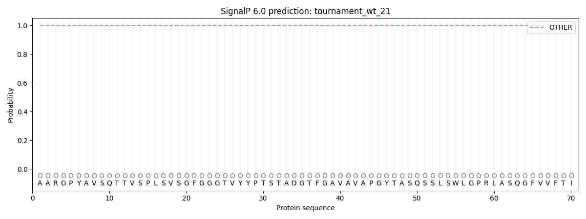 

 ***

#### tournament_wt_22

**Prediction:** Other

| Protein type   |   Other |   Signal Peptide (Sec/SPI) |   Lipoprotein signal peptide (Sec/SPII) |   TAT signal peptide (Tat/SPI) |   TAT Lipoprotein signal peptide (Tat/SPII) |   Pilin-like signal peptide (Sec/SPIII) |
|----------------|---------|----------------------------|-----------------------------------------|--------------------------------|---------------------------------------------|-----------------------------------------|
| Likelihood     |       1 |                          0 |                                       0 |                              0 |                                           0 |                                       0 |
**Download: ** [PNG](output_tournament_wt_22_plot.png) / [EPS](output_tournament_wt_22_plot.eps) /  [Tabular](output_tournament_wt_22_plot.txt)

  

 ***

#### tournament_wt_23

**Prediction:** Other

| Protein type   |   Other |   Signal Peptide (Sec/SPI) |   Lipoprotein signal peptide (Sec/SPII) |   TAT signal peptide (Tat/SPI) |   TAT Lipoprotein signal peptide (Tat/SPII) |   Pilin-like signal peptide (Sec/SPIII) |
|----------------|---------|----------------------------|-----------------------------------------|--------------------------------|---------------------------------------------|-----------------------------------------|
| Likelihood     |  0.9914 |                     0.0085 |                                  0.0001 |                              0 |                                           0 |                                       0 |
**Download: ** [PNG](output_tournament_wt_23_plot.png) / [EPS](output_tournament_wt_23_plot.eps) /  [Tabular](output_tournament_wt_23_plot.txt)

 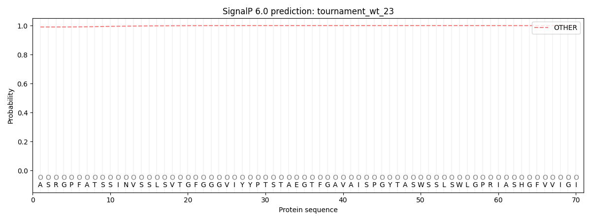 

 ***

#### tournament_wt_24

**Prediction:** Other

| Protein type   |   Other |   Signal Peptide (Sec/SPI) |   Lipoprotein signal peptide (Sec/SPII) |   TAT signal peptide (Tat/SPI) |   TAT Lipoprotein signal peptide (Tat/SPII) |   Pilin-like signal peptide (Sec/SPIII) |
|----------------|---------|----------------------------|-----------------------------------------|--------------------------------|---------------------------------------------|-----------------------------------------|
| Likelihood     |  0.9984 |                     0.0016 |                                  0.0001 |                              0 |                                           0 |                                       0 |
**Download: ** [PNG](output_tournament_wt_24_plot.png) / [EPS](output_tournament_wt_24_plot.eps) /  [Tabular](output_tournament_wt_24_plot.txt)

  

 ***

#### tournament_wt_25

**Prediction:** Other

| Protein type   |   Other |   Signal Peptide (Sec/SPI) |   Lipoprotein signal peptide (Sec/SPII) |   TAT signal peptide (Tat/SPI) |   TAT Lipoprotein signal peptide (Tat/SPII) |   Pilin-like signal peptide (Sec/SPIII) |
|----------------|---------|----------------------------|-----------------------------------------|--------------------------------|---------------------------------------------|-----------------------------------------|
| Likelihood     |  0.9987 |                     0.0013 |                                       0 |                              0 |                                           0 |                                       0 |
**Download: ** [PNG](output_tournament_wt_25_plot.png) / [EPS](output_tournament_wt_25_plot.eps) /  [Tabular](output_tournament_wt_25_plot.txt)

  

 ***

#### tournament_wt_26

**Prediction:** Other

| Protein type   |   Other |   Signal Peptide (Sec/SPI) |   Lipoprotein signal peptide (Sec/SPII) |   TAT signal peptide (Tat/SPI) |   TAT Lipoprotein signal peptide (Tat/SPII) |   Pilin-like signal peptide (Sec/SPIII) |
|----------------|---------|----------------------------|-----------------------------------------|--------------------------------|---------------------------------------------|-----------------------------------------|
| Likelihood     |  0.9992 |                     0.0008 |                                       0 |                              0 |                                           0 |                                       0 |
**Download: ** [PNG](output_tournament_wt_26_plot.png) / [EPS](output_tournament_wt_26_plot.eps) /  [Tabular](output_tournament_wt_26_plot.txt)

  

 ***

#### tournament_wt_27

**Prediction:** Other

| Protein type   |   Other |   Signal Peptide (Sec/SPI) |   Lipoprotein signal peptide (Sec/SPII) |   TAT signal peptide (Tat/SPI) |   TAT Lipoprotein signal peptide (Tat/SPII) |   Pilin-like signal peptide (Sec/SPIII) |
|----------------|---------|----------------------------|-----------------------------------------|--------------------------------|---------------------------------------------|-----------------------------------------|
| Likelihood     |       1 |                          0 |                                       0 |                              0 |                                           0 |                                       0 |
**Download: ** [PNG](output_tournament_wt_27_plot.png) / [EPS](output_tournament_wt_27_plot.eps) /  [Tabular](output_tournament_wt_27_plot.txt)

 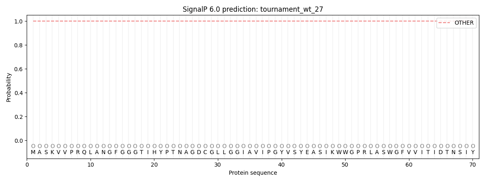 

 ***

#### tournament_wt_28

**Prediction:** Other

| Protein type   |   Other |   Signal Peptide (Sec/SPI) |   Lipoprotein signal peptide (Sec/SPII) |   TAT signal peptide (Tat/SPI) |   TAT Lipoprotein signal peptide (Tat/SPII) |   Pilin-like signal peptide (Sec/SPIII) |
|----------------|---------|----------------------------|-----------------------------------------|--------------------------------|---------------------------------------------|-----------------------------------------|
| Likelihood     |       1 |                          0 |                                       0 |                              0 |                                           0 |                                       0 |
**Download: ** [PNG](output_tournament_wt_28_plot.png) / [EPS](output_tournament_wt_28_plot.eps) /  [Tabular](output_tournament_wt_28_plot.txt)

  

 ***

#### tournament_wt_29

**Prediction:** Other

| Protein type   |   Other |   Signal Peptide (Sec/SPI) |   Lipoprotein signal peptide (Sec/SPII) |   TAT signal peptide (Tat/SPI) |   TAT Lipoprotein signal peptide (Tat/SPII) |   Pilin-like signal peptide (Sec/SPIII) |
|----------------|---------|----------------------------|-----------------------------------------|--------------------------------|---------------------------------------------|-----------------------------------------|
| Likelihood     |  0.9995 |                     0.0005 |                                       0 |                              0 |                                           0 |                                       0 |
**Download: ** [PNG](output_tournament_wt_29_plot.png) / [EPS](output_tournament_wt_29_plot.eps) /  [Tabular](output_tournament_wt_29_plot.txt)

  

 ***

#### tournament_wt_30

**Prediction:** Other

| Protein type   |   Other |   Signal Peptide (Sec/SPI) |   Lipoprotein signal peptide (Sec/SPII) |   TAT signal peptide (Tat/SPI) |   TAT Lipoprotein signal peptide (Tat/SPII) |   Pilin-like signal peptide (Sec/SPIII) |
|----------------|---------|----------------------------|-----------------------------------------|--------------------------------|---------------------------------------------|-----------------------------------------|
| Likelihood     |  0.9997 |                     0.0004 |                                       0 |                              0 |                                           0 |                                       0 |
**Download: ** [PNG](output_tournament_wt_30_plot.png) / [EPS](output_tournament_wt_30_plot.eps) /  [Tabular](output_tournament_wt_30_plot.txt)

  

 ***

#### tournament_wt_31

**Prediction:** Other

| Protein type   |   Other |   Signal Peptide (Sec/SPI) |   Lipoprotein signal peptide (Sec/SPII) |   TAT signal peptide (Tat/SPI) |   TAT Lipoprotein signal peptide (Tat/SPII) |   Pilin-like signal peptide (Sec/SPIII) |
|----------------|---------|----------------------------|-----------------------------------------|--------------------------------|---------------------------------------------|-----------------------------------------|
| Likelihood     |  0.9999 |                     0.0001 |                                       0 |                              0 |                                           0 |                                       0 |
**Download: ** [PNG](output_tournament_wt_31_plot.png) / [EPS](output_tournament_wt_31_plot.eps) /  [Tabular](output_tournament_wt_31_plot.txt)

  

 ***

#### tournament_wt_32

**Prediction:** Other

| Protein type   |   Other |   Signal Peptide (Sec/SPI) |   Lipoprotein signal peptide (Sec/SPII) |   TAT signal peptide (Tat/SPI) |   TAT Lipoprotein signal peptide (Tat/SPII) |   Pilin-like signal peptide (Sec/SPIII) |
|----------------|---------|----------------------------|-----------------------------------------|--------------------------------|---------------------------------------------|-----------------------------------------|
| Likelihood     |  0.9962 |                     0.0038 |                                       0 |                              0 |                                           0 |                                       0 |
**Download: ** [PNG](output_tournament_wt_32_plot.png) / [EPS](output_tournament_wt_32_plot.eps) /  [Tabular](output_tournament_wt_32_plot.txt)

  

 ***

#### tournament_wt_33

**Prediction:** Other

| Protein type   |   Other |   Signal Peptide (Sec/SPI) |   Lipoprotein signal peptide (Sec/SPII) |   TAT signal peptide (Tat/SPI) |   TAT Lipoprotein signal peptide (Tat/SPII) |   Pilin-like signal peptide (Sec/SPIII) |
|----------------|---------|----------------------------|-----------------------------------------|--------------------------------|---------------------------------------------|-----------------------------------------|
| Likelihood     |  0.9987 |                     0.0013 |                                       0 |                              0 |                                           0 |                                       0 |
**Download: ** [PNG](output_tournament_wt_33_plot.png) / [EPS](output_tournament_wt_33_plot.eps) /  [Tabular](output_tournament_wt_33_plot.txt)

 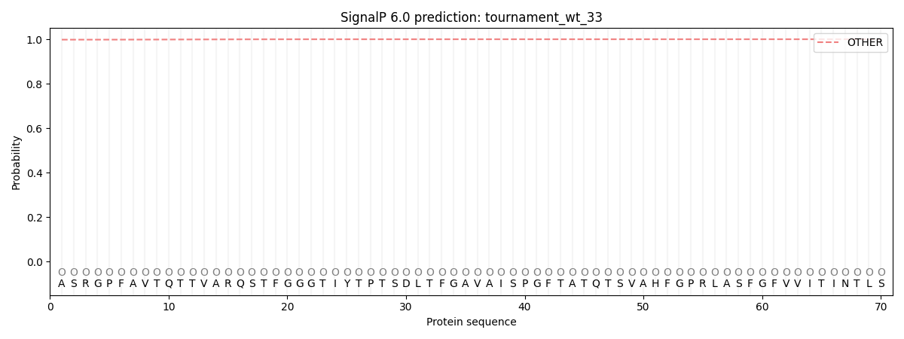 

 ***

#### tournament_wt_34

**Prediction:** Other

| Protein type   |   Other |   Signal Peptide (Sec/SPI) |   Lipoprotein signal peptide (Sec/SPII) |   TAT signal peptide (Tat/SPI) |   TAT Lipoprotein signal peptide (Tat/SPII) |   Pilin-like signal peptide (Sec/SPIII) |
|----------------|---------|----------------------------|-----------------------------------------|--------------------------------|---------------------------------------------|-----------------------------------------|
| Likelihood     |   0.992 |                     0.0079 |                                       0 |                              0 |                                           0 |                                       0 |
**Download: ** [PNG](output_tournament_wt_34_plot.png) / [EPS](output_tournament_wt_34_plot.eps) /  [Tabular](output_tournament_wt_34_plot.txt)

  

 ***

#### tournament_wt_35

**Prediction:** Other

| Protein type   |   Other |   Signal Peptide (Sec/SPI) |   Lipoprotein signal peptide (Sec/SPII) |   TAT signal peptide (Tat/SPI) |   TAT Lipoprotein signal peptide (Tat/SPII) |   Pilin-like signal peptide (Sec/SPIII) |
|----------------|---------|----------------------------|-----------------------------------------|--------------------------------|---------------------------------------------|-----------------------------------------|
| Likelihood     |  0.9981 |                     0.0018 |                                       0 |                              0 |                                           0 |                                       0 |
**Download: ** [PNG](output_tournament_wt_35_plot.png) / [EPS](output_tournament_wt_35_plot.eps) /  [Tabular](output_tournament_wt_35_plot.txt)

  

 ***

#### tournament_wt_36

**Prediction:** Other

| Protein type   |   Other |   Signal Peptide (Sec/SPI) |   Lipoprotein signal peptide (Sec/SPII) |   TAT signal peptide (Tat/SPI) |   TAT Lipoprotein signal peptide (Tat/SPII) |   Pilin-like signal peptide (Sec/SPIII) |
|----------------|---------|----------------------------|-----------------------------------------|--------------------------------|---------------------------------------------|-----------------------------------------|
| Likelihood     |  0.9993 |                     0.0008 |                                       0 |                              0 |                                           0 |                                       0 |
**Download: ** [PNG](output_tournament_wt_36_plot.png) / [EPS](output_tournament_wt_36_plot.eps) /  [Tabular](output_tournament_wt_36_plot.txt)

  

 ***

#### tournament_wt_37

**Prediction:** Other

| Protein type   |   Other |   Signal Peptide (Sec/SPI) |   Lipoprotein signal peptide (Sec/SPII) |   TAT signal peptide (Tat/SPI) |   TAT Lipoprotein signal peptide (Tat/SPII) |   Pilin-like signal peptide (Sec/SPIII) |
|----------------|---------|----------------------------|-----------------------------------------|--------------------------------|---------------------------------------------|-----------------------------------------|
| Likelihood     |  1.0001 |                          0 |                                       0 |                              0 |                                           0 |                                       0 |
**Download: ** [PNG](output_tournament_wt_37_plot.png) / [EPS](output_tournament_wt_37_plot.eps) /  [Tabular](output_tournament_wt_37_plot.txt)

  

 ***

#### tournament_wt_38

**Prediction:** Other

| Protein type   |   Other |   Signal Peptide (Sec/SPI) |   Lipoprotein signal peptide (Sec/SPII) |   TAT signal peptide (Tat/SPI) |   TAT Lipoprotein signal peptide (Tat/SPII) |   Pilin-like signal peptide (Sec/SPIII) |
|----------------|---------|----------------------------|-----------------------------------------|--------------------------------|---------------------------------------------|-----------------------------------------|
| Likelihood     |  1.0001 |                          0 |                                       0 |                              0 |                                           0 |                                       0 |
**Download: ** [PNG](output_tournament_wt_38_plot.png) / [EPS](output_tournament_wt_38_plot.eps) /  [Tabular](output_tournament_wt_38_plot.txt)

  

 ***

#### tournament_wt_39

**Prediction:** Other

| Protein type   |   Other |   Signal Peptide (Sec/SPI) |   Lipoprotein signal peptide (Sec/SPII) |   TAT signal peptide (Tat/SPI) |   TAT Lipoprotein signal peptide (Tat/SPII) |   Pilin-like signal peptide (Sec/SPIII) |
|----------------|---------|----------------------------|-----------------------------------------|--------------------------------|---------------------------------------------|-----------------------------------------|
| Likelihood     |  1.0001 |                          0 |                                       0 |                              0 |                                           0 |                                       0 |
**Download: ** [PNG](output_tournament_wt_39_plot.png) / [EPS](output_tournament_wt_39_plot.eps) /  [Tabular](output_tournament_wt_39_plot.txt)

  

 ***

#### tournament_wt_40

**Prediction:** Other

| Protein type   |   Other |   Signal Peptide (Sec/SPI) |   Lipoprotein signal peptide (Sec/SPII) |   TAT signal peptide (Tat/SPI) |   TAT Lipoprotein signal peptide (Tat/SPII) |   Pilin-like signal peptide (Sec/SPIII) |
|----------------|---------|----------------------------|-----------------------------------------|--------------------------------|---------------------------------------------|-----------------------------------------|
| Likelihood     |  0.9966 |                     0.0034 |                                       0 |                              0 |                                           0 |                                       0 |
**Download: ** [PNG](output_tournament_wt_40_plot.png) / [EPS](output_tournament_wt_40_plot.eps) /  [Tabular](output_tournament_wt_40_plot.txt)

  

 ***

#### tournament_wt_41

**Prediction:** Other

| Protein type   |   Other |   Signal Peptide (Sec/SPI) |   Lipoprotein signal peptide (Sec/SPII) |   TAT signal peptide (Tat/SPI) |   TAT Lipoprotein signal peptide (Tat/SPII) |   Pilin-like signal peptide (Sec/SPIII) |
|----------------|---------|----------------------------|-----------------------------------------|--------------------------------|---------------------------------------------|-----------------------------------------|
| Likelihood     |  0.9998 |                     0.0002 |                                       0 |                              0 |                                           0 |                                       0 |
**Download: ** [PNG](output_tournament_wt_41_plot.png) / [EPS](output_tournament_wt_41_plot.eps) /  [Tabular](output_tournament_wt_41_plot.txt)

  

 ***

#### tournament_wt_42

**Prediction:** Other

| Protein type   |   Other |   Signal Peptide (Sec/SPI) |   Lipoprotein signal peptide (Sec/SPII) |   TAT signal peptide (Tat/SPI) |   TAT Lipoprotein signal peptide (Tat/SPII) |   Pilin-like signal peptide (Sec/SPIII) |
|----------------|---------|----------------------------|-----------------------------------------|--------------------------------|---------------------------------------------|-----------------------------------------|
| Likelihood     |       1 |                          0 |                                       0 |                              0 |                                           0 |                                       0 |
**Download: ** [PNG](output_tournament_wt_42_plot.png) / [EPS](output_tournament_wt_42_plot.eps) /  [Tabular](output_tournament_wt_42_plot.txt)

  

 ***

#### tournament_wt_43

**Prediction:** Other

| Protein type   |   Other |   Signal Peptide (Sec/SPI) |   Lipoprotein signal peptide (Sec/SPII) |   TAT signal peptide (Tat/SPI) |   TAT Lipoprotein signal peptide (Tat/SPII) |   Pilin-like signal peptide (Sec/SPIII) |
|----------------|---------|----------------------------|-----------------------------------------|--------------------------------|---------------------------------------------|-----------------------------------------|
| Likelihood     |       1 |                          0 |                                       0 |                              0 |                                           0 |                                       0 |
**Download: ** [PNG](output_tournament_wt_43_plot.png) / [EPS](output_tournament_wt_43_plot.eps) /  [Tabular](output_tournament_wt_43_plot.txt)

  

 ***

#### tournament_wt_44

**Prediction:** Other

| Protein type   |   Other |   Signal Peptide (Sec/SPI) |   Lipoprotein signal peptide (Sec/SPII) |   TAT signal peptide (Tat/SPI) |   TAT Lipoprotein signal peptide (Tat/SPII) |   Pilin-like signal peptide (Sec/SPIII) |
|----------------|---------|----------------------------|-----------------------------------------|--------------------------------|---------------------------------------------|-----------------------------------------|
| Likelihood     |  0.9992 |                     0.0007 |                                  0.0001 |                              0 |                                           0 |                                       0 |
**Download: ** [PNG](output_tournament_wt_44_plot.png) / [EPS](output_tournament_wt_44_plot.eps) /  [Tabular](output_tournament_wt_44_plot.txt)

  

 ***

#### tournament_wt_45

**Prediction:** Other

| Protein type   |   Other |   Signal Peptide (Sec/SPI) |   Lipoprotein signal peptide (Sec/SPII) |   TAT signal peptide (Tat/SPI) |   TAT Lipoprotein signal peptide (Tat/SPII) |   Pilin-like signal peptide (Sec/SPIII) |
|----------------|---------|----------------------------|-----------------------------------------|--------------------------------|---------------------------------------------|-----------------------------------------|
| Likelihood     |  0.9999 |                     0.0001 |                                       0 |                              0 |                                           0 |                                       0 |
**Download: ** [PNG](output_tournament_wt_45_plot.png) / [EPS](output_tournament_wt_45_plot.eps) /  [Tabular](output_tournament_wt_45_plot.txt)

  

 ***

#### tournament_wt_46

**Prediction:** Other

| Protein type   |   Other |   Signal Peptide (Sec/SPI) |   Lipoprotein signal peptide (Sec/SPII) |   TAT signal peptide (Tat/SPI) |   TAT Lipoprotein signal peptide (Tat/SPII) |   Pilin-like signal peptide (Sec/SPIII) |
|----------------|---------|----------------------------|-----------------------------------------|--------------------------------|---------------------------------------------|-----------------------------------------|
| Likelihood     |  0.9979 |                     0.0021 |                                       0 |                              0 |                                           0 |                                       0 |
**Download: ** [PNG](output_tournament_wt_46_plot.png) / [EPS](output_tournament_wt_46_plot.eps) /  [Tabular](output_tournament_wt_46_plot.txt)

  

 ***

#### tournament_wt_47

**Prediction:** Other

| Protein type   |   Other |   Signal Peptide (Sec/SPI) |   Lipoprotein signal peptide (Sec/SPII) |   TAT signal peptide (Tat/SPI) |   TAT Lipoprotein signal peptide (Tat/SPII) |   Pilin-like signal peptide (Sec/SPIII) |
|----------------|---------|----------------------------|-----------------------------------------|--------------------------------|---------------------------------------------|-----------------------------------------|
| Likelihood     |  0.9984 |                     0.0015 |                                       0 |                              0 |                                           0 |                                       0 |
**Download: ** [PNG](output_tournament_wt_47_plot.png) / [EPS](output_tournament_wt_47_plot.eps) /  [Tabular](output_tournament_wt_47_plot.txt)

 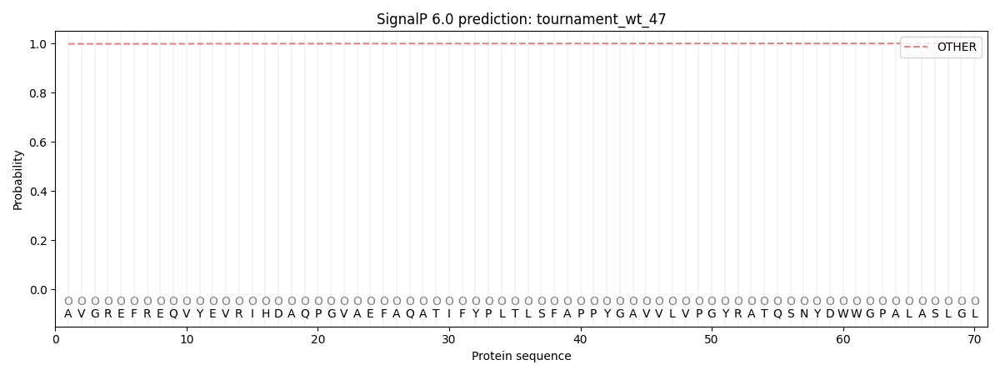 

 ***

#### tournament_wt_48

**Prediction:** Other

| Protein type   |   Other |   Signal Peptide (Sec/SPI) |   Lipoprotein signal peptide (Sec/SPII) |   TAT signal peptide (Tat/SPI) |   TAT Lipoprotein signal peptide (Tat/SPII) |   Pilin-like signal peptide (Sec/SPIII) |
|----------------|---------|----------------------------|-----------------------------------------|--------------------------------|---------------------------------------------|-----------------------------------------|
| Likelihood     |  0.9972 |                     0.0027 |                                       0 |                              0 |                                           0 |                                       0 |
**Download: ** [PNG](output_tournament_wt_48_plot.png) / [EPS](output_tournament_wt_48_plot.eps) /  [Tabular](output_tournament_wt_48_plot.txt)

  

 ***

#### tournament_wt_49

**Prediction:** Other

| Protein type   |   Other |   Signal Peptide (Sec/SPI) |   Lipoprotein signal peptide (Sec/SPII) |   TAT signal peptide (Tat/SPI) |   TAT Lipoprotein signal peptide (Tat/SPII) |   Pilin-like signal peptide (Sec/SPIII) |
|----------------|---------|----------------------------|-----------------------------------------|--------------------------------|---------------------------------------------|-----------------------------------------|
| Likelihood     |  1.0001 |                          0 |                                       0 |                              0 |                                           0 |                                       0 |
**Download: ** [PNG](output_tournament_wt_49_plot.png) / [EPS](output_tournament_wt_49_plot.eps) /  [Tabular](output_tournament_wt_49_plot.txt)

  

 ***

#### tournament_wt_50

**Prediction:** Other

| Protein type   |   Other |   Signal Peptide (Sec/SPI) |   Lipoprotein signal peptide (Sec/SPII) |   TAT signal peptide (Tat/SPI) |   TAT Lipoprotein signal peptide (Tat/SPII) |   Pilin-like signal peptide (Sec/SPIII) |
|----------------|---------|----------------------------|-----------------------------------------|--------------------------------|---------------------------------------------|-----------------------------------------|
| Likelihood     |  0.9998 |                     0.0002 |                                       0 |                              0 |                                           0 |                                       0 |
**Download: ** [PNG](output_tournament_wt_50_plot.png) / [EPS](output_tournament_wt_50_plot.eps) /  [Tabular](output_tournament_wt_50_plot.txt)

  

 ***

#### tournament_wt_51

**Prediction:** Other

| Protein type   |   Other |   Signal Peptide (Sec/SPI) |   Lipoprotein signal peptide (Sec/SPII) |   TAT signal peptide (Tat/SPI) |   TAT Lipoprotein signal peptide (Tat/SPII) |   Pilin-like signal peptide (Sec/SPIII) |
|----------------|---------|----------------------------|-----------------------------------------|--------------------------------|---------------------------------------------|-----------------------------------------|
| Likelihood     |   0.975 |                     0.0246 |                                  0.0002 |                         0.0001 |                                           0 |                                  0.0001 |
**Download: ** [PNG](output_tournament_wt_51_plot.png) / [EPS](output_tournament_wt_51_plot.eps) /  [Tabular](output_tournament_wt_51_plot.txt)

  

 ***

#### tournament_wt_52

**Prediction:** Other

| Protein type   |   Other |   Signal Peptide (Sec/SPI) |   Lipoprotein signal peptide (Sec/SPII) |   TAT signal peptide (Tat/SPI) |   TAT Lipoprotein signal peptide (Tat/SPII) |   Pilin-like signal peptide (Sec/SPIII) |
|----------------|---------|----------------------------|-----------------------------------------|--------------------------------|---------------------------------------------|-----------------------------------------|
| Likelihood     |  0.9914 |                     0.0085 |                                  0.0001 |                              0 |                                           0 |                                       0 |
**Download: ** [PNG](output_tournament_wt_52_plot.png) / [EPS](output_tournament_wt_52_plot.eps) /  [Tabular](output_tournament_wt_52_plot.txt)

 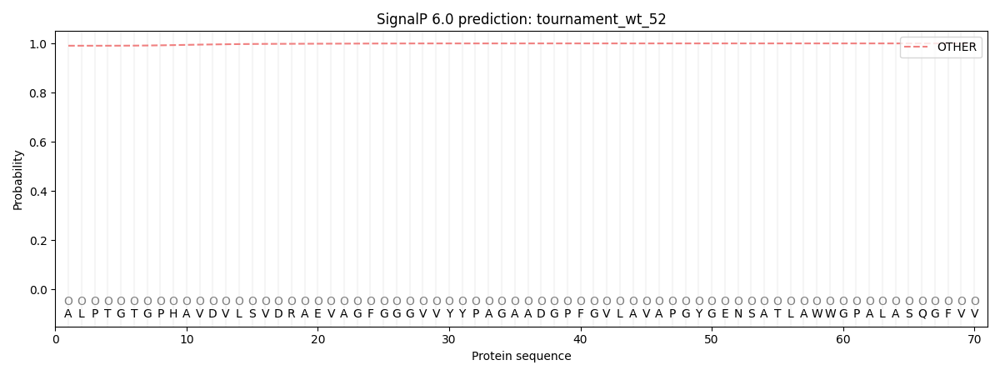 

 ***

#### tournament_wt_53

**Prediction:** Other

| Protein type   |   Other |   Signal Peptide (Sec/SPI) |   Lipoprotein signal peptide (Sec/SPII) |   TAT signal peptide (Tat/SPI) |   TAT Lipoprotein signal peptide (Tat/SPII) |   Pilin-like signal peptide (Sec/SPIII) |
|----------------|---------|----------------------------|-----------------------------------------|--------------------------------|---------------------------------------------|-----------------------------------------|
| Likelihood     |  0.9925 |                     0.0072 |                                  0.0002 |                              0 |                                           0 |                                  0.0001 |
**Download: ** [PNG](output_tournament_wt_53_plot.png) / [EPS](output_tournament_wt_53_plot.eps) /  [Tabular](output_tournament_wt_53_plot.txt)

  

 ***

#### tournament_wt_54

**Prediction:** Other

| Protein type   |   Other |   Signal Peptide (Sec/SPI) |   Lipoprotein signal peptide (Sec/SPII) |   TAT signal peptide (Tat/SPI) |   TAT Lipoprotein signal peptide (Tat/SPII) |   Pilin-like signal peptide (Sec/SPIII) |
|----------------|---------|----------------------------|-----------------------------------------|--------------------------------|---------------------------------------------|-----------------------------------------|
| Likelihood     |  0.9995 |                     0.0005 |                                       0 |                              0 |                                           0 |                                       0 |
**Download: ** [PNG](output_tournament_wt_54_plot.png) / [EPS](output_tournament_wt_54_plot.eps) /  [Tabular](output_tournament_wt_54_plot.txt)

  

 ***

#### tournament_wt_55

**Prediction:** Other

| Protein type   |   Other |   Signal Peptide (Sec/SPI) |   Lipoprotein signal peptide (Sec/SPII) |   TAT signal peptide (Tat/SPI) |   TAT Lipoprotein signal peptide (Tat/SPII) |   Pilin-like signal peptide (Sec/SPIII) |
|----------------|---------|----------------------------|-----------------------------------------|--------------------------------|---------------------------------------------|-----------------------------------------|
| Likelihood     |  0.9999 |                     0.0001 |                                       0 |                              0 |                                           0 |                                       0 |
**Download: ** [PNG](output_tournament_wt_55_plot.png) / [EPS](output_tournament_wt_55_plot.eps) /  [Tabular](output_tournament_wt_55_plot.txt)

  

 ***

#### tournament_wt_56

**Prediction:** Other

| Protein type   |   Other |   Signal Peptide (Sec/SPI) |   Lipoprotein signal peptide (Sec/SPII) |   TAT signal peptide (Tat/SPI) |   TAT Lipoprotein signal peptide (Tat/SPII) |   Pilin-like signal peptide (Sec/SPIII) |
|----------------|---------|----------------------------|-----------------------------------------|--------------------------------|---------------------------------------------|-----------------------------------------|
| Likelihood     |  0.9995 |                     0.0005 |                                       0 |                              0 |                                           0 |                                       0 |
**Download: ** [PNG](output_tournament_wt_56_plot.png) / [EPS](output_tournament_wt_56_plot.eps) /  [Tabular](output_tournament_wt_56_plot.txt)

  

 ***

#### tournament_wt_57

**Prediction:** Other

| Protein type   |   Other |   Signal Peptide (Sec/SPI) |   Lipoprotein signal peptide (Sec/SPII) |   TAT signal peptide (Tat/SPI) |   TAT Lipoprotein signal peptide (Tat/SPII) |   Pilin-like signal peptide (Sec/SPIII) |
|----------------|---------|----------------------------|-----------------------------------------|--------------------------------|---------------------------------------------|-----------------------------------------|
| Likelihood     |  0.9998 |                     0.0002 |                                       0 |                              0 |                                           0 |                                       0 |
**Download: ** [PNG](output_tournament_wt_57_plot.png) / [EPS](output_tournament_wt_57_plot.eps) /  [Tabular](output_tournament_wt_57_plot.txt)

  

 ***

#### tournament_wt_58

**Prediction:** Other

| Protein type   |   Other |   Signal Peptide (Sec/SPI) |   Lipoprotein signal peptide (Sec/SPII) |   TAT signal peptide (Tat/SPI) |   TAT Lipoprotein signal peptide (Tat/SPII) |   Pilin-like signal peptide (Sec/SPIII) |
|----------------|---------|----------------------------|-----------------------------------------|--------------------------------|---------------------------------------------|-----------------------------------------|
| Likelihood     |       1 |                          0 |                                       0 |                              0 |                                           0 |                                       0 |
**Download: ** [PNG](output_tournament_wt_58_plot.png) / [EPS](output_tournament_wt_58_plot.eps) /  [Tabular](output_tournament_wt_58_plot.txt)

  

 ***

#### tournament_wt_59

**Prediction:** Other

| Protein type   |   Other |   Signal Peptide (Sec/SPI) |   Lipoprotein signal peptide (Sec/SPII) |   TAT signal peptide (Tat/SPI) |   TAT Lipoprotein signal peptide (Tat/SPII) |   Pilin-like signal peptide (Sec/SPIII) |
|----------------|---------|----------------------------|-----------------------------------------|--------------------------------|---------------------------------------------|-----------------------------------------|
| Likelihood     |  0.9982 |                     0.0017 |                                  0.0001 |                              0 |                                           0 |                                       0 |
**Download: ** [PNG](output_tournament_wt_59_plot.png) / [EPS](output_tournament_wt_59_plot.eps) /  [Tabular](output_tournament_wt_59_plot.txt)

 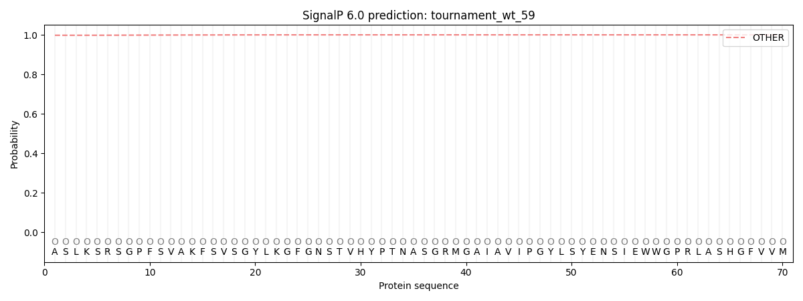 

 ***

#### tournament_wt_60

**Prediction:** Other

| Protein type   |   Other |   Signal Peptide (Sec/SPI) |   Lipoprotein signal peptide (Sec/SPII) |   TAT signal peptide (Tat/SPI) |   TAT Lipoprotein signal peptide (Tat/SPII) |   Pilin-like signal peptide (Sec/SPIII) |
|----------------|---------|----------------------------|-----------------------------------------|--------------------------------|---------------------------------------------|-----------------------------------------|
| Likelihood     |  0.9704 |                     0.0294 |                                  0.0001 |                         0.0001 |                                           0 |                                       0 |
**Download: ** [PNG](output_tournament_wt_60_plot.png) / [EPS](output_tournament_wt_60_plot.eps) /  [Tabular](output_tournament_wt_60_plot.txt)

  

 ***

#### tournament_wt_61

**Prediction:** Other

| Protein type   |   Other |   Signal Peptide (Sec/SPI) |   Lipoprotein signal peptide (Sec/SPII) |   TAT signal peptide (Tat/SPI) |   TAT Lipoprotein signal peptide (Tat/SPII) |   Pilin-like signal peptide (Sec/SPIII) |
|----------------|---------|----------------------------|-----------------------------------------|--------------------------------|---------------------------------------------|-----------------------------------------|
| Likelihood     |  0.9943 |                     0.0056 |                                       0 |                              0 |                                           0 |                                       0 |
**Download: ** [PNG](output_tournament_wt_61_plot.png) / [EPS](output_tournament_wt_61_plot.eps) /  [Tabular](output_tournament_wt_61_plot.txt)

  

 ***

#### tournament_wt_62

**Prediction:** Other

| Protein type   |   Other |   Signal Peptide (Sec/SPI) |   Lipoprotein signal peptide (Sec/SPII) |   TAT signal peptide (Tat/SPI) |   TAT Lipoprotein signal peptide (Tat/SPII) |   Pilin-like signal peptide (Sec/SPIII) |
|----------------|---------|----------------------------|-----------------------------------------|--------------------------------|---------------------------------------------|-----------------------------------------|
| Likelihood     |  0.9993 |                     0.0007 |                                       0 |                              0 |                                           0 |                                       0 |
**Download: ** [PNG](output_tournament_wt_62_plot.png) / [EPS](output_tournament_wt_62_plot.eps) /  [Tabular](output_tournament_wt_62_plot.txt)

  

 ***

#### tournament_wt_63

**Prediction:** Other

| Protein type   |   Other |   Signal Peptide (Sec/SPI) |   Lipoprotein signal peptide (Sec/SPII) |   TAT signal peptide (Tat/SPI) |   TAT Lipoprotein signal peptide (Tat/SPII) |   Pilin-like signal peptide (Sec/SPIII) |
|----------------|---------|----------------------------|-----------------------------------------|--------------------------------|---------------------------------------------|-----------------------------------------|
| Likelihood     |       1 |                          0 |                                       0 |                              0 |                                           0 |                                       0 |
**Download: ** [PNG](output_tournament_wt_63_plot.png) / [EPS](output_tournament_wt_63_plot.eps) /  [Tabular](output_tournament_wt_63_plot.txt)

  

 ***

#### tournament_wt_64

**Prediction:** Other

| Protein type   |   Other |   Signal Peptide (Sec/SPI) |   Lipoprotein signal peptide (Sec/SPII) |   TAT signal peptide (Tat/SPI) |   TAT Lipoprotein signal peptide (Tat/SPII) |   Pilin-like signal peptide (Sec/SPIII) |
|----------------|---------|----------------------------|-----------------------------------------|--------------------------------|---------------------------------------------|-----------------------------------------|
| Likelihood     |  0.9977 |                     0.0023 |                                  0.0001 |                              0 |                                           0 |                                       0 |
**Download: ** [PNG](output_tournament_wt_64_plot.png) / [EPS](output_tournament_wt_64_plot.eps) /  [Tabular](output_tournament_wt_64_plot.txt)

  

 ***

#### tournament_wt_65

**Prediction:** Other

| Protein type   |   Other |   Signal Peptide (Sec/SPI) |   Lipoprotein signal peptide (Sec/SPII) |   TAT signal peptide (Tat/SPI) |   TAT Lipoprotein signal peptide (Tat/SPII) |   Pilin-like signal peptide (Sec/SPIII) |
|----------------|---------|----------------------------|-----------------------------------------|--------------------------------|---------------------------------------------|-----------------------------------------|
| Likelihood     |   0.998 |                     0.0018 |                                  0.0002 |                              0 |                                           0 |                                       0 |
**Download: ** [PNG](output_tournament_wt_65_plot.png) / [EPS](output_tournament_wt_65_plot.eps) /  [Tabular](output_tournament_wt_65_plot.txt)

  

 ***

#### tournament_wt_66

**Prediction:** Other

| Protein type   |   Other |   Signal Peptide (Sec/SPI) |   Lipoprotein signal peptide (Sec/SPII) |   TAT signal peptide (Tat/SPI) |   TAT Lipoprotein signal peptide (Tat/SPII) |   Pilin-like signal peptide (Sec/SPIII) |
|----------------|---------|----------------------------|-----------------------------------------|--------------------------------|---------------------------------------------|-----------------------------------------|
| Likelihood     |  0.9487 |                     0.0506 |                                  0.0003 |                         0.0002 |                                      0.0001 |                                  0.0001 |
**Download: ** [PNG](output_tournament_wt_66_plot.png) / [EPS](output_tournament_wt_66_plot.eps) /  [Tabular](output_tournament_wt_66_plot.txt)

 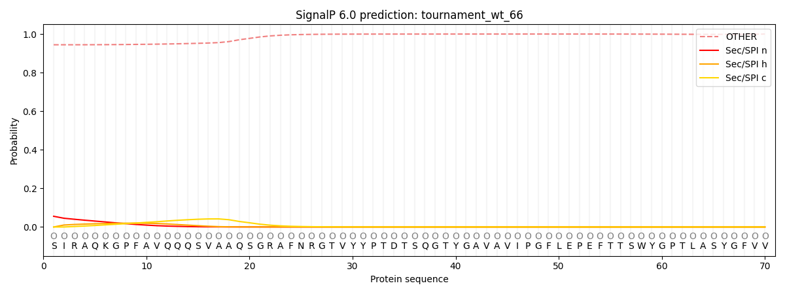 

 ***

#### tournament_wt_67

**Prediction:** Other

| Protein type   |   Other |   Signal Peptide (Sec/SPI) |   Lipoprotein signal peptide (Sec/SPII) |   TAT signal peptide (Tat/SPI) |   TAT Lipoprotein signal peptide (Tat/SPII) |   Pilin-like signal peptide (Sec/SPIII) |
|----------------|---------|----------------------------|-----------------------------------------|--------------------------------|---------------------------------------------|-----------------------------------------|
| Likelihood     |  0.9905 |                     0.0094 |                                  0.0001 |                              0 |                                           0 |                                       0 |
**Download: ** [PNG](output_tournament_wt_67_plot.png) / [EPS](output_tournament_wt_67_plot.eps) /  [Tabular](output_tournament_wt_67_plot.txt)

 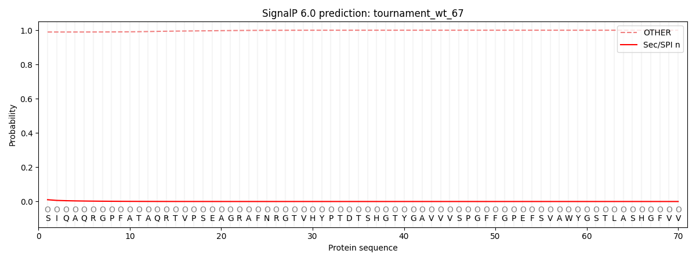 

 ***

#### tournament_wt_68

**Prediction:** Other

| Protein type   |   Other |   Signal Peptide (Sec/SPI) |   Lipoprotein signal peptide (Sec/SPII) |   TAT signal peptide (Tat/SPI) |   TAT Lipoprotein signal peptide (Tat/SPII) |   Pilin-like signal peptide (Sec/SPIII) |
|----------------|---------|----------------------------|-----------------------------------------|--------------------------------|---------------------------------------------|-----------------------------------------|
| Likelihood     |  0.9961 |                     0.0038 |                                  0.0001 |                              0 |                                           0 |                                       0 |
**Download: ** [PNG](output_tournament_wt_68_plot.png) / [EPS](output_tournament_wt_68_plot.eps) /  [Tabular](output_tournament_wt_68_plot.txt)

  

 ***

#### tournament_wt_69

**Prediction:** Other

| Protein type   |   Other |   Signal Peptide (Sec/SPI) |   Lipoprotein signal peptide (Sec/SPII) |   TAT signal peptide (Tat/SPI) |   TAT Lipoprotein signal peptide (Tat/SPII) |   Pilin-like signal peptide (Sec/SPIII) |
|----------------|---------|----------------------------|-----------------------------------------|--------------------------------|---------------------------------------------|-----------------------------------------|
| Likelihood     |  0.9996 |                     0.0004 |                                       0 |                              0 |                                           0 |                                       0 |
**Download: ** [PNG](output_tournament_wt_69_plot.png) / [EPS](output_tournament_wt_69_plot.eps) /  [Tabular](output_tournament_wt_69_plot.txt)

  

 ***

#### tournament_wt_70

**Prediction:** Other

| Protein type   |   Other |   Signal Peptide (Sec/SPI) |   Lipoprotein signal peptide (Sec/SPII) |   TAT signal peptide (Tat/SPI) |   TAT Lipoprotein signal peptide (Tat/SPII) |   Pilin-like signal peptide (Sec/SPIII) |
|----------------|---------|----------------------------|-----------------------------------------|--------------------------------|---------------------------------------------|-----------------------------------------|
| Likelihood     |       1 |                          0 |                                       0 |                              0 |                                           0 |                                       0 |
**Download: ** [PNG](output_tournament_wt_70_plot.png) / [EPS](output_tournament_wt_70_plot.eps) /  [Tabular](output_tournament_wt_70_plot.txt)

  

 ***

#### tournament_wt_71

**Prediction:** Other

| Protein type   |   Other |   Signal Peptide (Sec/SPI) |   Lipoprotein signal peptide (Sec/SPII) |   TAT signal peptide (Tat/SPI) |   TAT Lipoprotein signal peptide (Tat/SPII) |   Pilin-like signal peptide (Sec/SPIII) |
|----------------|---------|----------------------------|-----------------------------------------|--------------------------------|---------------------------------------------|-----------------------------------------|
| Likelihood     |  0.9996 |                     0.0004 |                                       0 |                              0 |                                           0 |                                       0 |
**Download: ** [PNG](output_tournament_wt_71_plot.png) / [EPS](output_tournament_wt_71_plot.eps) /  [Tabular](output_tournament_wt_71_plot.txt)

  

 ***

#### tournament_wt_72

**Prediction:** Other

| Protein type   |   Other |   Signal Peptide (Sec/SPI) |   Lipoprotein signal peptide (Sec/SPII) |   TAT signal peptide (Tat/SPI) |   TAT Lipoprotein signal peptide (Tat/SPII) |   Pilin-like signal peptide (Sec/SPIII) |
|----------------|---------|----------------------------|-----------------------------------------|--------------------------------|---------------------------------------------|-----------------------------------------|
| Likelihood     |       1 |                     0.0001 |                                       0 |                              0 |                                           0 |                                       0 |
**Download: ** [PNG](output_tournament_wt_72_plot.png) / [EPS](output_tournament_wt_72_plot.eps) /  [Tabular](output_tournament_wt_72_plot.txt)

  

 ***

#### tournament_wt_73

**Prediction:** Other

| Protein type   |   Other |   Signal Peptide (Sec/SPI) |   Lipoprotein signal peptide (Sec/SPII) |   TAT signal peptide (Tat/SPI) |   TAT Lipoprotein signal peptide (Tat/SPII) |   Pilin-like signal peptide (Sec/SPIII) |
|----------------|---------|----------------------------|-----------------------------------------|--------------------------------|---------------------------------------------|-----------------------------------------|
| Likelihood     |   0.995 |                     0.0049 |                                  0.0001 |                              0 |                                           0 |                                       0 |
**Download: ** [PNG](output_tournament_wt_73_plot.png) / [EPS](output_tournament_wt_73_plot.eps) /  [Tabular](output_tournament_wt_73_plot.txt)

 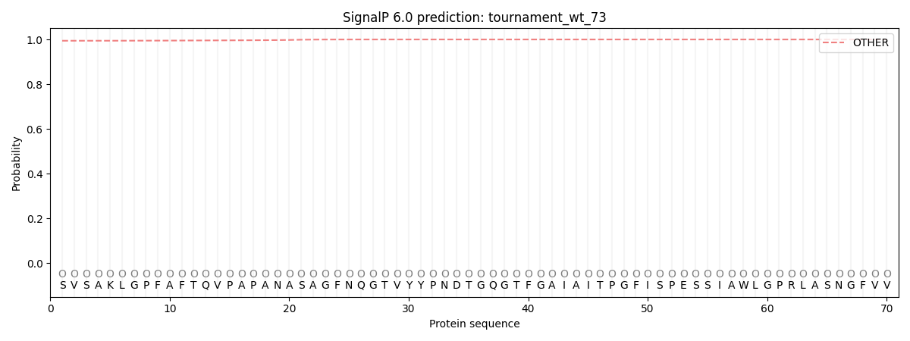 

 ***

#### tournament_wt_74

**Prediction:** Other

| Protein type   |   Other |   Signal Peptide (Sec/SPI) |   Lipoprotein signal peptide (Sec/SPII) |   TAT signal peptide (Tat/SPI) |   TAT Lipoprotein signal peptide (Tat/SPII) |   Pilin-like signal peptide (Sec/SPIII) |
|----------------|---------|----------------------------|-----------------------------------------|--------------------------------|---------------------------------------------|-----------------------------------------|
| Likelihood     |  0.9985 |                     0.0013 |                                  0.0002 |                              0 |                                           0 |                                       0 |
**Download: ** [PNG](output_tournament_wt_74_plot.png) / [EPS](output_tournament_wt_74_plot.eps) /  [Tabular](output_tournament_wt_74_plot.txt)

  

 ***

#### tournament_wt_75

**Prediction:** Other

| Protein type   |   Other |   Signal Peptide (Sec/SPI) |   Lipoprotein signal peptide (Sec/SPII) |   TAT signal peptide (Tat/SPI) |   TAT Lipoprotein signal peptide (Tat/SPII) |   Pilin-like signal peptide (Sec/SPIII) |
|----------------|---------|----------------------------|-----------------------------------------|--------------------------------|---------------------------------------------|-----------------------------------------|
| Likelihood     |  0.9994 |                     0.0006 |                                       0 |                              0 |                                           0 |                                       0 |
**Download: ** [PNG](output_tournament_wt_75_plot.png) / [EPS](output_tournament_wt_75_plot.eps) /  [Tabular](output_tournament_wt_75_plot.txt)

  

 ***

#### tournament_wt_76

**Prediction:** Other

| Protein type   |   Other |   Signal Peptide (Sec/SPI) |   Lipoprotein signal peptide (Sec/SPII) |   TAT signal peptide (Tat/SPI) |   TAT Lipoprotein signal peptide (Tat/SPII) |   Pilin-like signal peptide (Sec/SPIII) |
|----------------|---------|----------------------------|-----------------------------------------|--------------------------------|---------------------------------------------|-----------------------------------------|
| Likelihood     |  0.9962 |                     0.0036 |                                  0.0001 |                              0 |                                           0 |                                  0.0001 |
**Download: ** [PNG](output_tournament_wt_76_plot.png) / [EPS](output_tournament_wt_76_plot.eps) /  [Tabular](output_tournament_wt_76_plot.txt)

  

 ***

#### tournament_wt_77

**Prediction:** Other

| Protein type   |   Other |   Signal Peptide (Sec/SPI) |   Lipoprotein signal peptide (Sec/SPII) |   TAT signal peptide (Tat/SPI) |   TAT Lipoprotein signal peptide (Tat/SPII) |   Pilin-like signal peptide (Sec/SPIII) |
|----------------|---------|----------------------------|-----------------------------------------|--------------------------------|---------------------------------------------|-----------------------------------------|
| Likelihood     |  0.9996 |                     0.0004 |                                       0 |                              0 |                                           0 |                                       0 |
**Download: ** [PNG](output_tournament_wt_77_plot.png) / [EPS](output_tournament_wt_77_plot.eps) /  [Tabular](output_tournament_wt_77_plot.txt)

  

 ***

#### tournament_wt_78

**Prediction:** Other

| Protein type   |   Other |   Signal Peptide (Sec/SPI) |   Lipoprotein signal peptide (Sec/SPII) |   TAT signal peptide (Tat/SPI) |   TAT Lipoprotein signal peptide (Tat/SPII) |   Pilin-like signal peptide (Sec/SPIII) |
|----------------|---------|----------------------------|-----------------------------------------|--------------------------------|---------------------------------------------|-----------------------------------------|
| Likelihood     |  0.9994 |                     0.0006 |                                       0 |                              0 |                                           0 |                                       0 |
**Download: ** [PNG](output_tournament_wt_78_plot.png) / [EPS](output_tournament_wt_78_plot.eps) /  [Tabular](output_tournament_wt_78_plot.txt)

  

 ***

#### tournament_wt_79

**Prediction:** Other

| Protein type   |   Other |   Signal Peptide (Sec/SPI) |   Lipoprotein signal peptide (Sec/SPII) |   TAT signal peptide (Tat/SPI) |   TAT Lipoprotein signal peptide (Tat/SPII) |   Pilin-like signal peptide (Sec/SPIII) |
|----------------|---------|----------------------------|-----------------------------------------|--------------------------------|---------------------------------------------|-----------------------------------------|
| Likelihood     |  1.0001 |                          0 |                                       0 |                              0 |                                           0 |                                       0 |
**Download: ** [PNG](output_tournament_wt_79_plot.png) / [EPS](output_tournament_wt_79_plot.eps) /  [Tabular](output_tournament_wt_79_plot.txt)

  

 ***

#### tournament_wt_80

**Prediction:** Other

| Protein type   |   Other |   Signal Peptide (Sec/SPI) |   Lipoprotein signal peptide (Sec/SPII) |   TAT signal peptide (Tat/SPI) |   TAT Lipoprotein signal peptide (Tat/SPII) |   Pilin-like signal peptide (Sec/SPIII) |
|----------------|---------|----------------------------|-----------------------------------------|--------------------------------|---------------------------------------------|-----------------------------------------|
| Likelihood     |  1.0001 |                          0 |                                       0 |                              0 |                                           0 |                                       0 |
**Download: ** [PNG](output_tournament_wt_80_plot.png) / [EPS](output_tournament_wt_80_plot.eps) /  [Tabular](output_tournament_wt_80_plot.txt)

 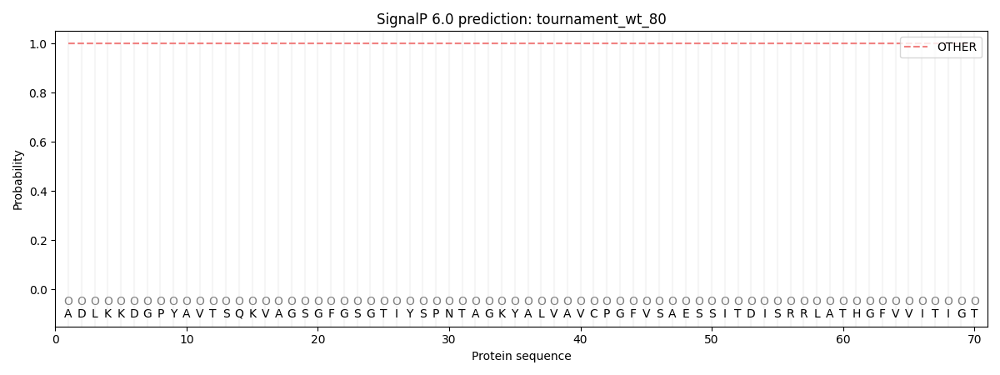 

 ***

#### tournament_wt_81

**Prediction:** Other

| Protein type   |   Other |   Signal Peptide (Sec/SPI) |   Lipoprotein signal peptide (Sec/SPII) |   TAT signal peptide (Tat/SPI) |   TAT Lipoprotein signal peptide (Tat/SPII) |   Pilin-like signal peptide (Sec/SPIII) |
|----------------|---------|----------------------------|-----------------------------------------|--------------------------------|---------------------------------------------|-----------------------------------------|
| Likelihood     |  0.9999 |                     0.0001 |                                       0 |                              0 |                                           0 |                                       0 |
**Download: ** [PNG](output_tournament_wt_81_plot.png) / [EPS](output_tournament_wt_81_plot.eps) /  [Tabular](output_tournament_wt_81_plot.txt)

  

 ***

#### tournament_wt_82

**Prediction:** Other

| Protein type   |   Other |   Signal Peptide (Sec/SPI) |   Lipoprotein signal peptide (Sec/SPII) |   TAT signal peptide (Tat/SPI) |   TAT Lipoprotein signal peptide (Tat/SPII) |   Pilin-like signal peptide (Sec/SPIII) |
|----------------|---------|----------------------------|-----------------------------------------|--------------------------------|---------------------------------------------|-----------------------------------------|
| Likelihood     |       1 |                     0.0001 |                                       0 |                              0 |                                           0 |                                       0 |
**Download: ** [PNG](output_tournament_wt_82_plot.png) / [EPS](output_tournament_wt_82_plot.eps) /  [Tabular](output_tournament_wt_82_plot.txt)

  

 ***

#### tournament_wt_83

**Prediction:** Other

| Protein type   |   Other |   Signal Peptide (Sec/SPI) |   Lipoprotein signal peptide (Sec/SPII) |   TAT signal peptide (Tat/SPI) |   TAT Lipoprotein signal peptide (Tat/SPII) |   Pilin-like signal peptide (Sec/SPIII) |
|----------------|---------|----------------------------|-----------------------------------------|--------------------------------|---------------------------------------------|-----------------------------------------|
| Likelihood     |  0.9996 |                     0.0005 |                                       0 |                              0 |                                           0 |                                       0 |
**Download: ** [PNG](output_tournament_wt_83_plot.png) / [EPS](output_tournament_wt_83_plot.eps) /  [Tabular](output_tournament_wt_83_plot.txt)

  

 ***

#### tournament_wt_84

**Prediction:** Other

| Protein type   |   Other |   Signal Peptide (Sec/SPI) |   Lipoprotein signal peptide (Sec/SPII) |   TAT signal peptide (Tat/SPI) |   TAT Lipoprotein signal peptide (Tat/SPII) |   Pilin-like signal peptide (Sec/SPIII) |
|----------------|---------|----------------------------|-----------------------------------------|--------------------------------|---------------------------------------------|-----------------------------------------|
| Likelihood     |  0.9974 |                     0.0025 |                                  0.0001 |                              0 |                                           0 |                                       0 |
**Download: ** [PNG](output_tournament_wt_84_plot.png) / [EPS](output_tournament_wt_84_plot.eps) /  [Tabular](output_tournament_wt_84_plot.txt)

  

 ***

#### tournament_wt_85

**Prediction:** Other

| Protein type   |   Other |   Signal Peptide (Sec/SPI) |   Lipoprotein signal peptide (Sec/SPII) |   TAT signal peptide (Tat/SPI) |   TAT Lipoprotein signal peptide (Tat/SPII) |   Pilin-like signal peptide (Sec/SPIII) |
|----------------|---------|----------------------------|-----------------------------------------|--------------------------------|---------------------------------------------|-----------------------------------------|
| Likelihood     |  0.9985 |                     0.0014 |                                  0.0001 |                              0 |                                           0 |                                       0 |
**Download: ** [PNG](output_tournament_wt_85_plot.png) / [EPS](output_tournament_wt_85_plot.eps) /  [Tabular](output_tournament_wt_85_plot.txt)

  

 ***

#### tournament_wt_86

**Prediction:** Other

| Protein type   |   Other |   Signal Peptide (Sec/SPI) |   Lipoprotein signal peptide (Sec/SPII) |   TAT signal peptide (Tat/SPI) |   TAT Lipoprotein signal peptide (Tat/SPII) |   Pilin-like signal peptide (Sec/SPIII) |
|----------------|---------|----------------------------|-----------------------------------------|--------------------------------|---------------------------------------------|-----------------------------------------|
| Likelihood     |  0.9999 |                     0.0001 |                                       0 |                              0 |                                           0 |                                       0 |
**Download: ** [PNG](output_tournament_wt_86_plot.png) / [EPS](output_tournament_wt_86_plot.eps) /  [Tabular](output_tournament_wt_86_plot.txt)

 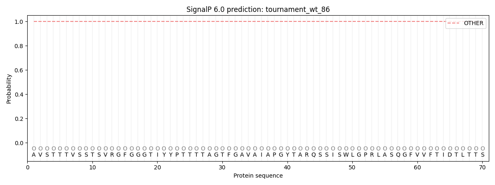 

 ***

#### tournament_wt_87

**Prediction:** Other

| Protein type   |   Other |   Signal Peptide (Sec/SPI) |   Lipoprotein signal peptide (Sec/SPII) |   TAT signal peptide (Tat/SPI) |   TAT Lipoprotein signal peptide (Tat/SPII) |   Pilin-like signal peptide (Sec/SPIII) |
|----------------|---------|----------------------------|-----------------------------------------|--------------------------------|---------------------------------------------|-----------------------------------------|
| Likelihood     |       1 |                          0 |                                       0 |                              0 |                                           0 |                                       0 |
**Download: ** [PNG](output_tournament_wt_87_plot.png) / [EPS](output_tournament_wt_87_plot.eps) /  [Tabular](output_tournament_wt_87_plot.txt)

  

 ***

#### tournament_wt_88

**Prediction:** Other

| Protein type   |   Other |   Signal Peptide (Sec/SPI) |   Lipoprotein signal peptide (Sec/SPII) |   TAT signal peptide (Tat/SPI) |   TAT Lipoprotein signal peptide (Tat/SPII) |   Pilin-like signal peptide (Sec/SPIII) |
|----------------|---------|----------------------------|-----------------------------------------|--------------------------------|---------------------------------------------|-----------------------------------------|
| Likelihood     |  0.9994 |                     0.0005 |                                  0.0001 |                              0 |                                           0 |                                       0 |
**Download: ** [PNG](output_tournament_wt_88_plot.png) / [EPS](output_tournament_wt_88_plot.eps) /  [Tabular](output_tournament_wt_88_plot.txt)

  

 ***

#### tournament_wt_89

**Prediction:** Other

| Protein type   |   Other |   Signal Peptide (Sec/SPI) |   Lipoprotein signal peptide (Sec/SPII) |   TAT signal peptide (Tat/SPI) |   TAT Lipoprotein signal peptide (Tat/SPII) |   Pilin-like signal peptide (Sec/SPIII) |
|----------------|---------|----------------------------|-----------------------------------------|--------------------------------|---------------------------------------------|-----------------------------------------|
| Likelihood     |  0.9846 |                     0.0151 |                                  0.0002 |                              0 |                                           0 |                                  0.0001 |
**Download: ** [PNG](output_tournament_wt_89_plot.png) / [EPS](output_tournament_wt_89_plot.eps) /  [Tabular](output_tournament_wt_89_plot.txt)

  

 ***

#### tournament_wt_90

**Prediction:** Other

| Protein type   |   Other |   Signal Peptide (Sec/SPI) |   Lipoprotein signal peptide (Sec/SPII) |   TAT signal peptide (Tat/SPI) |   TAT Lipoprotein signal peptide (Tat/SPII) |   Pilin-like signal peptide (Sec/SPIII) |
|----------------|---------|----------------------------|-----------------------------------------|--------------------------------|---------------------------------------------|-----------------------------------------|
| Likelihood     |  0.9994 |                     0.0006 |                                       0 |                              0 |                                           0 |                                       0 |
**Download: ** [PNG](output_tournament_wt_90_plot.png) / [EPS](output_tournament_wt_90_plot.eps) /  [Tabular](output_tournament_wt_90_plot.txt)

  

 ***

#### tournament_wt_91

**Prediction:** Other

| Protein type   |   Other |   Signal Peptide (Sec/SPI) |   Lipoprotein signal peptide (Sec/SPII) |   TAT signal peptide (Tat/SPI) |   TAT Lipoprotein signal peptide (Tat/SPII) |   Pilin-like signal peptide (Sec/SPIII) |
|----------------|---------|----------------------------|-----------------------------------------|--------------------------------|---------------------------------------------|-----------------------------------------|
| Likelihood     |   0.997 |                     0.0028 |                                  0.0001 |                              0 |                                           0 |                                       0 |
**Download: ** [PNG](output_tournament_wt_91_plot.png) / [EPS](output_tournament_wt_91_plot.eps) /  [Tabular](output_tournament_wt_91_plot.txt)

  

 ***

#### tournament_wt_92

**Prediction:** Other

| Protein type   |   Other |   Signal Peptide (Sec/SPI) |   Lipoprotein signal peptide (Sec/SPII) |   TAT signal peptide (Tat/SPI) |   TAT Lipoprotein signal peptide (Tat/SPII) |   Pilin-like signal peptide (Sec/SPIII) |
|----------------|---------|----------------------------|-----------------------------------------|--------------------------------|---------------------------------------------|-----------------------------------------|
| Likelihood     |  0.9959 |                     0.0041 |                                       0 |                              0 |                                           0 |                                       0 |
**Download: ** [PNG](output_tournament_wt_92_plot.png) / [EPS](output_tournament_wt_92_plot.eps) /  [Tabular](output_tournament_wt_92_plot.txt)

  

 ***

#### tournament_wt_93

**Prediction:** Other

| Protein type   |   Other |   Signal Peptide (Sec/SPI) |   Lipoprotein signal peptide (Sec/SPII) |   TAT signal peptide (Tat/SPI) |   TAT Lipoprotein signal peptide (Tat/SPII) |   Pilin-like signal peptide (Sec/SPIII) |
|----------------|---------|----------------------------|-----------------------------------------|--------------------------------|---------------------------------------------|-----------------------------------------|
| Likelihood     |  0.9943 |                     0.0055 |                                  0.0002 |                              0 |                                           0 |                                       0 |
**Download: ** [PNG](output_tournament_wt_93_plot.png) / [EPS](output_tournament_wt_93_plot.eps) /  [Tabular](output_tournament_wt_93_plot.txt)

  

 ***

#### tournament_wt_94

**Prediction:** Other

| Protein type   |   Other |   Signal Peptide (Sec/SPI) |   Lipoprotein signal peptide (Sec/SPII) |   TAT signal peptide (Tat/SPI) |   TAT Lipoprotein signal peptide (Tat/SPII) |   Pilin-like signal peptide (Sec/SPIII) |
|----------------|---------|----------------------------|-----------------------------------------|--------------------------------|---------------------------------------------|-----------------------------------------|
| Likelihood     |  0.9976 |                     0.0024 |                                       0 |                              0 |                                           0 |                                       0 |
**Download: ** [PNG](output_tournament_wt_94_plot.png) / [EPS](output_tournament_wt_94_plot.eps) /  [Tabular](output_tournament_wt_94_plot.txt)

  

 ***

#### tournament_wt_95

**Prediction:** Other

| Protein type   |   Other |   Signal Peptide (Sec/SPI) |   Lipoprotein signal peptide (Sec/SPII) |   TAT signal peptide (Tat/SPI) |   TAT Lipoprotein signal peptide (Tat/SPII) |   Pilin-like signal peptide (Sec/SPIII) |
|----------------|---------|----------------------------|-----------------------------------------|--------------------------------|---------------------------------------------|-----------------------------------------|
| Likelihood     |   0.999 |                      0.001 |                                       0 |                              0 |                                           0 |                                       0 |
**Download: ** [PNG](output_tournament_wt_95_plot.png) / [EPS](output_tournament_wt_95_plot.eps) /  [Tabular](output_tournament_wt_95_plot.txt)

  

 ***

#### tournament_wt_96

**Prediction:** Other

| Protein type   |   Other |   Signal Peptide (Sec/SPI) |   Lipoprotein signal peptide (Sec/SPII) |   TAT signal peptide (Tat/SPI) |   TAT Lipoprotein signal peptide (Tat/SPII) |   Pilin-like signal peptide (Sec/SPIII) |
|----------------|---------|----------------------------|-----------------------------------------|--------------------------------|---------------------------------------------|-----------------------------------------|
| Likelihood     |  0.9936 |                     0.0061 |                                  0.0002 |                              0 |                                           0 |                                  0.0001 |
**Download: ** [PNG](output_tournament_wt_96_plot.png) / [EPS](output_tournament_wt_96_plot.eps) /  [Tabular](output_tournament_wt_96_plot.txt)

  

 ***

#### tournament_wt_97

**Prediction:** Other

| Protein type   |   Other |   Signal Peptide (Sec/SPI) |   Lipoprotein signal peptide (Sec/SPII) |   TAT signal peptide (Tat/SPI) |   TAT Lipoprotein signal peptide (Tat/SPII) |   Pilin-like signal peptide (Sec/SPIII) |
|----------------|---------|----------------------------|-----------------------------------------|--------------------------------|---------------------------------------------|-----------------------------------------|
| Likelihood     |  0.9958 |                     0.0041 |                                  0.0001 |                              0 |                                           0 |                                       0 |
**Download: ** [PNG](output_tournament_wt_97_plot.png) / [EPS](output_tournament_wt_97_plot.eps) /  [Tabular](output_tournament_wt_97_plot.txt)

  

 ***

#### tournament_wt_98

**Prediction:** Other

| Protein type   |   Other |   Signal Peptide (Sec/SPI) |   Lipoprotein signal peptide (Sec/SPII) |   TAT signal peptide (Tat/SPI) |   TAT Lipoprotein signal peptide (Tat/SPII) |   Pilin-like signal peptide (Sec/SPIII) |
|----------------|---------|----------------------------|-----------------------------------------|--------------------------------|---------------------------------------------|-----------------------------------------|
| Likelihood     |  0.9929 |                     0.0069 |                                  0.0001 |                              0 |                                           0 |                                       0 |
**Download: ** [PNG](output_tournament_wt_98_plot.png) / [EPS](output_tournament_wt_98_plot.eps) /  [Tabular](output_tournament_wt_98_plot.txt)

  

 ***

#### tournament_wt_99

**Prediction:** Other

| Protein type   |   Other |   Signal Peptide (Sec/SPI) |   Lipoprotein signal peptide (Sec/SPII) |   TAT signal peptide (Tat/SPI) |   TAT Lipoprotein signal peptide (Tat/SPII) |   Pilin-like signal peptide (Sec/SPIII) |
|----------------|---------|----------------------------|-----------------------------------------|--------------------------------|---------------------------------------------|-----------------------------------------|
| Likelihood     |  1.0001 |                          0 |                                       0 |                              0 |                                           0 |                                       0 |
**Download: ** [PNG](output_tournament_wt_99_plot.png) / [EPS](output_tournament_wt_99_plot.eps) /  [Tabular](output_tournament_wt_99_plot.txt)

  

 ***

#### tournament_wt_100

**Prediction:** Other

| Protein type   |   Other |   Signal Peptide (Sec/SPI) |   Lipoprotein signal peptide (Sec/SPII) |   TAT signal peptide (Tat/SPI) |   TAT Lipoprotein signal peptide (Tat/SPII) |   Pilin-like signal peptide (Sec/SPIII) |
|----------------|---------|----------------------------|-----------------------------------------|--------------------------------|---------------------------------------------|-----------------------------------------|
| Likelihood     |       1 |                          0 |                                       0 |                              0 |                                           0 |                                       0 |
**Download: ** [PNG](output_tournament_wt_100_plot.png) / [EPS](output_tournament_wt_100_plot.eps) /  [Tabular](output_tournament_wt_100_plot.txt)

  

 ***

#### tournament_wt_101

**Prediction:** Other

| Protein type   |   Other |   Signal Peptide (Sec/SPI) |   Lipoprotein signal peptide (Sec/SPII) |   TAT signal peptide (Tat/SPI) |   TAT Lipoprotein signal peptide (Tat/SPII) |   Pilin-like signal peptide (Sec/SPIII) |
|----------------|---------|----------------------------|-----------------------------------------|--------------------------------|---------------------------------------------|-----------------------------------------|
| Likelihood     |  0.9977 |                     0.0021 |                                  0.0001 |                              0 |                                           0 |                                  0.0001 |
**Download: ** [PNG](output_tournament_wt_101_plot.png) / [EPS](output_tournament_wt_101_plot.eps) /  [Tabular](output_tournament_wt_101_plot.txt)

  

 ***

#### tournament_wt_102

**Prediction:** Other

| Protein type   |   Other |   Signal Peptide (Sec/SPI) |   Lipoprotein signal peptide (Sec/SPII) |   TAT signal peptide (Tat/SPI) |   TAT Lipoprotein signal peptide (Tat/SPII) |   Pilin-like signal peptide (Sec/SPIII) |
|----------------|---------|----------------------------|-----------------------------------------|--------------------------------|---------------------------------------------|-----------------------------------------|
| Likelihood     |  1.0001 |                          0 |                                       0 |                              0 |                                           0 |                                       0 |
**Download: ** [PNG](output_tournament_wt_102_plot.png) / [EPS](output_tournament_wt_102_plot.eps) /  [Tabular](output_tournament_wt_102_plot.txt)

  

 ***

#### tournament_wt_103

**Prediction:** Other

| Protein type   |   Other |   Signal Peptide (Sec/SPI) |   Lipoprotein signal peptide (Sec/SPII) |   TAT signal peptide (Tat/SPI) |   TAT Lipoprotein signal peptide (Tat/SPII) |   Pilin-like signal peptide (Sec/SPIII) |
|----------------|---------|----------------------------|-----------------------------------------|--------------------------------|---------------------------------------------|-----------------------------------------|
| Likelihood     |  0.9977 |                     0.0022 |                                       0 |                              0 |                                           0 |                                       0 |
**Download: ** [PNG](output_tournament_wt_103_plot.png) / [EPS](output_tournament_wt_103_plot.eps) /  [Tabular](output_tournament_wt_103_plot.txt)

  

 ***

#### tournament_wt_104

**Prediction:** Other

| Protein type   |   Other |   Signal Peptide (Sec/SPI) |   Lipoprotein signal peptide (Sec/SPII) |   TAT signal peptide (Tat/SPI) |   TAT Lipoprotein signal peptide (Tat/SPII) |   Pilin-like signal peptide (Sec/SPIII) |
|----------------|---------|----------------------------|-----------------------------------------|--------------------------------|---------------------------------------------|-----------------------------------------|
| Likelihood     |       1 |                          0 |                                       0 |                              0 |                                           0 |                                       0 |
**Download: ** [PNG](output_tournament_wt_104_plot.png) / [EPS](output_tournament_wt_104_plot.eps) /  [Tabular](output_tournament_wt_104_plot.txt)

  

 ***

#### tournament_wt_105

**Prediction:** Other

| Protein type   |   Other |   Signal Peptide (Sec/SPI) |   Lipoprotein signal peptide (Sec/SPII) |   TAT signal peptide (Tat/SPI) |   TAT Lipoprotein signal peptide (Tat/SPII) |   Pilin-like signal peptide (Sec/SPIII) |
|----------------|---------|----------------------------|-----------------------------------------|--------------------------------|---------------------------------------------|-----------------------------------------|
| Likelihood     |  0.9961 |                     0.0038 |                                  0.0001 |                              0 |                                           0 |                                       0 |
**Download: ** [PNG](output_tournament_wt_105_plot.png) / [EPS](output_tournament_wt_105_plot.eps) /  [Tabular](output_tournament_wt_105_plot.txt)

  

 ***

#### tournament_wt_106

**Prediction:** Other

| Protein type   |   Other |   Signal Peptide (Sec/SPI) |   Lipoprotein signal peptide (Sec/SPII) |   TAT signal peptide (Tat/SPI) |   TAT Lipoprotein signal peptide (Tat/SPII) |   Pilin-like signal peptide (Sec/SPIII) |
|----------------|---------|----------------------------|-----------------------------------------|--------------------------------|---------------------------------------------|-----------------------------------------|
| Likelihood     |  0.9993 |                     0.0008 |                                       0 |                              0 |                                           0 |                                       0 |
**Download: ** [PNG](output_tournament_wt_106_plot.png) / [EPS](output_tournament_wt_106_plot.eps) /  [Tabular](output_tournament_wt_106_plot.txt)

  

 ***

#### tournament_wt_107

**Prediction:** Other

| Protein type   |   Other |   Signal Peptide (Sec/SPI) |   Lipoprotein signal peptide (Sec/SPII) |   TAT signal peptide (Tat/SPI) |   TAT Lipoprotein signal peptide (Tat/SPII) |   Pilin-like signal peptide (Sec/SPIII) |
|----------------|---------|----------------------------|-----------------------------------------|--------------------------------|---------------------------------------------|-----------------------------------------|
| Likelihood     |  0.9995 |                     0.0005 |                                       0 |                              0 |                                           0 |                                       0 |
**Download: ** [PNG](output_tournament_wt_107_plot.png) / [EPS](output_tournament_wt_107_plot.eps) /  [Tabular](output_tournament_wt_107_plot.txt)

  

 ***

#### tournament_wt_108

**Prediction:** Other

| Protein type   |   Other |   Signal Peptide (Sec/SPI) |   Lipoprotein signal peptide (Sec/SPII) |   TAT signal peptide (Tat/SPI) |   TAT Lipoprotein signal peptide (Tat/SPII) |   Pilin-like signal peptide (Sec/SPIII) |
|----------------|---------|----------------------------|-----------------------------------------|--------------------------------|---------------------------------------------|-----------------------------------------|
| Likelihood     |  0.9976 |                     0.0024 |                                       0 |                              0 |                                           0 |                                       0 |
**Download: ** [PNG](output_tournament_wt_108_plot.png) / [EPS](output_tournament_wt_108_plot.eps) /  [Tabular](output_tournament_wt_108_plot.txt)

  

 ***

#### tournament_wt_109

**Prediction:** Other

| Protein type   |   Other |   Signal Peptide (Sec/SPI) |   Lipoprotein signal peptide (Sec/SPII) |   TAT signal peptide (Tat/SPI) |   TAT Lipoprotein signal peptide (Tat/SPII) |   Pilin-like signal peptide (Sec/SPIII) |
|----------------|---------|----------------------------|-----------------------------------------|--------------------------------|---------------------------------------------|-----------------------------------------|
| Likelihood     |  0.9876 |                     0.0121 |                                  0.0002 |                              0 |                                           0 |                                  0.0001 |
**Download: ** [PNG](output_tournament_wt_109_plot.png) / [EPS](output_tournament_wt_109_plot.eps) /  [Tabular](output_tournament_wt_109_plot.txt)

  

 ***

#### tournament_wt_110

**Prediction:** Other

| Protein type   |   Other |   Signal Peptide (Sec/SPI) |   Lipoprotein signal peptide (Sec/SPII) |   TAT signal peptide (Tat/SPI) |   TAT Lipoprotein signal peptide (Tat/SPII) |   Pilin-like signal peptide (Sec/SPIII) |
|----------------|---------|----------------------------|-----------------------------------------|--------------------------------|---------------------------------------------|-----------------------------------------|
| Likelihood     |   0.997 |                     0.0031 |                                       0 |                              0 |                                           0 |                                       0 |
**Download: ** [PNG](output_tournament_wt_110_plot.png) / [EPS](output_tournament_wt_110_plot.eps) /  [Tabular](output_tournament_wt_110_plot.txt)

  

 ***

#### tournament_wt_111

**Prediction:** Other

| Protein type   |   Other |   Signal Peptide (Sec/SPI) |   Lipoprotein signal peptide (Sec/SPII) |   TAT signal peptide (Tat/SPI) |   TAT Lipoprotein signal peptide (Tat/SPII) |   Pilin-like signal peptide (Sec/SPIII) |
|----------------|---------|----------------------------|-----------------------------------------|--------------------------------|---------------------------------------------|-----------------------------------------|
| Likelihood     |   0.994 |                     0.0057 |                                  0.0002 |                              0 |                                           0 |                                       0 |
**Download: ** [PNG](output_tournament_wt_111_plot.png) / [EPS](output_tournament_wt_111_plot.eps) /  [Tabular](output_tournament_wt_111_plot.txt)

  

 ***

#### tournament_wt_112

**Prediction:** Other

| Protein type   |   Other |   Signal Peptide (Sec/SPI) |   Lipoprotein signal peptide (Sec/SPII) |   TAT signal peptide (Tat/SPI) |   TAT Lipoprotein signal peptide (Tat/SPII) |   Pilin-like signal peptide (Sec/SPIII) |
|----------------|---------|----------------------------|-----------------------------------------|--------------------------------|---------------------------------------------|-----------------------------------------|
| Likelihood     |  0.9997 |                     0.0004 |                                       0 |                              0 |                                           0 |                                       0 |
**Download: ** [PNG](output_tournament_wt_112_plot.png) / [EPS](output_tournament_wt_112_plot.eps) /  [Tabular](output_tournament_wt_112_plot.txt)

  

 ***

#### tournament_wt_113

**Prediction:** Other

| Protein type   |   Other |   Signal Peptide (Sec/SPI) |   Lipoprotein signal peptide (Sec/SPII) |   TAT signal peptide (Tat/SPI) |   TAT Lipoprotein signal peptide (Tat/SPII) |   Pilin-like signal peptide (Sec/SPIII) |
|----------------|---------|----------------------------|-----------------------------------------|--------------------------------|---------------------------------------------|-----------------------------------------|
| Likelihood     |  0.9903 |                     0.0097 |                                       0 |                              0 |                                           0 |                                       0 |
**Download: ** [PNG](output_tournament_wt_113_plot.png) / [EPS](output_tournament_wt_113_plot.eps) /  [Tabular](output_tournament_wt_113_plot.txt)

  

 ***

#### tournament_wt_114

**Prediction:** Other

| Protein type   |   Other |   Signal Peptide (Sec/SPI) |   Lipoprotein signal peptide (Sec/SPII) |   TAT signal peptide (Tat/SPI) |   TAT Lipoprotein signal peptide (Tat/SPII) |   Pilin-like signal peptide (Sec/SPIII) |
|----------------|---------|----------------------------|-----------------------------------------|--------------------------------|---------------------------------------------|-----------------------------------------|
| Likelihood     |  0.9974 |                     0.0026 |                                       0 |                              0 |                                           0 |                                       0 |
**Download: ** [PNG](output_tournament_wt_114_plot.png) / [EPS](output_tournament_wt_114_plot.eps) /  [Tabular](output_tournament_wt_114_plot.txt)

  

 ***

#### tournament_wt_115

**Prediction:** Other

| Protein type   |   Other |   Signal Peptide (Sec/SPI) |   Lipoprotein signal peptide (Sec/SPII) |   TAT signal peptide (Tat/SPI) |   TAT Lipoprotein signal peptide (Tat/SPII) |   Pilin-like signal peptide (Sec/SPIII) |
|----------------|---------|----------------------------|-----------------------------------------|--------------------------------|---------------------------------------------|-----------------------------------------|
| Likelihood     |  0.9927 |                     0.0073 |                                       0 |                              0 |                                           0 |                                       0 |
**Download: ** [PNG](output_tournament_wt_115_plot.png) / [EPS](output_tournament_wt_115_plot.eps) /  [Tabular](output_tournament_wt_115_plot.txt)

  

 ***

#### tournament_wt_116

**Prediction:** Other

| Protein type   |   Other |   Signal Peptide (Sec/SPI) |   Lipoprotein signal peptide (Sec/SPII) |   TAT signal peptide (Tat/SPI) |   TAT Lipoprotein signal peptide (Tat/SPII) |   Pilin-like signal peptide (Sec/SPIII) |
|----------------|---------|----------------------------|-----------------------------------------|--------------------------------|---------------------------------------------|-----------------------------------------|
| Likelihood     |       1 |                          0 |                                       0 |                              0 |                                           0 |                                       0 |
**Download: ** [PNG](output_tournament_wt_116_plot.png) / [EPS](output_tournament_wt_116_plot.eps) /  [Tabular](output_tournament_wt_116_plot.txt)

  

 ***

#### tournament_wt_117

**Prediction:** Other

| Protein type   |   Other |   Signal Peptide (Sec/SPI) |   Lipoprotein signal peptide (Sec/SPII) |   TAT signal peptide (Tat/SPI) |   TAT Lipoprotein signal peptide (Tat/SPII) |   Pilin-like signal peptide (Sec/SPIII) |
|----------------|---------|----------------------------|-----------------------------------------|--------------------------------|---------------------------------------------|-----------------------------------------|
| Likelihood     |  0.9979 |                     0.0021 |                                       0 |                              0 |                                           0 |                                       0 |
**Download: ** [PNG](output_tournament_wt_117_plot.png) / [EPS](output_tournament_wt_117_plot.eps) /  [Tabular](output_tournament_wt_117_plot.txt)

  

 ***

#### tournament_wt_118

**Prediction:** Other

| Protein type   |   Other |   Signal Peptide (Sec/SPI) |   Lipoprotein signal peptide (Sec/SPII) |   TAT signal peptide (Tat/SPI) |   TAT Lipoprotein signal peptide (Tat/SPII) |   Pilin-like signal peptide (Sec/SPIII) |
|----------------|---------|----------------------------|-----------------------------------------|--------------------------------|---------------------------------------------|-----------------------------------------|
| Likelihood     |  0.9995 |                     0.0005 |                                       0 |                              0 |                                           0 |                                       0 |
**Download: ** [PNG](output_tournament_wt_118_plot.png) / [EPS](output_tournament_wt_118_plot.eps) /  [Tabular](output_tournament_wt_118_plot.txt)

  

 ***

#### tournament_wt_119

**Prediction:** Other

| Protein type   |   Other |   Signal Peptide (Sec/SPI) |   Lipoprotein signal peptide (Sec/SPII) |   TAT signal peptide (Tat/SPI) |   TAT Lipoprotein signal peptide (Tat/SPII) |   Pilin-like signal peptide (Sec/SPIII) |
|----------------|---------|----------------------------|-----------------------------------------|--------------------------------|---------------------------------------------|-----------------------------------------|
| Likelihood     |  0.9964 |                     0.0036 |                                  0.0001 |                              0 |                                           0 |                                       0 |
**Download: ** [PNG](output_tournament_wt_119_plot.png) / [EPS](output_tournament_wt_119_plot.eps) /  [Tabular](output_tournament_wt_119_plot.txt)

  

 ***

#### tournament_wt_120

**Prediction:** Other

| Protein type   |   Other |   Signal Peptide (Sec/SPI) |   Lipoprotein signal peptide (Sec/SPII) |   TAT signal peptide (Tat/SPI) |   TAT Lipoprotein signal peptide (Tat/SPII) |   Pilin-like signal peptide (Sec/SPIII) |
|----------------|---------|----------------------------|-----------------------------------------|--------------------------------|---------------------------------------------|-----------------------------------------|
| Likelihood     |  0.9955 |                     0.0043 |                                  0.0002 |                              0 |                                           0 |                                       0 |
**Download: ** [PNG](output_tournament_wt_120_plot.png) / [EPS](output_tournament_wt_120_plot.eps) /  [Tabular](output_tournament_wt_120_plot.txt)

  

 ***

#### tournament_wt_121

**Prediction:** Other

| Protein type   |   Other |   Signal Peptide (Sec/SPI) |   Lipoprotein signal peptide (Sec/SPII) |   TAT signal peptide (Tat/SPI) |   TAT Lipoprotein signal peptide (Tat/SPII) |   Pilin-like signal peptide (Sec/SPIII) |
|----------------|---------|----------------------------|-----------------------------------------|--------------------------------|---------------------------------------------|-----------------------------------------|
| Likelihood     |   0.999 |                     0.0009 |                                  0.0001 |                              0 |                                           0 |                                       0 |
**Download: ** [PNG](output_tournament_wt_121_plot.png) / [EPS](output_tournament_wt_121_plot.eps) /  [Tabular](output_tournament_wt_121_plot.txt)

  

 ***

#### tournament_wt_122

**Prediction:** Other

| Protein type   |   Other |   Signal Peptide (Sec/SPI) |   Lipoprotein signal peptide (Sec/SPII) |   TAT signal peptide (Tat/SPI) |   TAT Lipoprotein signal peptide (Tat/SPII) |   Pilin-like signal peptide (Sec/SPIII) |
|----------------|---------|----------------------------|-----------------------------------------|--------------------------------|---------------------------------------------|-----------------------------------------|
| Likelihood     |  0.9986 |                     0.0014 |                                       0 |                              0 |                                           0 |                                       0 |
**Download: ** [PNG](output_tournament_wt_122_plot.png) / [EPS](output_tournament_wt_122_plot.eps) /  [Tabular](output_tournament_wt_122_plot.txt)

  

 ***

#### tournament_wt_123

**Prediction:** Other

| Protein type   |   Other |   Signal Peptide (Sec/SPI) |   Lipoprotein signal peptide (Sec/SPII) |   TAT signal peptide (Tat/SPI) |   TAT Lipoprotein signal peptide (Tat/SPII) |   Pilin-like signal peptide (Sec/SPIII) |
|----------------|---------|----------------------------|-----------------------------------------|--------------------------------|---------------------------------------------|-----------------------------------------|
| Likelihood     |   0.997 |                     0.0029 |                                       0 |                              0 |                                           0 |                                       0 |
**Download: ** [PNG](output_tournament_wt_123_plot.png) / [EPS](output_tournament_wt_123_plot.eps) /  [Tabular](output_tournament_wt_123_plot.txt)

  

 ***

#### tournament_wt_124

**Prediction:** Other

| Protein type   |   Other |   Signal Peptide (Sec/SPI) |   Lipoprotein signal peptide (Sec/SPII) |   TAT signal peptide (Tat/SPI) |   TAT Lipoprotein signal peptide (Tat/SPII) |   Pilin-like signal peptide (Sec/SPIII) |
|----------------|---------|----------------------------|-----------------------------------------|--------------------------------|---------------------------------------------|-----------------------------------------|
| Likelihood     |  0.9957 |                     0.0039 |                                  0.0003 |                              0 |                                           0 |                                  0.0001 |
**Download: ** [PNG](output_tournament_wt_124_plot.png) / [EPS](output_tournament_wt_124_plot.eps) /  [Tabular](output_tournament_wt_124_plot.txt)

  

 ***

#### tournament_wt_125

**Prediction:** Other

| Protein type   |   Other |   Signal Peptide (Sec/SPI) |   Lipoprotein signal peptide (Sec/SPII) |   TAT signal peptide (Tat/SPI) |   TAT Lipoprotein signal peptide (Tat/SPII) |   Pilin-like signal peptide (Sec/SPIII) |
|----------------|---------|----------------------------|-----------------------------------------|--------------------------------|---------------------------------------------|-----------------------------------------|
| Likelihood     |       1 |                          0 |                                       0 |                              0 |                                           0 |                                       0 |
**Download: ** [PNG](output_tournament_wt_125_plot.png) / [EPS](output_tournament_wt_125_plot.eps) /  [Tabular](output_tournament_wt_125_plot.txt)

  

 ***

#### tournament_wt_126

**Prediction:** Other

| Protein type   |   Other |   Signal Peptide (Sec/SPI) |   Lipoprotein signal peptide (Sec/SPII) |   TAT signal peptide (Tat/SPI) |   TAT Lipoprotein signal peptide (Tat/SPII) |   Pilin-like signal peptide (Sec/SPIII) |
|----------------|---------|----------------------------|-----------------------------------------|--------------------------------|---------------------------------------------|-----------------------------------------|
| Likelihood     |  0.9998 |                     0.0003 |                                       0 |                              0 |                                           0 |                                       0 |
**Download: ** [PNG](output_tournament_wt_126_plot.png) / [EPS](output_tournament_wt_126_plot.eps) /  [Tabular](output_tournament_wt_126_plot.txt)

  

 ***

#### tournament_wt_127

**Prediction:** Other

| Protein type   |   Other |   Signal Peptide (Sec/SPI) |   Lipoprotein signal peptide (Sec/SPII) |   TAT signal peptide (Tat/SPI) |   TAT Lipoprotein signal peptide (Tat/SPII) |   Pilin-like signal peptide (Sec/SPIII) |
|----------------|---------|----------------------------|-----------------------------------------|--------------------------------|---------------------------------------------|-----------------------------------------|
| Likelihood     |  0.9872 |                     0.0126 |                                  0.0001 |                              0 |                                           0 |                                       0 |
**Download: ** [PNG](output_tournament_wt_127_plot.png) / [EPS](output_tournament_wt_127_plot.eps) /  [Tabular](output_tournament_wt_127_plot.txt)

  

 ***

#### tournament_wt_128

**Prediction:** Other

| Protein type   |   Other |   Signal Peptide (Sec/SPI) |   Lipoprotein signal peptide (Sec/SPII) |   TAT signal peptide (Tat/SPI) |   TAT Lipoprotein signal peptide (Tat/SPII) |   Pilin-like signal peptide (Sec/SPIII) |
|----------------|---------|----------------------------|-----------------------------------------|--------------------------------|---------------------------------------------|-----------------------------------------|
| Likelihood     |   0.999 |                      0.001 |                                       0 |                              0 |                                           0 |                                       0 |
**Download: ** [PNG](output_tournament_wt_128_plot.png) / [EPS](output_tournament_wt_128_plot.eps) /  [Tabular](output_tournament_wt_128_plot.txt)

  

 ***

#### tournament_wt_129

**Prediction:** Other

| Protein type   |   Other |   Signal Peptide (Sec/SPI) |   Lipoprotein signal peptide (Sec/SPII) |   TAT signal peptide (Tat/SPI) |   TAT Lipoprotein signal peptide (Tat/SPII) |   Pilin-like signal peptide (Sec/SPIII) |
|----------------|---------|----------------------------|-----------------------------------------|--------------------------------|---------------------------------------------|-----------------------------------------|
| Likelihood     |  0.9986 |                     0.0014 |                                       0 |                              0 |                                           0 |                                       0 |
**Download: ** [PNG](output_tournament_wt_129_plot.png) / [EPS](output_tournament_wt_129_plot.eps) /  [Tabular](output_tournament_wt_129_plot.txt)

  

 ***

#### tournament_wt_130

**Prediction:** Other

| Protein type   |   Other |   Signal Peptide (Sec/SPI) |   Lipoprotein signal peptide (Sec/SPII) |   TAT signal peptide (Tat/SPI) |   TAT Lipoprotein signal peptide (Tat/SPII) |   Pilin-like signal peptide (Sec/SPIII) |
|----------------|---------|----------------------------|-----------------------------------------|--------------------------------|---------------------------------------------|-----------------------------------------|
| Likelihood     |  0.9961 |                     0.0036 |                                  0.0002 |                              0 |                                           0 |                                       0 |
**Download: ** [PNG](output_tournament_wt_130_plot.png) / [EPS](output_tournament_wt_130_plot.eps) /  [Tabular](output_tournament_wt_130_plot.txt)

  

 ***

#### tournament_wt_131

**Prediction:** Other

| Protein type   |   Other |   Signal Peptide (Sec/SPI) |   Lipoprotein signal peptide (Sec/SPII) |   TAT signal peptide (Tat/SPI) |   TAT Lipoprotein signal peptide (Tat/SPII) |   Pilin-like signal peptide (Sec/SPIII) |
|----------------|---------|----------------------------|-----------------------------------------|--------------------------------|---------------------------------------------|-----------------------------------------|
| Likelihood     |  0.9987 |                     0.0013 |                                  0.0001 |                              0 |                                           0 |                                       0 |
**Download: ** [PNG](output_tournament_wt_131_plot.png) / [EPS](output_tournament_wt_131_plot.eps) /  [Tabular](output_tournament_wt_131_plot.txt)

 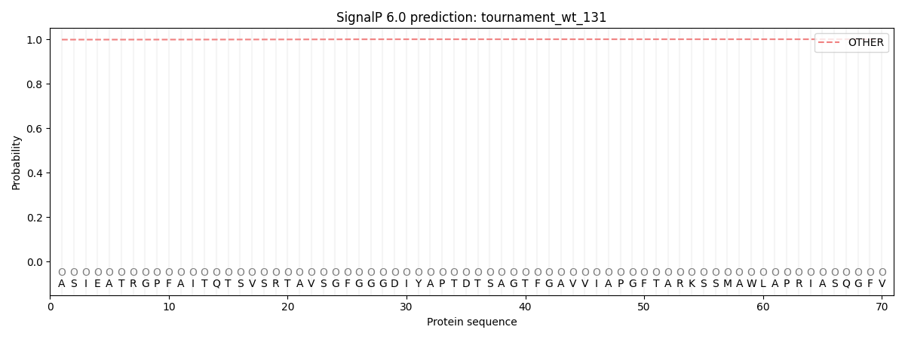 

 ***

#### tournament_wt_132

**Prediction:** Other

| Protein type   |   Other |   Signal Peptide (Sec/SPI) |   Lipoprotein signal peptide (Sec/SPII) |   TAT signal peptide (Tat/SPI) |   TAT Lipoprotein signal peptide (Tat/SPII) |   Pilin-like signal peptide (Sec/SPIII) |
|----------------|---------|----------------------------|-----------------------------------------|--------------------------------|---------------------------------------------|-----------------------------------------|
| Likelihood     |  0.9993 |                     0.0007 |                                       0 |                              0 |                                           0 |                                       0 |
**Download: ** [PNG](output_tournament_wt_132_plot.png) / [EPS](output_tournament_wt_132_plot.eps) /  [Tabular](output_tournament_wt_132_plot.txt)

  

 ***

#### tournament_wt_133

**Prediction:** Other

| Protein type   |   Other |   Signal Peptide (Sec/SPI) |   Lipoprotein signal peptide (Sec/SPII) |   TAT signal peptide (Tat/SPI) |   TAT Lipoprotein signal peptide (Tat/SPII) |   Pilin-like signal peptide (Sec/SPIII) |
|----------------|---------|----------------------------|-----------------------------------------|--------------------------------|---------------------------------------------|-----------------------------------------|
| Likelihood     |  0.9999 |                     0.0001 |                                       0 |                              0 |                                           0 |                                       0 |
**Download: ** [PNG](output_tournament_wt_133_plot.png) / [EPS](output_tournament_wt_133_plot.eps) /  [Tabular](output_tournament_wt_133_plot.txt)

  

 ***

#### tournament_wt_134

**Prediction:** Other

| Protein type   |   Other |   Signal Peptide (Sec/SPI) |   Lipoprotein signal peptide (Sec/SPII) |   TAT signal peptide (Tat/SPI) |   TAT Lipoprotein signal peptide (Tat/SPII) |   Pilin-like signal peptide (Sec/SPIII) |
|----------------|---------|----------------------------|-----------------------------------------|--------------------------------|---------------------------------------------|-----------------------------------------|
| Likelihood     |  1.0001 |                          0 |                                       0 |                              0 |                                           0 |                                       0 |
**Download: ** [PNG](output_tournament_wt_134_plot.png) / [EPS](output_tournament_wt_134_plot.eps) /  [Tabular](output_tournament_wt_134_plot.txt)

  

 ***

#### tournament_wt_135

**Prediction:** Other

| Protein type   |   Other |   Signal Peptide (Sec/SPI) |   Lipoprotein signal peptide (Sec/SPII) |   TAT signal peptide (Tat/SPI) |   TAT Lipoprotein signal peptide (Tat/SPII) |   Pilin-like signal peptide (Sec/SPIII) |
|----------------|---------|----------------------------|-----------------------------------------|--------------------------------|---------------------------------------------|-----------------------------------------|
| Likelihood     |  0.9999 |                     0.0001 |                                       0 |                              0 |                                           0 |                                       0 |
**Download: ** [PNG](output_tournament_wt_135_plot.png) / [EPS](output_tournament_wt_135_plot.eps) /  [Tabular](output_tournament_wt_135_plot.txt)

  

 ***

#### tournament_wt_136

**Prediction:** Other

| Protein type   |   Other |   Signal Peptide (Sec/SPI) |   Lipoprotein signal peptide (Sec/SPII) |   TAT signal peptide (Tat/SPI) |   TAT Lipoprotein signal peptide (Tat/SPII) |   Pilin-like signal peptide (Sec/SPIII) |
|----------------|---------|----------------------------|-----------------------------------------|--------------------------------|---------------------------------------------|-----------------------------------------|
| Likelihood     |  0.9887 |                     0.0112 |                                       0 |                              0 |                                           0 |                                       0 |
**Download: ** [PNG](output_tournament_wt_136_plot.png) / [EPS](output_tournament_wt_136_plot.eps) /  [Tabular](output_tournament_wt_136_plot.txt)

  

 ***

#### tournament_wt_137

**Prediction:** Other

| Protein type   |   Other |   Signal Peptide (Sec/SPI) |   Lipoprotein signal peptide (Sec/SPII) |   TAT signal peptide (Tat/SPI) |   TAT Lipoprotein signal peptide (Tat/SPII) |   Pilin-like signal peptide (Sec/SPIII) |
|----------------|---------|----------------------------|-----------------------------------------|--------------------------------|---------------------------------------------|-----------------------------------------|
| Likelihood     |       1 |                          0 |                                       0 |                              0 |                                           0 |                                       0 |
**Download: ** [PNG](output_tournament_wt_137_plot.png) / [EPS](output_tournament_wt_137_plot.eps) /  [Tabular](output_tournament_wt_137_plot.txt)

  

 ***

#### tournament_wt_138

**Prediction:** Other

| Protein type   |   Other |   Signal Peptide (Sec/SPI) |   Lipoprotein signal peptide (Sec/SPII) |   TAT signal peptide (Tat/SPI) |   TAT Lipoprotein signal peptide (Tat/SPII) |   Pilin-like signal peptide (Sec/SPIII) |
|----------------|---------|----------------------------|-----------------------------------------|--------------------------------|---------------------------------------------|-----------------------------------------|
| Likelihood     |       1 |                          0 |                                       0 |                              0 |                                           0 |                                       0 |
**Download: ** [PNG](output_tournament_wt_138_plot.png) / [EPS](output_tournament_wt_138_plot.eps) /  [Tabular](output_tournament_wt_138_plot.txt)

 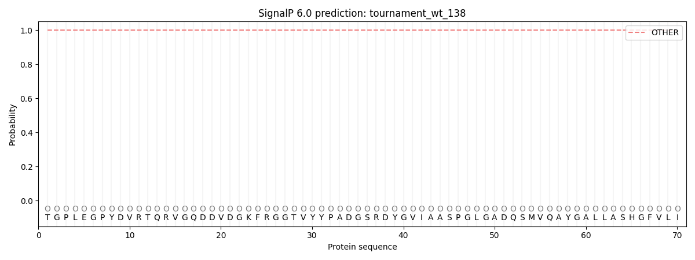 

 ***

#### tournament_wt_139

**Prediction:** Other

| Protein type   |   Other |   Signal Peptide (Sec/SPI) |   Lipoprotein signal peptide (Sec/SPII) |   TAT signal peptide (Tat/SPI) |   TAT Lipoprotein signal peptide (Tat/SPII) |   Pilin-like signal peptide (Sec/SPIII) |
|----------------|---------|----------------------------|-----------------------------------------|--------------------------------|---------------------------------------------|-----------------------------------------|
| Likelihood     |       1 |                     0.0001 |                                       0 |                              0 |                                           0 |                                       0 |
**Download: ** [PNG](output_tournament_wt_139_plot.png) / [EPS](output_tournament_wt_139_plot.eps) /  [Tabular](output_tournament_wt_139_plot.txt)

  

 ***

#### tournament_wt_140

**Prediction:** Other

| Protein type   |   Other |   Signal Peptide (Sec/SPI) |   Lipoprotein signal peptide (Sec/SPII) |   TAT signal peptide (Tat/SPI) |   TAT Lipoprotein signal peptide (Tat/SPII) |   Pilin-like signal peptide (Sec/SPIII) |
|----------------|---------|----------------------------|-----------------------------------------|--------------------------------|---------------------------------------------|-----------------------------------------|
| Likelihood     |  0.9846 |                      0.015 |                                  0.0002 |                         0.0001 |                                           0 |                                  0.0001 |
**Download: ** [PNG](output_tournament_wt_140_plot.png) / [EPS](output_tournament_wt_140_plot.eps) /  [Tabular](output_tournament_wt_140_plot.txt)

 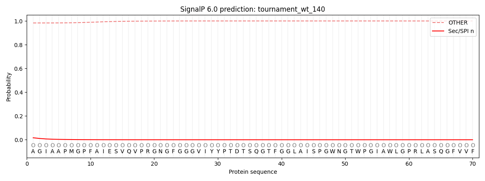 

 ***

#### tournament_wt_141

**Prediction:** Other

| Protein type   |   Other |   Signal Peptide (Sec/SPI) |   Lipoprotein signal peptide (Sec/SPII) |   TAT signal peptide (Tat/SPI) |   TAT Lipoprotein signal peptide (Tat/SPII) |   Pilin-like signal peptide (Sec/SPIII) |
|----------------|---------|----------------------------|-----------------------------------------|--------------------------------|---------------------------------------------|-----------------------------------------|
| Likelihood     |  0.9953 |                     0.0047 |                                       0 |                              0 |                                           0 |                                       0 |
**Download: ** [PNG](output_tournament_wt_141_plot.png) / [EPS](output_tournament_wt_141_plot.eps) /  [Tabular](output_tournament_wt_141_plot.txt)

  

 ***

#### tournament_wt_142

**Prediction:** Other

| Protein type   |   Other |   Signal Peptide (Sec/SPI) |   Lipoprotein signal peptide (Sec/SPII) |   TAT signal peptide (Tat/SPI) |   TAT Lipoprotein signal peptide (Tat/SPII) |   Pilin-like signal peptide (Sec/SPIII) |
|----------------|---------|----------------------------|-----------------------------------------|--------------------------------|---------------------------------------------|-----------------------------------------|
| Likelihood     |  0.9912 |                     0.0086 |                                  0.0001 |                              0 |                                           0 |                                  0.0001 |
**Download: ** [PNG](output_tournament_wt_142_plot.png) / [EPS](output_tournament_wt_142_plot.eps) /  [Tabular](output_tournament_wt_142_plot.txt)

  

 ***

#### tournament_wt_143

**Prediction:** Other

| Protein type   |   Other |   Signal Peptide (Sec/SPI) |   Lipoprotein signal peptide (Sec/SPII) |   TAT signal peptide (Tat/SPI) |   TAT Lipoprotein signal peptide (Tat/SPII) |   Pilin-like signal peptide (Sec/SPIII) |
|----------------|---------|----------------------------|-----------------------------------------|--------------------------------|---------------------------------------------|-----------------------------------------|
| Likelihood     |  0.9993 |                     0.0007 |                                       0 |                              0 |                                           0 |                                       0 |
**Download: ** [PNG](output_tournament_wt_143_plot.png) / [EPS](output_tournament_wt_143_plot.eps) /  [Tabular](output_tournament_wt_143_plot.txt)

 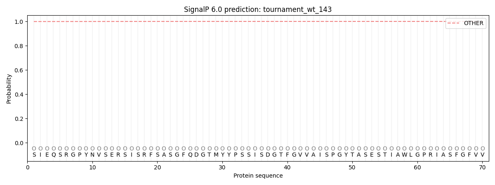 

 ***

#### tournament_wt_144

**Prediction:** Other

| Protein type   |   Other |   Signal Peptide (Sec/SPI) |   Lipoprotein signal peptide (Sec/SPII) |   TAT signal peptide (Tat/SPI) |   TAT Lipoprotein signal peptide (Tat/SPII) |   Pilin-like signal peptide (Sec/SPIII) |
|----------------|---------|----------------------------|-----------------------------------------|--------------------------------|---------------------------------------------|-----------------------------------------|
| Likelihood     |  0.9899 |                     0.0098 |                                  0.0003 |                              0 |                                           0 |                                       0 |
**Download: ** [PNG](output_tournament_wt_144_plot.png) / [EPS](output_tournament_wt_144_plot.eps) /  [Tabular](output_tournament_wt_144_plot.txt)

  

 ***

#### tournament_wt_145

**Prediction:** Other

| Protein type   |   Other |   Signal Peptide (Sec/SPI) |   Lipoprotein signal peptide (Sec/SPII) |   TAT signal peptide (Tat/SPI) |   TAT Lipoprotein signal peptide (Tat/SPII) |   Pilin-like signal peptide (Sec/SPIII) |
|----------------|---------|----------------------------|-----------------------------------------|--------------------------------|---------------------------------------------|-----------------------------------------|
| Likelihood     |  0.9999 |                     0.0001 |                                       0 |                              0 |                                           0 |                                       0 |
**Download: ** [PNG](output_tournament_wt_145_plot.png) / [EPS](output_tournament_wt_145_plot.eps) /  [Tabular](output_tournament_wt_145_plot.txt)

  

 ***

#### tournament_wt_146

**Prediction:** Other

| Protein type   |   Other |   Signal Peptide (Sec/SPI) |   Lipoprotein signal peptide (Sec/SPII) |   TAT signal peptide (Tat/SPI) |   TAT Lipoprotein signal peptide (Tat/SPII) |   Pilin-like signal peptide (Sec/SPIII) |
|----------------|---------|----------------------------|-----------------------------------------|--------------------------------|---------------------------------------------|-----------------------------------------|
| Likelihood     |   0.996 |                      0.004 |                                       0 |                              0 |                                           0 |                                       0 |
**Download: ** [PNG](output_tournament_wt_146_plot.png) / [EPS](output_tournament_wt_146_plot.eps) /  [Tabular](output_tournament_wt_146_plot.txt)

  

 ***

#### tournament_wt_147

**Prediction:** Other

| Protein type   |   Other |   Signal Peptide (Sec/SPI) |   Lipoprotein signal peptide (Sec/SPII) |   TAT signal peptide (Tat/SPI) |   TAT Lipoprotein signal peptide (Tat/SPII) |   Pilin-like signal peptide (Sec/SPIII) |
|----------------|---------|----------------------------|-----------------------------------------|--------------------------------|---------------------------------------------|-----------------------------------------|
| Likelihood     |  0.9999 |                     0.0001 |                                       0 |                              0 |                                           0 |                                       0 |
**Download: ** [PNG](output_tournament_wt_147_plot.png) / [EPS](output_tournament_wt_147_plot.eps) /  [Tabular](output_tournament_wt_147_plot.txt)

  

 ***

#### tournament_wt_148

**Prediction:** Other

| Protein type   |   Other |   Signal Peptide (Sec/SPI) |   Lipoprotein signal peptide (Sec/SPII) |   TAT signal peptide (Tat/SPI) |   TAT Lipoprotein signal peptide (Tat/SPII) |   Pilin-like signal peptide (Sec/SPIII) |
|----------------|---------|----------------------------|-----------------------------------------|--------------------------------|---------------------------------------------|-----------------------------------------|
| Likelihood     |       1 |                          0 |                                       0 |                              0 |                                           0 |                                       0 |
**Download: ** [PNG](output_tournament_wt_148_plot.png) / [EPS](output_tournament_wt_148_plot.eps) /  [Tabular](output_tournament_wt_148_plot.txt)

  

 ***

#### tournament_wt_149

**Prediction:** Other

| Protein type   |   Other |   Signal Peptide (Sec/SPI) |   Lipoprotein signal peptide (Sec/SPII) |   TAT signal peptide (Tat/SPI) |   TAT Lipoprotein signal peptide (Tat/SPII) |   Pilin-like signal peptide (Sec/SPIII) |
|----------------|---------|----------------------------|-----------------------------------------|--------------------------------|---------------------------------------------|-----------------------------------------|
| Likelihood     |  0.9995 |                     0.0005 |                                       0 |                              0 |                                           0 |                                       0 |
**Download: ** [PNG](output_tournament_wt_149_plot.png) / [EPS](output_tournament_wt_149_plot.eps) /  [Tabular](output_tournament_wt_149_plot.txt)

  

 ***

#### tournament_wt_150

**Prediction:** Other

| Protein type   |   Other |   Signal Peptide (Sec/SPI) |   Lipoprotein signal peptide (Sec/SPII) |   TAT signal peptide (Tat/SPI) |   TAT Lipoprotein signal peptide (Tat/SPII) |   Pilin-like signal peptide (Sec/SPIII) |
|----------------|---------|----------------------------|-----------------------------------------|--------------------------------|---------------------------------------------|-----------------------------------------|
| Likelihood     |       1 |                          0 |                                       0 |                              0 |                                           0 |                                       0 |
**Download: ** [PNG](output_tournament_wt_150_plot.png) / [EPS](output_tournament_wt_150_plot.eps) /  [Tabular](output_tournament_wt_150_plot.txt)

  

 ***

#### tournament_wt_151

**Prediction:** Other

| Protein type   |   Other |   Signal Peptide (Sec/SPI) |   Lipoprotein signal peptide (Sec/SPII) |   TAT signal peptide (Tat/SPI) |   TAT Lipoprotein signal peptide (Tat/SPII) |   Pilin-like signal peptide (Sec/SPIII) |
|----------------|---------|----------------------------|-----------------------------------------|--------------------------------|---------------------------------------------|-----------------------------------------|
| Likelihood     |  0.9953 |                     0.0047 |                                       0 |                              0 |                                           0 |                                       0 |
**Download: ** [PNG](output_tournament_wt_151_plot.png) / [EPS](output_tournament_wt_151_plot.eps) /  [Tabular](output_tournament_wt_151_plot.txt)

  

 ***

#### tournament_wt_152

**Prediction:** Other

| Protein type   |   Other |   Signal Peptide (Sec/SPI) |   Lipoprotein signal peptide (Sec/SPII) |   TAT signal peptide (Tat/SPI) |   TAT Lipoprotein signal peptide (Tat/SPII) |   Pilin-like signal peptide (Sec/SPIII) |
|----------------|---------|----------------------------|-----------------------------------------|--------------------------------|---------------------------------------------|-----------------------------------------|
| Likelihood     |   0.998 |                      0.002 |                                       0 |                              0 |                                           0 |                                       0 |
**Download: ** [PNG](output_tournament_wt_152_plot.png) / [EPS](output_tournament_wt_152_plot.eps) /  [Tabular](output_tournament_wt_152_plot.txt)

  

 ***

#### tournament_wt_153

**Prediction:** Other

| Protein type   |   Other |   Signal Peptide (Sec/SPI) |   Lipoprotein signal peptide (Sec/SPII) |   TAT signal peptide (Tat/SPI) |   TAT Lipoprotein signal peptide (Tat/SPII) |   Pilin-like signal peptide (Sec/SPIII) |
|----------------|---------|----------------------------|-----------------------------------------|--------------------------------|---------------------------------------------|-----------------------------------------|
| Likelihood     |  0.9654 |                     0.0304 |                                  0.0037 |                         0.0001 |                                      0.0001 |                                  0.0002 |
**Download: ** [PNG](output_tournament_wt_153_plot.png) / [EPS](output_tournament_wt_153_plot.eps) /  [Tabular](output_tournament_wt_153_plot.txt)

  

 ***

#### tournament_wt_154

**Prediction:** Other

| Protein type   |   Other |   Signal Peptide (Sec/SPI) |   Lipoprotein signal peptide (Sec/SPII) |   TAT signal peptide (Tat/SPI) |   TAT Lipoprotein signal peptide (Tat/SPII) |   Pilin-like signal peptide (Sec/SPIII) |
|----------------|---------|----------------------------|-----------------------------------------|--------------------------------|---------------------------------------------|-----------------------------------------|
| Likelihood     |  0.9983 |                     0.0017 |                                  0.0001 |                              0 |                                           0 |                                       0 |
**Download: ** [PNG](output_tournament_wt_154_plot.png) / [EPS](output_tournament_wt_154_plot.eps) /  [Tabular](output_tournament_wt_154_plot.txt)

  

 ***

#### tournament_wt_155

**Prediction:** Other

| Protein type   |   Other |   Signal Peptide (Sec/SPI) |   Lipoprotein signal peptide (Sec/SPII) |   TAT signal peptide (Tat/SPI) |   TAT Lipoprotein signal peptide (Tat/SPII) |   Pilin-like signal peptide (Sec/SPIII) |
|----------------|---------|----------------------------|-----------------------------------------|--------------------------------|---------------------------------------------|-----------------------------------------|
| Likelihood     |  0.9949 |                     0.0051 |                                       0 |                              0 |                                           0 |                                       0 |
**Download: ** [PNG](output_tournament_wt_155_plot.png) / [EPS](output_tournament_wt_155_plot.eps) /  [Tabular](output_tournament_wt_155_plot.txt)

  

 ***

#### tournament_wt_156

**Prediction:** Other

| Protein type   |   Other |   Signal Peptide (Sec/SPI) |   Lipoprotein signal peptide (Sec/SPII) |   TAT signal peptide (Tat/SPI) |   TAT Lipoprotein signal peptide (Tat/SPII) |   Pilin-like signal peptide (Sec/SPIII) |
|----------------|---------|----------------------------|-----------------------------------------|--------------------------------|---------------------------------------------|-----------------------------------------|
| Likelihood     |   0.999 |                     0.0009 |                                       0 |                              0 |                                           0 |                                       0 |
**Download: ** [PNG](output_tournament_wt_156_plot.png) / [EPS](output_tournament_wt_156_plot.eps) /  [Tabular](output_tournament_wt_156_plot.txt)

  

 ***

#### tournament_wt_157

**Prediction:** Other

| Protein type   |   Other |   Signal Peptide (Sec/SPI) |   Lipoprotein signal peptide (Sec/SPII) |   TAT signal peptide (Tat/SPI) |   TAT Lipoprotein signal peptide (Tat/SPII) |   Pilin-like signal peptide (Sec/SPIII) |
|----------------|---------|----------------------------|-----------------------------------------|--------------------------------|---------------------------------------------|-----------------------------------------|
| Likelihood     |  0.9998 |                     0.0003 |                                       0 |                              0 |                                           0 |                                       0 |
**Download: ** [PNG](output_tournament_wt_157_plot.png) / [EPS](output_tournament_wt_157_plot.eps) /  [Tabular](output_tournament_wt_157_plot.txt)

  

 ***

#### tournament_wt_158

**Prediction:** Other

| Protein type   |   Other |   Signal Peptide (Sec/SPI) |   Lipoprotein signal peptide (Sec/SPII) |   TAT signal peptide (Tat/SPI) |   TAT Lipoprotein signal peptide (Tat/SPII) |   Pilin-like signal peptide (Sec/SPIII) |
|----------------|---------|----------------------------|-----------------------------------------|--------------------------------|---------------------------------------------|-----------------------------------------|
| Likelihood     |  1.0001 |                          0 |                                       0 |                              0 |                                           0 |                                       0 |
**Download: ** [PNG](output_tournament_wt_158_plot.png) / [EPS](output_tournament_wt_158_plot.eps) /  [Tabular](output_tournament_wt_158_plot.txt)

  

 ***

#### tournament_wt_159

**Prediction:** Other

| Protein type   |   Other |   Signal Peptide (Sec/SPI) |   Lipoprotein signal peptide (Sec/SPII) |   TAT signal peptide (Tat/SPI) |   TAT Lipoprotein signal peptide (Tat/SPII) |   Pilin-like signal peptide (Sec/SPIII) |
|----------------|---------|----------------------------|-----------------------------------------|--------------------------------|---------------------------------------------|-----------------------------------------|
| Likelihood     |   0.995 |                     0.0047 |                                  0.0002 |                              0 |                                           0 |                                       0 |
**Download: ** [PNG](output_tournament_wt_159_plot.png) / [EPS](output_tournament_wt_159_plot.eps) /  [Tabular](output_tournament_wt_159_plot.txt)

  

 ***

#### tournament_wt_160

**Prediction:** Other

| Protein type   |   Other |   Signal Peptide (Sec/SPI) |   Lipoprotein signal peptide (Sec/SPII) |   TAT signal peptide (Tat/SPI) |   TAT Lipoprotein signal peptide (Tat/SPII) |   Pilin-like signal peptide (Sec/SPIII) |
|----------------|---------|----------------------------|-----------------------------------------|--------------------------------|---------------------------------------------|-----------------------------------------|
| Likelihood     |  0.9997 |                     0.0004 |                                       0 |                              0 |                                           0 |                                       0 |
**Download: ** [PNG](output_tournament_wt_160_plot.png) / [EPS](output_tournament_wt_160_plot.eps) /  [Tabular](output_tournament_wt_160_plot.txt)

  

 ***

#### tournament_wt_161

**Prediction:** Other

| Protein type   |   Other |   Signal Peptide (Sec/SPI) |   Lipoprotein signal peptide (Sec/SPII) |   TAT signal peptide (Tat/SPI) |   TAT Lipoprotein signal peptide (Tat/SPII) |   Pilin-like signal peptide (Sec/SPIII) |
|----------------|---------|----------------------------|-----------------------------------------|--------------------------------|---------------------------------------------|-----------------------------------------|
| Likelihood     |  0.9998 |                     0.0003 |                                       0 |                              0 |                                           0 |                                       0 |
**Download: ** [PNG](output_tournament_wt_161_plot.png) / [EPS](output_tournament_wt_161_plot.eps) /  [Tabular](output_tournament_wt_161_plot.txt)

  

 ***

#### tournament_wt_162

**Prediction:** Other

| Protein type   |   Other |   Signal Peptide (Sec/SPI) |   Lipoprotein signal peptide (Sec/SPII) |   TAT signal peptide (Tat/SPI) |   TAT Lipoprotein signal peptide (Tat/SPII) |   Pilin-like signal peptide (Sec/SPIII) |
|----------------|---------|----------------------------|-----------------------------------------|--------------------------------|---------------------------------------------|-----------------------------------------|
| Likelihood     |  0.9998 |                     0.0002 |                                       0 |                              0 |                                           0 |                                       0 |
**Download: ** [PNG](output_tournament_wt_162_plot.png) / [EPS](output_tournament_wt_162_plot.eps) /  [Tabular](output_tournament_wt_162_plot.txt)

  

 ***

#### tournament_wt_163

**Prediction:** Other

| Protein type   |   Other |   Signal Peptide (Sec/SPI) |   Lipoprotein signal peptide (Sec/SPII) |   TAT signal peptide (Tat/SPI) |   TAT Lipoprotein signal peptide (Tat/SPII) |   Pilin-like signal peptide (Sec/SPIII) |
|----------------|---------|----------------------------|-----------------------------------------|--------------------------------|---------------------------------------------|-----------------------------------------|
| Likelihood     |   0.981 |                     0.0189 |                                       0 |                              0 |                                           0 |                                       0 |
**Download: ** [PNG](output_tournament_wt_163_plot.png) / [EPS](output_tournament_wt_163_plot.eps) /  [Tabular](output_tournament_wt_163_plot.txt)

 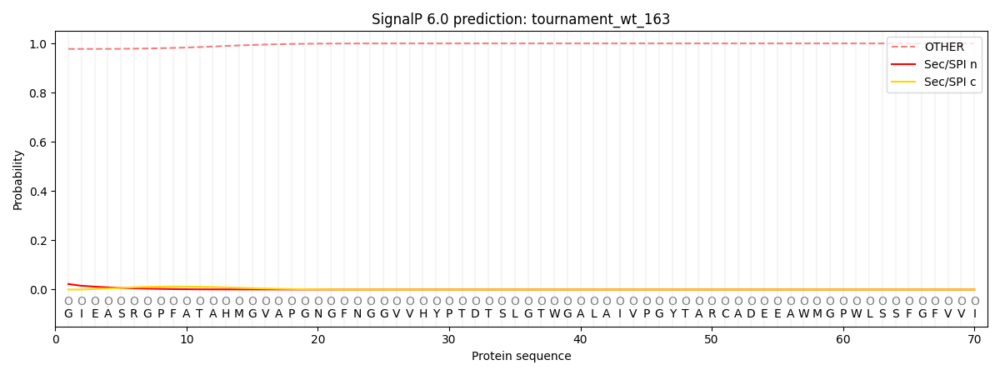 

 ***

#### tournament_wt_164

**Prediction:** Other

| Protein type   |   Other |   Signal Peptide (Sec/SPI) |   Lipoprotein signal peptide (Sec/SPII) |   TAT signal peptide (Tat/SPI) |   TAT Lipoprotein signal peptide (Tat/SPII) |   Pilin-like signal peptide (Sec/SPIII) |
|----------------|---------|----------------------------|-----------------------------------------|--------------------------------|---------------------------------------------|-----------------------------------------|
| Likelihood     |  0.9984 |                     0.0016 |                                       0 |                              0 |                                           0 |                                       0 |
**Download: ** [PNG](output_tournament_wt_164_plot.png) / [EPS](output_tournament_wt_164_plot.eps) /  [Tabular](output_tournament_wt_164_plot.txt)

  

 ***

#### tournament_wt_165

**Prediction:** Other

| Protein type   |   Other |   Signal Peptide (Sec/SPI) |   Lipoprotein signal peptide (Sec/SPII) |   TAT signal peptide (Tat/SPI) |   TAT Lipoprotein signal peptide (Tat/SPII) |   Pilin-like signal peptide (Sec/SPIII) |
|----------------|---------|----------------------------|-----------------------------------------|--------------------------------|---------------------------------------------|-----------------------------------------|
| Likelihood     |  0.9981 |                     0.0019 |                                       0 |                              0 |                                           0 |                                       0 |
**Download: ** [PNG](output_tournament_wt_165_plot.png) / [EPS](output_tournament_wt_165_plot.eps) /  [Tabular](output_tournament_wt_165_plot.txt)

  

 ***

#### tournament_wt_166

**Prediction:** Other

| Protein type   |   Other |   Signal Peptide (Sec/SPI) |   Lipoprotein signal peptide (Sec/SPII) |   TAT signal peptide (Tat/SPI) |   TAT Lipoprotein signal peptide (Tat/SPII) |   Pilin-like signal peptide (Sec/SPIII) |
|----------------|---------|----------------------------|-----------------------------------------|--------------------------------|---------------------------------------------|-----------------------------------------|
| Likelihood     |  0.9914 |                     0.0083 |                                  0.0002 |                              0 |                                           0 |                                  0.0001 |
**Download: ** [PNG](output_tournament_wt_166_plot.png) / [EPS](output_tournament_wt_166_plot.eps) /  [Tabular](output_tournament_wt_166_plot.txt)

  

 ***

#### tournament_wt_167

**Prediction:** Other

| Protein type   |   Other |   Signal Peptide (Sec/SPI) |   Lipoprotein signal peptide (Sec/SPII) |   TAT signal peptide (Tat/SPI) |   TAT Lipoprotein signal peptide (Tat/SPII) |   Pilin-like signal peptide (Sec/SPIII) |
|----------------|---------|----------------------------|-----------------------------------------|--------------------------------|---------------------------------------------|-----------------------------------------|
| Likelihood     |  1.0001 |                          0 |                                       0 |                              0 |                                           0 |                                       0 |
**Download: ** [PNG](output_tournament_wt_167_plot.png) / [EPS](output_tournament_wt_167_plot.eps) /  [Tabular](output_tournament_wt_167_plot.txt)

  

 ***

#### tournament_wt_168

**Prediction:** Other

| Protein type   |   Other |   Signal Peptide (Sec/SPI) |   Lipoprotein signal peptide (Sec/SPII) |   TAT signal peptide (Tat/SPI) |   TAT Lipoprotein signal peptide (Tat/SPII) |   Pilin-like signal peptide (Sec/SPIII) |
|----------------|---------|----------------------------|-----------------------------------------|--------------------------------|---------------------------------------------|-----------------------------------------|
| Likelihood     |       1 |                          0 |                                       0 |                              0 |                                           0 |                                       0 |
**Download: ** [PNG](output_tournament_wt_168_plot.png) / [EPS](output_tournament_wt_168_plot.eps) /  [Tabular](output_tournament_wt_168_plot.txt)

  

 ***

#### tournament_wt_169

**Prediction:** Other

| Protein type   |   Other |   Signal Peptide (Sec/SPI) |   Lipoprotein signal peptide (Sec/SPII) |   TAT signal peptide (Tat/SPI) |   TAT Lipoprotein signal peptide (Tat/SPII) |   Pilin-like signal peptide (Sec/SPIII) |
|----------------|---------|----------------------------|-----------------------------------------|--------------------------------|---------------------------------------------|-----------------------------------------|
| Likelihood     |  0.9998 |                     0.0002 |                                       0 |                              0 |                                           0 |                                       0 |
**Download: ** [PNG](output_tournament_wt_169_plot.png) / [EPS](output_tournament_wt_169_plot.eps) /  [Tabular](output_tournament_wt_169_plot.txt)

  

 ***

#### tournament_wt_170

**Prediction:** Other

| Protein type   |   Other |   Signal Peptide (Sec/SPI) |   Lipoprotein signal peptide (Sec/SPII) |   TAT signal peptide (Tat/SPI) |   TAT Lipoprotein signal peptide (Tat/SPII) |   Pilin-like signal peptide (Sec/SPIII) |
|----------------|---------|----------------------------|-----------------------------------------|--------------------------------|---------------------------------------------|-----------------------------------------|
| Likelihood     |  0.9992 |                     0.0008 |                                       0 |                              0 |                                           0 |                                       0 |
**Download: ** [PNG](output_tournament_wt_170_plot.png) / [EPS](output_tournament_wt_170_plot.eps) /  [Tabular](output_tournament_wt_170_plot.txt)

  

 ***

#### tournament_wt_171

**Prediction:** Other

| Protein type   |   Other |   Signal Peptide (Sec/SPI) |   Lipoprotein signal peptide (Sec/SPII) |   TAT signal peptide (Tat/SPI) |   TAT Lipoprotein signal peptide (Tat/SPII) |   Pilin-like signal peptide (Sec/SPIII) |
|----------------|---------|----------------------------|-----------------------------------------|--------------------------------|---------------------------------------------|-----------------------------------------|
| Likelihood     |       1 |                     0.0001 |                                       0 |                              0 |                                           0 |                                       0 |
**Download: ** [PNG](output_tournament_wt_171_plot.png) / [EPS](output_tournament_wt_171_plot.eps) /  [Tabular](output_tournament_wt_171_plot.txt)

  

 ***

#### tournament_wt_172

**Prediction:** Other

| Protein type   |   Other |   Signal Peptide (Sec/SPI) |   Lipoprotein signal peptide (Sec/SPII) |   TAT signal peptide (Tat/SPI) |   TAT Lipoprotein signal peptide (Tat/SPII) |   Pilin-like signal peptide (Sec/SPIII) |
|----------------|---------|----------------------------|-----------------------------------------|--------------------------------|---------------------------------------------|-----------------------------------------|
| Likelihood     |  0.9977 |                     0.0023 |                                       0 |                              0 |                                           0 |                                       0 |
**Download: ** [PNG](output_tournament_wt_172_plot.png) / [EPS](output_tournament_wt_172_plot.eps) /  [Tabular](output_tournament_wt_172_plot.txt)

  

 ***

#### tournament_wt_173

**Prediction:** Other

| Protein type   |   Other |   Signal Peptide (Sec/SPI) |   Lipoprotein signal peptide (Sec/SPII) |   TAT signal peptide (Tat/SPI) |   TAT Lipoprotein signal peptide (Tat/SPII) |   Pilin-like signal peptide (Sec/SPIII) |
|----------------|---------|----------------------------|-----------------------------------------|--------------------------------|---------------------------------------------|-----------------------------------------|
| Likelihood     |  0.9999 |                     0.0002 |                                       0 |                              0 |                                           0 |                                       0 |
**Download: ** [PNG](output_tournament_wt_173_plot.png) / [EPS](output_tournament_wt_173_plot.eps) /  [Tabular](output_tournament_wt_173_plot.txt)

  

 ***

#### tournament_wt_174

**Prediction:** Other

| Protein type   |   Other |   Signal Peptide (Sec/SPI) |   Lipoprotein signal peptide (Sec/SPII) |   TAT signal peptide (Tat/SPI) |   TAT Lipoprotein signal peptide (Tat/SPII) |   Pilin-like signal peptide (Sec/SPIII) |
|----------------|---------|----------------------------|-----------------------------------------|--------------------------------|---------------------------------------------|-----------------------------------------|
| Likelihood     |  0.9999 |                     0.0002 |                                       0 |                              0 |                                           0 |                                       0 |
**Download: ** [PNG](output_tournament_wt_174_plot.png) / [EPS](output_tournament_wt_174_plot.eps) /  [Tabular](output_tournament_wt_174_plot.txt)

  

 ***

#### tournament_wt_175

**Prediction:** Other

| Protein type   |   Other |   Signal Peptide (Sec/SPI) |   Lipoprotein signal peptide (Sec/SPII) |   TAT signal peptide (Tat/SPI) |   TAT Lipoprotein signal peptide (Tat/SPII) |   Pilin-like signal peptide (Sec/SPIII) |
|----------------|---------|----------------------------|-----------------------------------------|--------------------------------|---------------------------------------------|-----------------------------------------|
| Likelihood     |  0.9993 |                     0.0007 |                                       0 |                              0 |                                           0 |                                       0 |
**Download: ** [PNG](output_tournament_wt_175_plot.png) / [EPS](output_tournament_wt_175_plot.eps) /  [Tabular](output_tournament_wt_175_plot.txt)

  

 ***

#### tournament_wt_176

**Prediction:** Other

| Protein type   |   Other |   Signal Peptide (Sec/SPI) |   Lipoprotein signal peptide (Sec/SPII) |   TAT signal peptide (Tat/SPI) |   TAT Lipoprotein signal peptide (Tat/SPII) |   Pilin-like signal peptide (Sec/SPIII) |
|----------------|---------|----------------------------|-----------------------------------------|--------------------------------|---------------------------------------------|-----------------------------------------|
| Likelihood     |  0.9993 |                     0.0007 |                                       0 |                              0 |                                           0 |                                       0 |
**Download: ** [PNG](output_tournament_wt_176_plot.png) / [EPS](output_tournament_wt_176_plot.eps) /  [Tabular](output_tournament_wt_176_plot.txt)

  

 ***

#### tournament_wt_177

**Prediction:** Other

| Protein type   |   Other |   Signal Peptide (Sec/SPI) |   Lipoprotein signal peptide (Sec/SPII) |   TAT signal peptide (Tat/SPI) |   TAT Lipoprotein signal peptide (Tat/SPII) |   Pilin-like signal peptide (Sec/SPIII) |
|----------------|---------|----------------------------|-----------------------------------------|--------------------------------|---------------------------------------------|-----------------------------------------|
| Likelihood     |  0.9675 |                     0.0322 |                                  0.0001 |                         0.0001 |                                           0 |                                  0.0001 |
**Download: ** [PNG](output_tournament_wt_177_plot.png) / [EPS](output_tournament_wt_177_plot.eps) /  [Tabular](output_tournament_wt_177_plot.txt)

 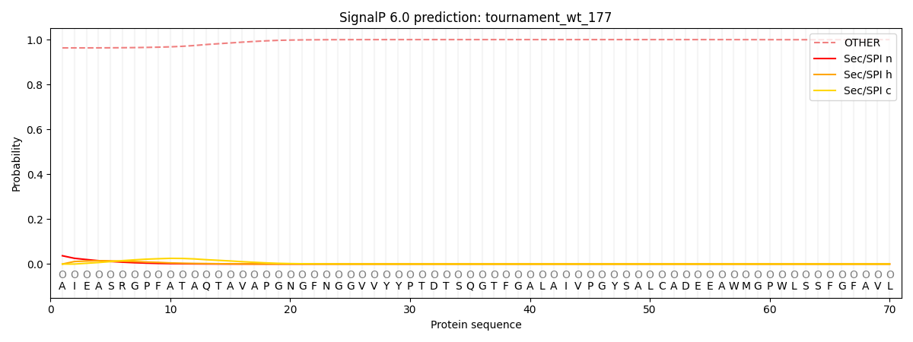 

 ***

#### tournament_wt_178

**Prediction:** Other

| Protein type   |   Other |   Signal Peptide (Sec/SPI) |   Lipoprotein signal peptide (Sec/SPII) |   TAT signal peptide (Tat/SPI) |   TAT Lipoprotein signal peptide (Tat/SPII) |   Pilin-like signal peptide (Sec/SPIII) |
|----------------|---------|----------------------------|-----------------------------------------|--------------------------------|---------------------------------------------|-----------------------------------------|
| Likelihood     |  0.9978 |                     0.0022 |                                       0 |                              0 |                                           0 |                                       0 |
**Download: ** [PNG](output_tournament_wt_178_plot.png) / [EPS](output_tournament_wt_178_plot.eps) /  [Tabular](output_tournament_wt_178_plot.txt)

  

 ***

#### tournament_wt_179

**Prediction:** Other

| Protein type   |   Other |   Signal Peptide (Sec/SPI) |   Lipoprotein signal peptide (Sec/SPII) |   TAT signal peptide (Tat/SPI) |   TAT Lipoprotein signal peptide (Tat/SPII) |   Pilin-like signal peptide (Sec/SPIII) |
|----------------|---------|----------------------------|-----------------------------------------|--------------------------------|---------------------------------------------|-----------------------------------------|
| Likelihood     |       1 |                          0 |                                       0 |                              0 |                                           0 |                                       0 |
**Download: ** [PNG](output_tournament_wt_179_plot.png) / [EPS](output_tournament_wt_179_plot.eps) /  [Tabular](output_tournament_wt_179_plot.txt)

 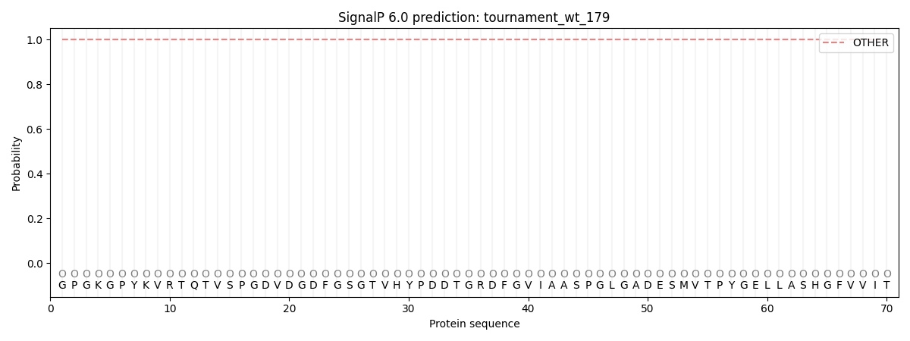 

 ***

#### tournament_wt_180

**Prediction:** Other

| Protein type   |   Other |   Signal Peptide (Sec/SPI) |   Lipoprotein signal peptide (Sec/SPII) |   TAT signal peptide (Tat/SPI) |   TAT Lipoprotein signal peptide (Tat/SPII) |   Pilin-like signal peptide (Sec/SPIII) |
|----------------|---------|----------------------------|-----------------------------------------|--------------------------------|---------------------------------------------|-----------------------------------------|
| Likelihood     |  0.9938 |                     0.0061 |                                       0 |                              0 |                                           0 |                                       0 |
**Download: ** [PNG](output_tournament_wt_180_plot.png) / [EPS](output_tournament_wt_180_plot.eps) /  [Tabular](output_tournament_wt_180_plot.txt)

  

 ***

#### tournament_wt_181

**Prediction:** Other

| Protein type   |   Other |   Signal Peptide (Sec/SPI) |   Lipoprotein signal peptide (Sec/SPII) |   TAT signal peptide (Tat/SPI) |   TAT Lipoprotein signal peptide (Tat/SPII) |   Pilin-like signal peptide (Sec/SPIII) |
|----------------|---------|----------------------------|-----------------------------------------|--------------------------------|---------------------------------------------|-----------------------------------------|
| Likelihood     |  0.9998 |                     0.0002 |                                       0 |                              0 |                                           0 |                                       0 |
**Download: ** [PNG](output_tournament_wt_181_plot.png) / [EPS](output_tournament_wt_181_plot.eps) /  [Tabular](output_tournament_wt_181_plot.txt)

  

 ***

#### tournament_wt_182

**Prediction:** Other

| Protein type   |   Other |   Signal Peptide (Sec/SPI) |   Lipoprotein signal peptide (Sec/SPII) |   TAT signal peptide (Tat/SPI) |   TAT Lipoprotein signal peptide (Tat/SPII) |   Pilin-like signal peptide (Sec/SPIII) |
|----------------|---------|----------------------------|-----------------------------------------|--------------------------------|---------------------------------------------|-----------------------------------------|
| Likelihood     |       1 |                          0 |                                       0 |                              0 |                                           0 |                                       0 |
**Download: ** [PNG](output_tournament_wt_182_plot.png) / [EPS](output_tournament_wt_182_plot.eps) /  [Tabular](output_tournament_wt_182_plot.txt)

  

 ***

#### tournament_wt_183

**Prediction:** Other

| Protein type   |   Other |   Signal Peptide (Sec/SPI) |   Lipoprotein signal peptide (Sec/SPII) |   TAT signal peptide (Tat/SPI) |   TAT Lipoprotein signal peptide (Tat/SPII) |   Pilin-like signal peptide (Sec/SPIII) |
|----------------|---------|----------------------------|-----------------------------------------|--------------------------------|---------------------------------------------|-----------------------------------------|
| Likelihood     |  0.9989 |                      0.001 |                                       0 |                              0 |                                           0 |                                       0 |
**Download: ** [PNG](output_tournament_wt_183_plot.png) / [EPS](output_tournament_wt_183_plot.eps) /  [Tabular](output_tournament_wt_183_plot.txt)

  

 ***

#### tournament_wt_184

**Prediction:** Other

| Protein type   |   Other |   Signal Peptide (Sec/SPI) |   Lipoprotein signal peptide (Sec/SPII) |   TAT signal peptide (Tat/SPI) |   TAT Lipoprotein signal peptide (Tat/SPII) |   Pilin-like signal peptide (Sec/SPIII) |
|----------------|---------|----------------------------|-----------------------------------------|--------------------------------|---------------------------------------------|-----------------------------------------|
| Likelihood     |  0.9942 |                     0.0055 |                                  0.0002 |                              0 |                                           0 |                                       0 |
**Download: ** [PNG](output_tournament_wt_184_plot.png) / [EPS](output_tournament_wt_184_plot.eps) /  [Tabular](output_tournament_wt_184_plot.txt)

  

 ***

#### tournament_wt_185

**Prediction:** Other

| Protein type   |   Other |   Signal Peptide (Sec/SPI) |   Lipoprotein signal peptide (Sec/SPII) |   TAT signal peptide (Tat/SPI) |   TAT Lipoprotein signal peptide (Tat/SPII) |   Pilin-like signal peptide (Sec/SPIII) |
|----------------|---------|----------------------------|-----------------------------------------|--------------------------------|---------------------------------------------|-----------------------------------------|
| Likelihood     |  0.9978 |                     0.0022 |                                       0 |                              0 |                                           0 |                                       0 |
**Download: ** [PNG](output_tournament_wt_185_plot.png) / [EPS](output_tournament_wt_185_plot.eps) /  [Tabular](output_tournament_wt_185_plot.txt)

 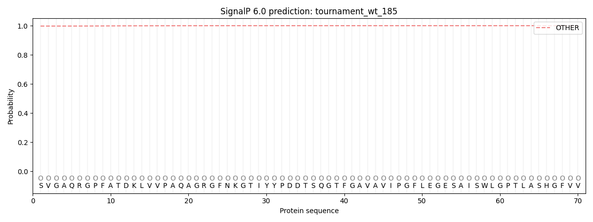 

 ***

#### tournament_wt_186

**Prediction:** Other

| Protein type   |   Other |   Signal Peptide (Sec/SPI) |   Lipoprotein signal peptide (Sec/SPII) |   TAT signal peptide (Tat/SPI) |   TAT Lipoprotein signal peptide (Tat/SPII) |   Pilin-like signal peptide (Sec/SPIII) |
|----------------|---------|----------------------------|-----------------------------------------|--------------------------------|---------------------------------------------|-----------------------------------------|
| Likelihood     |  0.9988 |                     0.0011 |                                       0 |                              0 |                                           0 |                                       0 |
**Download: ** [PNG](output_tournament_wt_186_plot.png) / [EPS](output_tournament_wt_186_plot.eps) /  [Tabular](output_tournament_wt_186_plot.txt)

  

 ***

#### tournament_wt_187

**Prediction:** Other

| Protein type   |   Other |   Signal Peptide (Sec/SPI) |   Lipoprotein signal peptide (Sec/SPII) |   TAT signal peptide (Tat/SPI) |   TAT Lipoprotein signal peptide (Tat/SPII) |   Pilin-like signal peptide (Sec/SPIII) |
|----------------|---------|----------------------------|-----------------------------------------|--------------------------------|---------------------------------------------|-----------------------------------------|
| Likelihood     |   0.999 |                      0.001 |                                       0 |                              0 |                                           0 |                                       0 |
**Download: ** [PNG](output_tournament_wt_187_plot.png) / [EPS](output_tournament_wt_187_plot.eps) /  [Tabular](output_tournament_wt_187_plot.txt)

  

 ***

#### tournament_wt_188

**Prediction:** Other

| Protein type   |   Other |   Signal Peptide (Sec/SPI) |   Lipoprotein signal peptide (Sec/SPII) |   TAT signal peptide (Tat/SPI) |   TAT Lipoprotein signal peptide (Tat/SPII) |   Pilin-like signal peptide (Sec/SPIII) |
|----------------|---------|----------------------------|-----------------------------------------|--------------------------------|---------------------------------------------|-----------------------------------------|
| Likelihood     |  0.9945 |                     0.0054 |                                       0 |                              0 |                                           0 |                                       0 |
**Download: ** [PNG](output_tournament_wt_188_plot.png) / [EPS](output_tournament_wt_188_plot.eps) /  [Tabular](output_tournament_wt_188_plot.txt)

 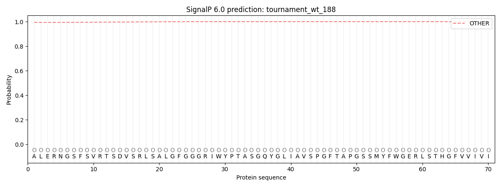 

 ***

#### tournament_wt_189

**Prediction:** Other

| Protein type   |   Other |   Signal Peptide (Sec/SPI) |   Lipoprotein signal peptide (Sec/SPII) |   TAT signal peptide (Tat/SPI) |   TAT Lipoprotein signal peptide (Tat/SPII) |   Pilin-like signal peptide (Sec/SPIII) |
|----------------|---------|----------------------------|-----------------------------------------|--------------------------------|---------------------------------------------|-----------------------------------------|
| Likelihood     |  0.9546 |                     0.0448 |                                  0.0003 |                         0.0001 |                                      0.0001 |                                  0.0002 |
**Download: ** [PNG](output_tournament_wt_189_plot.png) / [EPS](output_tournament_wt_189_plot.eps) /  [Tabular](output_tournament_wt_189_plot.txt)

  

 ***

#### tournament_wt_190

**Prediction:** Other

| Protein type   |   Other |   Signal Peptide (Sec/SPI) |   Lipoprotein signal peptide (Sec/SPII) |   TAT signal peptide (Tat/SPI) |   TAT Lipoprotein signal peptide (Tat/SPII) |   Pilin-like signal peptide (Sec/SPIII) |
|----------------|---------|----------------------------|-----------------------------------------|--------------------------------|---------------------------------------------|-----------------------------------------|
| Likelihood     |  0.9991 |                     0.0009 |                                       0 |                              0 |                                           0 |                                       0 |
**Download: ** [PNG](output_tournament_wt_190_plot.png) / [EPS](output_tournament_wt_190_plot.eps) /  [Tabular](output_tournament_wt_190_plot.txt)

  

 ***

#### tournament_wt_191

**Prediction:** Other

| Protein type   |   Other |   Signal Peptide (Sec/SPI) |   Lipoprotein signal peptide (Sec/SPII) |   TAT signal peptide (Tat/SPI) |   TAT Lipoprotein signal peptide (Tat/SPII) |   Pilin-like signal peptide (Sec/SPIII) |
|----------------|---------|----------------------------|-----------------------------------------|--------------------------------|---------------------------------------------|-----------------------------------------|
| Likelihood     |  0.9998 |                     0.0002 |                                       0 |                              0 |                                           0 |                                       0 |
**Download: ** [PNG](output_tournament_wt_191_plot.png) / [EPS](output_tournament_wt_191_plot.eps) /  [Tabular](output_tournament_wt_191_plot.txt)

  

 ***

#### tournament_wt_192

**Prediction:** Other

| Protein type   |   Other |   Signal Peptide (Sec/SPI) |   Lipoprotein signal peptide (Sec/SPII) |   TAT signal peptide (Tat/SPI) |   TAT Lipoprotein signal peptide (Tat/SPII) |   Pilin-like signal peptide (Sec/SPIII) |
|----------------|---------|----------------------------|-----------------------------------------|--------------------------------|---------------------------------------------|-----------------------------------------|
| Likelihood     |       1 |                     0.0001 |                                       0 |                              0 |                                           0 |                                       0 |
**Download: ** [PNG](output_tournament_wt_192_plot.png) / [EPS](output_tournament_wt_192_plot.eps) /  [Tabular](output_tournament_wt_192_plot.txt)

  

 ***

#### tournament_wt_193

**Prediction:** Other

| Protein type   |   Other |   Signal Peptide (Sec/SPI) |   Lipoprotein signal peptide (Sec/SPII) |   TAT signal peptide (Tat/SPI) |   TAT Lipoprotein signal peptide (Tat/SPII) |   Pilin-like signal peptide (Sec/SPIII) |
|----------------|---------|----------------------------|-----------------------------------------|--------------------------------|---------------------------------------------|-----------------------------------------|
| Likelihood     |  1.0001 |                          0 |                                       0 |                              0 |                                           0 |                                       0 |
**Download: ** [PNG](output_tournament_wt_193_plot.png) / [EPS](output_tournament_wt_193_plot.eps) /  [Tabular](output_tournament_wt_193_plot.txt)

  

 ***

#### tournament_wt_194

**Prediction:** Other

| Protein type   |   Other |   Signal Peptide (Sec/SPI) |   Lipoprotein signal peptide (Sec/SPII) |   TAT signal peptide (Tat/SPI) |   TAT Lipoprotein signal peptide (Tat/SPII) |   Pilin-like signal peptide (Sec/SPIII) |
|----------------|---------|----------------------------|-----------------------------------------|--------------------------------|---------------------------------------------|-----------------------------------------|
| Likelihood     |       1 |                          0 |                                       0 |                              0 |                                           0 |                                       0 |
**Download: ** [PNG](output_tournament_wt_194_plot.png) / [EPS](output_tournament_wt_194_plot.eps) /  [Tabular](output_tournament_wt_194_plot.txt)

  

 ***

#### tournament_wt_195

**Prediction:** Other

| Protein type   |   Other |   Signal Peptide (Sec/SPI) |   Lipoprotein signal peptide (Sec/SPII) |   TAT signal peptide (Tat/SPI) |   TAT Lipoprotein signal peptide (Tat/SPII) |   Pilin-like signal peptide (Sec/SPIII) |
|----------------|---------|----------------------------|-----------------------------------------|--------------------------------|---------------------------------------------|-----------------------------------------|
| Likelihood     |  0.9978 |                     0.0021 |                                  0.0001 |                              0 |                                           0 |                                       0 |
**Download: ** [PNG](output_tournament_wt_195_plot.png) / [EPS](output_tournament_wt_195_plot.eps) /  [Tabular](output_tournament_wt_195_plot.txt)

  

 ***

#### tournament_wt_196

**Prediction:** Other

| Protein type   |   Other |   Signal Peptide (Sec/SPI) |   Lipoprotein signal peptide (Sec/SPII) |   TAT signal peptide (Tat/SPI) |   TAT Lipoprotein signal peptide (Tat/SPII) |   Pilin-like signal peptide (Sec/SPIII) |
|----------------|---------|----------------------------|-----------------------------------------|--------------------------------|---------------------------------------------|-----------------------------------------|
| Likelihood     |  0.9995 |                     0.0006 |                                       0 |                              0 |                                           0 |                                       0 |
**Download: ** [PNG](output_tournament_wt_196_plot.png) / [EPS](output_tournament_wt_196_plot.eps) /  [Tabular](output_tournament_wt_196_plot.txt)

  

 ***

#### tournament_wt_197

**Prediction:** Other

| Protein type   |   Other |   Signal Peptide (Sec/SPI) |   Lipoprotein signal peptide (Sec/SPII) |   TAT signal peptide (Tat/SPI) |   TAT Lipoprotein signal peptide (Tat/SPII) |   Pilin-like signal peptide (Sec/SPIII) |
|----------------|---------|----------------------------|-----------------------------------------|--------------------------------|---------------------------------------------|-----------------------------------------|
| Likelihood     |  0.9995 |                     0.0005 |                                       0 |                              0 |                                           0 |                                       0 |
**Download: ** [PNG](output_tournament_wt_197_plot.png) / [EPS](output_tournament_wt_197_plot.eps) /  [Tabular](output_tournament_wt_197_plot.txt)

  

 ***

#### tournament_wt_198

**Prediction:** Other

| Protein type   |   Other |   Signal Peptide (Sec/SPI) |   Lipoprotein signal peptide (Sec/SPII) |   TAT signal peptide (Tat/SPI) |   TAT Lipoprotein signal peptide (Tat/SPII) |   Pilin-like signal peptide (Sec/SPIII) |
|----------------|---------|----------------------------|-----------------------------------------|--------------------------------|---------------------------------------------|-----------------------------------------|
| Likelihood     |  0.9937 |                      0.006 |                                  0.0003 |                              0 |                                           0 |                                       0 |
**Download: ** [PNG](output_tournament_wt_198_plot.png) / [EPS](output_tournament_wt_198_plot.eps) /  [Tabular](output_tournament_wt_198_plot.txt)

  

 ***

#### tournament_wt_199

**Prediction:** Other

| Protein type   |   Other |   Signal Peptide (Sec/SPI) |   Lipoprotein signal peptide (Sec/SPII) |   TAT signal peptide (Tat/SPI) |   TAT Lipoprotein signal peptide (Tat/SPII) |   Pilin-like signal peptide (Sec/SPIII) |
|----------------|---------|----------------------------|-----------------------------------------|--------------------------------|---------------------------------------------|-----------------------------------------|
| Likelihood     |  0.9975 |                     0.0023 |                                  0.0002 |                              0 |                                           0 |                                  0.0001 |
**Download: ** [PNG](output_tournament_wt_199_plot.png) / [EPS](output_tournament_wt_199_plot.eps) /  [Tabular](output_tournament_wt_199_plot.txt)

  

 ***

#### tournament_wt_200

**Prediction:** Other

| Protein type   |   Other |   Signal Peptide (Sec/SPI) |   Lipoprotein signal peptide (Sec/SPII) |   TAT signal peptide (Tat/SPI) |   TAT Lipoprotein signal peptide (Tat/SPII) |   Pilin-like signal peptide (Sec/SPIII) |
|----------------|---------|----------------------------|-----------------------------------------|--------------------------------|---------------------------------------------|-----------------------------------------|
| Likelihood     |  0.9977 |                     0.0022 |                                  0.0002 |                              0 |                                           0 |                                       0 |
**Download: ** [PNG](output_tournament_wt_200_plot.png) / [EPS](output_tournament_wt_200_plot.eps) /  [Tabular](output_tournament_wt_200_plot.txt)

  

 ***

#### tournament_wt_201

**Prediction:** Other

| Protein type   |   Other |   Signal Peptide (Sec/SPI) |   Lipoprotein signal peptide (Sec/SPII) |   TAT signal peptide (Tat/SPI) |   TAT Lipoprotein signal peptide (Tat/SPII) |   Pilin-like signal peptide (Sec/SPIII) |
|----------------|---------|----------------------------|-----------------------------------------|--------------------------------|---------------------------------------------|-----------------------------------------|
| Likelihood     |  0.9981 |                     0.0017 |                                  0.0002 |                              0 |                                           0 |                                       0 |
**Download: ** [PNG](output_tournament_wt_201_plot.png) / [EPS](output_tournament_wt_201_plot.eps) /  [Tabular](output_tournament_wt_201_plot.txt)

  

 ***

#### tournament_wt_202

**Prediction:** Other

| Protein type   |   Other |   Signal Peptide (Sec/SPI) |   Lipoprotein signal peptide (Sec/SPII) |   TAT signal peptide (Tat/SPI) |   TAT Lipoprotein signal peptide (Tat/SPII) |   Pilin-like signal peptide (Sec/SPIII) |
|----------------|---------|----------------------------|-----------------------------------------|--------------------------------|---------------------------------------------|-----------------------------------------|
| Likelihood     |  0.9981 |                     0.0018 |                                       0 |                              0 |                                           0 |                                       0 |
**Download: ** [PNG](output_tournament_wt_202_plot.png) / [EPS](output_tournament_wt_202_plot.eps) /  [Tabular](output_tournament_wt_202_plot.txt)

  

 ***

#### tournament_wt_203

**Prediction:** Other

| Protein type   |   Other |   Signal Peptide (Sec/SPI) |   Lipoprotein signal peptide (Sec/SPII) |   TAT signal peptide (Tat/SPI) |   TAT Lipoprotein signal peptide (Tat/SPII) |   Pilin-like signal peptide (Sec/SPIII) |
|----------------|---------|----------------------------|-----------------------------------------|--------------------------------|---------------------------------------------|-----------------------------------------|
| Likelihood     |   0.998 |                      0.002 |                                       0 |                              0 |                                           0 |                                       0 |
**Download: ** [PNG](output_tournament_wt_203_plot.png) / [EPS](output_tournament_wt_203_plot.eps) /  [Tabular](output_tournament_wt_203_plot.txt)

  

 ***

#### tournament_wt_204

**Prediction:** Other

| Protein type   |   Other |   Signal Peptide (Sec/SPI) |   Lipoprotein signal peptide (Sec/SPII) |   TAT signal peptide (Tat/SPI) |   TAT Lipoprotein signal peptide (Tat/SPII) |   Pilin-like signal peptide (Sec/SPIII) |
|----------------|---------|----------------------------|-----------------------------------------|--------------------------------|---------------------------------------------|-----------------------------------------|
| Likelihood     |  0.9943 |                     0.0056 |                                       0 |                              0 |                                           0 |                                       0 |
**Download: ** [PNG](output_tournament_wt_204_plot.png) / [EPS](output_tournament_wt_204_plot.eps) /  [Tabular](output_tournament_wt_204_plot.txt)

 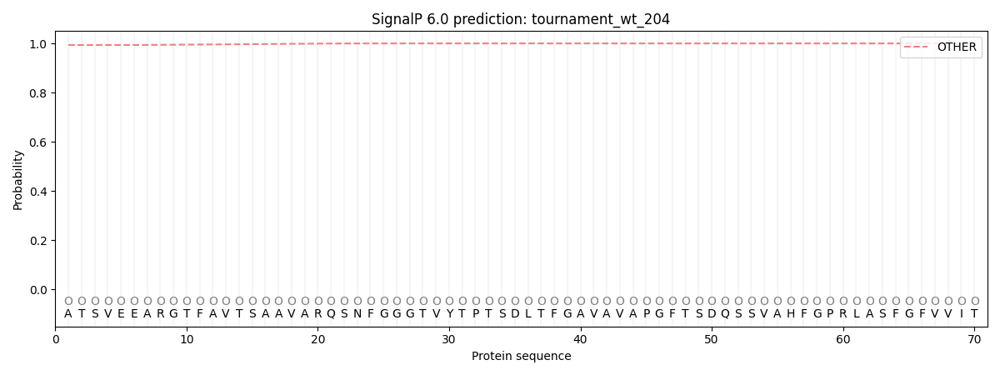 

 ***

#### tournament_wt_205

**Prediction:** Other

| Protein type   |   Other |   Signal Peptide (Sec/SPI) |   Lipoprotein signal peptide (Sec/SPII) |   TAT signal peptide (Tat/SPI) |   TAT Lipoprotein signal peptide (Tat/SPII) |   Pilin-like signal peptide (Sec/SPIII) |
|----------------|---------|----------------------------|-----------------------------------------|--------------------------------|---------------------------------------------|-----------------------------------------|
| Likelihood     |  0.9964 |                     0.0036 |                                  0.0001 |                              0 |                                           0 |                                       0 |
**Download: ** [PNG](output_tournament_wt_205_plot.png) / [EPS](output_tournament_wt_205_plot.eps) /  [Tabular](output_tournament_wt_205_plot.txt)

  

 ***

#### tournament_wt_206

**Prediction:** Other

| Protein type   |   Other |   Signal Peptide (Sec/SPI) |   Lipoprotein signal peptide (Sec/SPII) |   TAT signal peptide (Tat/SPI) |   TAT Lipoprotein signal peptide (Tat/SPII) |   Pilin-like signal peptide (Sec/SPIII) |
|----------------|---------|----------------------------|-----------------------------------------|--------------------------------|---------------------------------------------|-----------------------------------------|
| Likelihood     |  0.9949 |                     0.0051 |                                       0 |                              0 |                                           0 |                                       0 |
**Download: ** [PNG](output_tournament_wt_206_plot.png) / [EPS](output_tournament_wt_206_plot.eps) /  [Tabular](output_tournament_wt_206_plot.txt)

  

 ***

#### tournament_wt_207

**Prediction:** Other

| Protein type   |   Other |   Signal Peptide (Sec/SPI) |   Lipoprotein signal peptide (Sec/SPII) |   TAT signal peptide (Tat/SPI) |   TAT Lipoprotein signal peptide (Tat/SPII) |   Pilin-like signal peptide (Sec/SPIII) |
|----------------|---------|----------------------------|-----------------------------------------|--------------------------------|---------------------------------------------|-----------------------------------------|
| Likelihood     |  0.9996 |                     0.0004 |                                       0 |                              0 |                                           0 |                                       0 |
**Download: ** [PNG](output_tournament_wt_207_plot.png) / [EPS](output_tournament_wt_207_plot.eps) /  [Tabular](output_tournament_wt_207_plot.txt)

  

 ***

#### tournament_wt_208

**Prediction:** Other

| Protein type   |   Other |   Signal Peptide (Sec/SPI) |   Lipoprotein signal peptide (Sec/SPII) |   TAT signal peptide (Tat/SPI) |   TAT Lipoprotein signal peptide (Tat/SPII) |   Pilin-like signal peptide (Sec/SPIII) |
|----------------|---------|----------------------------|-----------------------------------------|--------------------------------|---------------------------------------------|-----------------------------------------|
| Likelihood     |  0.9992 |                     0.0008 |                                       0 |                              0 |                                           0 |                                       0 |
**Download: ** [PNG](output_tournament_wt_208_plot.png) / [EPS](output_tournament_wt_208_plot.eps) /  [Tabular](output_tournament_wt_208_plot.txt)

  

 ***

#### tournament_wt_209

**Prediction:** Other

| Protein type   |   Other |   Signal Peptide (Sec/SPI) |   Lipoprotein signal peptide (Sec/SPII) |   TAT signal peptide (Tat/SPI) |   TAT Lipoprotein signal peptide (Tat/SPII) |   Pilin-like signal peptide (Sec/SPIII) |
|----------------|---------|----------------------------|-----------------------------------------|--------------------------------|---------------------------------------------|-----------------------------------------|
| Likelihood     |       1 |                     0.0001 |                                       0 |                              0 |                                           0 |                                       0 |
**Download: ** [PNG](output_tournament_wt_209_plot.png) / [EPS](output_tournament_wt_209_plot.eps) /  [Tabular](output_tournament_wt_209_plot.txt)

  

 ***

#### tournament_wt_210

**Prediction:** Other

| Protein type   |   Other |   Signal Peptide (Sec/SPI) |   Lipoprotein signal peptide (Sec/SPII) |   TAT signal peptide (Tat/SPI) |   TAT Lipoprotein signal peptide (Tat/SPII) |   Pilin-like signal peptide (Sec/SPIII) |
|----------------|---------|----------------------------|-----------------------------------------|--------------------------------|---------------------------------------------|-----------------------------------------|
| Likelihood     |  0.9992 |                     0.0007 |                                       0 |                              0 |                                           0 |                                       0 |
**Download: ** [PNG](output_tournament_wt_210_plot.png) / [EPS](output_tournament_wt_210_plot.eps) /  [Tabular](output_tournament_wt_210_plot.txt)

  

 ***

#### tournament_wt_211

**Prediction:** Other

| Protein type   |   Other |   Signal Peptide (Sec/SPI) |   Lipoprotein signal peptide (Sec/SPII) |   TAT signal peptide (Tat/SPI) |   TAT Lipoprotein signal peptide (Tat/SPII) |   Pilin-like signal peptide (Sec/SPIII) |
|----------------|---------|----------------------------|-----------------------------------------|--------------------------------|---------------------------------------------|-----------------------------------------|
| Likelihood     |  0.9965 |                     0.0034 |                                       0 |                              0 |                                           0 |                                       0 |
**Download: ** [PNG](output_tournament_wt_211_plot.png) / [EPS](output_tournament_wt_211_plot.eps) /  [Tabular](output_tournament_wt_211_plot.txt)

 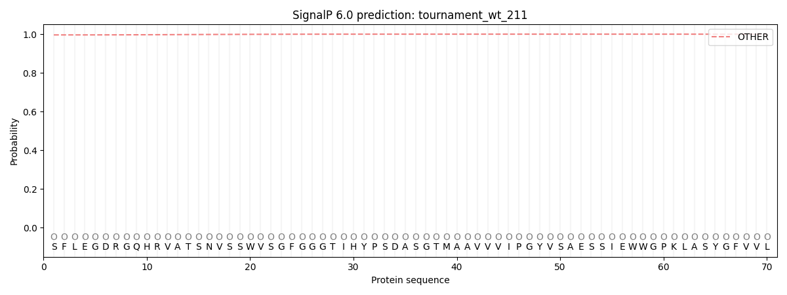 

 ***

#### tournament_wt_212

**Prediction:** Other

| Protein type   |   Other |   Signal Peptide (Sec/SPI) |   Lipoprotein signal peptide (Sec/SPII) |   TAT signal peptide (Tat/SPI) |   TAT Lipoprotein signal peptide (Tat/SPII) |   Pilin-like signal peptide (Sec/SPIII) |
|----------------|---------|----------------------------|-----------------------------------------|--------------------------------|---------------------------------------------|-----------------------------------------|
| Likelihood     |  0.9991 |                      0.001 |                                       0 |                              0 |                                           0 |                                       0 |
**Download: ** [PNG](output_tournament_wt_212_plot.png) / [EPS](output_tournament_wt_212_plot.eps) /  [Tabular](output_tournament_wt_212_plot.txt)

  

 ***

#### tournament_wt_213

**Prediction:** Other

| Protein type   |   Other |   Signal Peptide (Sec/SPI) |   Lipoprotein signal peptide (Sec/SPII) |   TAT signal peptide (Tat/SPI) |   TAT Lipoprotein signal peptide (Tat/SPII) |   Pilin-like signal peptide (Sec/SPIII) |
|----------------|---------|----------------------------|-----------------------------------------|--------------------------------|---------------------------------------------|-----------------------------------------|
| Likelihood     |       1 |                          0 |                                       0 |                              0 |                                           0 |                                       0 |
**Download: ** [PNG](output_tournament_wt_213_plot.png) / [EPS](output_tournament_wt_213_plot.eps) /  [Tabular](output_tournament_wt_213_plot.txt)

  

 ***

#### tournament_wt_214

**Prediction:** Other

| Protein type   |   Other |   Signal Peptide (Sec/SPI) |   Lipoprotein signal peptide (Sec/SPII) |   TAT signal peptide (Tat/SPI) |   TAT Lipoprotein signal peptide (Tat/SPII) |   Pilin-like signal peptide (Sec/SPIII) |
|----------------|---------|----------------------------|-----------------------------------------|--------------------------------|---------------------------------------------|-----------------------------------------|
| Likelihood     |  0.9996 |                     0.0005 |                                       0 |                              0 |                                           0 |                                       0 |
**Download: ** [PNG](output_tournament_wt_214_plot.png) / [EPS](output_tournament_wt_214_plot.eps) /  [Tabular](output_tournament_wt_214_plot.txt)

  

 ***

#### tournament_wt_215

**Prediction:** Other

| Protein type   |   Other |   Signal Peptide (Sec/SPI) |   Lipoprotein signal peptide (Sec/SPII) |   TAT signal peptide (Tat/SPI) |   TAT Lipoprotein signal peptide (Tat/SPII) |   Pilin-like signal peptide (Sec/SPIII) |
|----------------|---------|----------------------------|-----------------------------------------|--------------------------------|---------------------------------------------|-----------------------------------------|
| Likelihood     |  0.9997 |                     0.0003 |                                       0 |                              0 |                                           0 |                                       0 |
**Download: ** [PNG](output_tournament_wt_215_plot.png) / [EPS](output_tournament_wt_215_plot.eps) /  [Tabular](output_tournament_wt_215_plot.txt)

  

 ***

#### tournament_wt_216

**Prediction:** Other

| Protein type   |   Other |   Signal Peptide (Sec/SPI) |   Lipoprotein signal peptide (Sec/SPII) |   TAT signal peptide (Tat/SPI) |   TAT Lipoprotein signal peptide (Tat/SPII) |   Pilin-like signal peptide (Sec/SPIII) |
|----------------|---------|----------------------------|-----------------------------------------|--------------------------------|---------------------------------------------|-----------------------------------------|
| Likelihood     |  0.9937 |                      0.006 |                                  0.0002 |                              0 |                                           0 |                                  0.0001 |
**Download: ** [PNG](output_tournament_wt_216_plot.png) / [EPS](output_tournament_wt_216_plot.eps) /  [Tabular](output_tournament_wt_216_plot.txt)

 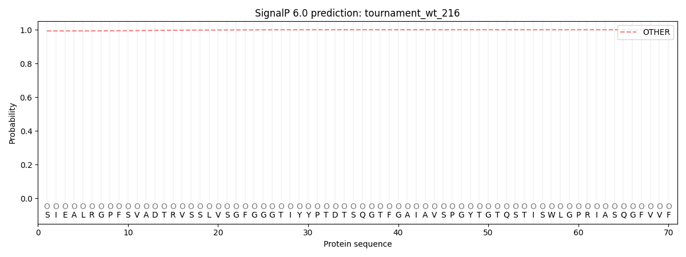 

 ***

#### tournament_wt_217

**Prediction:** Other

| Protein type   |   Other |   Signal Peptide (Sec/SPI) |   Lipoprotein signal peptide (Sec/SPII) |   TAT signal peptide (Tat/SPI) |   TAT Lipoprotein signal peptide (Tat/SPII) |   Pilin-like signal peptide (Sec/SPIII) |
|----------------|---------|----------------------------|-----------------------------------------|--------------------------------|---------------------------------------------|-----------------------------------------|
| Likelihood     |  0.9907 |                     0.0093 |                                       0 |                              0 |                                           0 |                                       0 |
**Download: ** [PNG](output_tournament_wt_217_plot.png) / [EPS](output_tournament_wt_217_plot.eps) /  [Tabular](output_tournament_wt_217_plot.txt)

 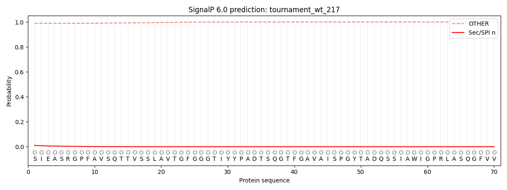 

 ***

#### tournament_wt_218

**Prediction:** Other

| Protein type   |   Other |   Signal Peptide (Sec/SPI) |   Lipoprotein signal peptide (Sec/SPII) |   TAT signal peptide (Tat/SPI) |   TAT Lipoprotein signal peptide (Tat/SPII) |   Pilin-like signal peptide (Sec/SPIII) |
|----------------|---------|----------------------------|-----------------------------------------|--------------------------------|---------------------------------------------|-----------------------------------------|
| Likelihood     |  0.8011 |                      0.198 |                                  0.0002 |                         0.0003 |                                      0.0002 |                                  0.0002 |
**Download: ** [PNG](output_tournament_wt_218_plot.png) / [EPS](output_tournament_wt_218_plot.eps) /  [Tabular](output_tournament_wt_218_plot.txt)

 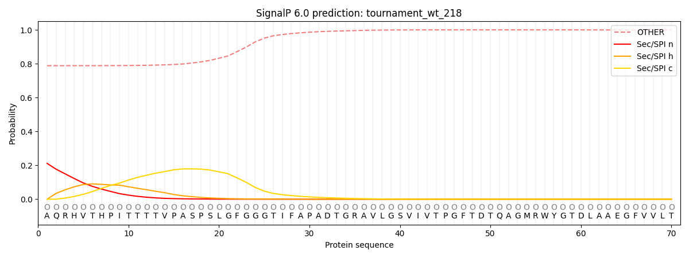 

 ***

#### tournament_wt_219

**Prediction:** Other

| Protein type   |   Other |   Signal Peptide (Sec/SPI) |   Lipoprotein signal peptide (Sec/SPII) |   TAT signal peptide (Tat/SPI) |   TAT Lipoprotein signal peptide (Tat/SPII) |   Pilin-like signal peptide (Sec/SPIII) |
|----------------|---------|----------------------------|-----------------------------------------|--------------------------------|---------------------------------------------|-----------------------------------------|
| Likelihood     |  0.9905 |                     0.0085 |                                  0.0008 |                         0.0001 |                                           0 |                                  0.0001 |
**Download: ** [PNG](output_tournament_wt_219_plot.png) / [EPS](output_tournament_wt_219_plot.eps) /  [Tabular](output_tournament_wt_219_plot.txt)

 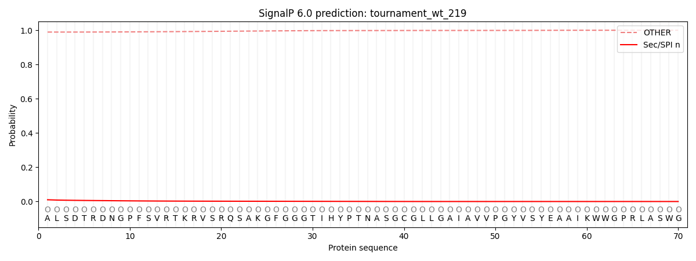 

 ***

#### tournament_wt_220

**Prediction:** Other

| Protein type   |   Other |   Signal Peptide (Sec/SPI) |   Lipoprotein signal peptide (Sec/SPII) |   TAT signal peptide (Tat/SPI) |   TAT Lipoprotein signal peptide (Tat/SPII) |   Pilin-like signal peptide (Sec/SPIII) |
|----------------|---------|----------------------------|-----------------------------------------|--------------------------------|---------------------------------------------|-----------------------------------------|
| Likelihood     |  0.9996 |                     0.0004 |                                       0 |                              0 |                                           0 |                                       0 |
**Download: ** [PNG](output_tournament_wt_220_plot.png) / [EPS](output_tournament_wt_220_plot.eps) /  [Tabular](output_tournament_wt_220_plot.txt)

  

 ***

#### tournament_wt_221

**Prediction:** Other

| Protein type   |   Other |   Signal Peptide (Sec/SPI) |   Lipoprotein signal peptide (Sec/SPII) |   TAT signal peptide (Tat/SPI) |   TAT Lipoprotein signal peptide (Tat/SPII) |   Pilin-like signal peptide (Sec/SPIII) |
|----------------|---------|----------------------------|-----------------------------------------|--------------------------------|---------------------------------------------|-----------------------------------------|
| Likelihood     |   0.999 |                      0.001 |                                       0 |                              0 |                                           0 |                                       0 |
**Download: ** [PNG](output_tournament_wt_221_plot.png) / [EPS](output_tournament_wt_221_plot.eps) /  [Tabular](output_tournament_wt_221_plot.txt)

  

 ***

#### tournament_wt_222

**Prediction:** Other

| Protein type   |   Other |   Signal Peptide (Sec/SPI) |   Lipoprotein signal peptide (Sec/SPII) |   TAT signal peptide (Tat/SPI) |   TAT Lipoprotein signal peptide (Tat/SPII) |   Pilin-like signal peptide (Sec/SPIII) |
|----------------|---------|----------------------------|-----------------------------------------|--------------------------------|---------------------------------------------|-----------------------------------------|
| Likelihood     |  0.9775 |                     0.0223 |                                  0.0001 |                              0 |                                           0 |                                  0.0001 |
**Download: ** [PNG](output_tournament_wt_222_plot.png) / [EPS](output_tournament_wt_222_plot.eps) /  [Tabular](output_tournament_wt_222_plot.txt)

 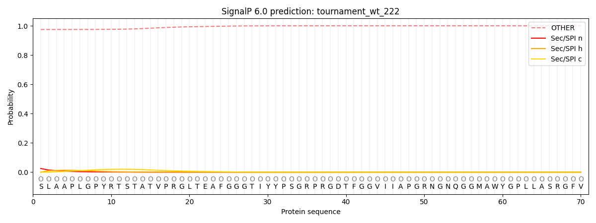 

 ***

#### tournament_wt_223

**Prediction:** Other

| Protein type   |   Other |   Signal Peptide (Sec/SPI) |   Lipoprotein signal peptide (Sec/SPII) |   TAT signal peptide (Tat/SPI) |   TAT Lipoprotein signal peptide (Tat/SPII) |   Pilin-like signal peptide (Sec/SPIII) |
|----------------|---------|----------------------------|-----------------------------------------|--------------------------------|---------------------------------------------|-----------------------------------------|
| Likelihood     |       1 |                          0 |                                       0 |                              0 |                                           0 |                                       0 |
**Download: ** [PNG](output_tournament_wt_223_plot.png) / [EPS](output_tournament_wt_223_plot.eps) /  [Tabular](output_tournament_wt_223_plot.txt)

 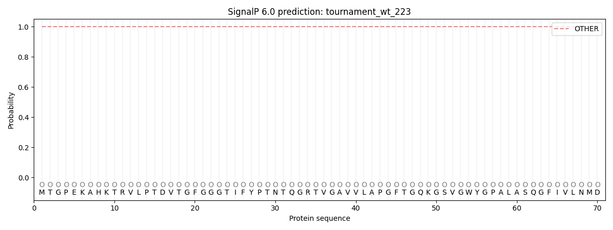 

 ***

#### tournament_wt_224

**Prediction:** Other

| Protein type   |   Other |   Signal Peptide (Sec/SPI) |   Lipoprotein signal peptide (Sec/SPII) |   TAT signal peptide (Tat/SPI) |   TAT Lipoprotein signal peptide (Tat/SPII) |   Pilin-like signal peptide (Sec/SPIII) |
|----------------|---------|----------------------------|-----------------------------------------|--------------------------------|---------------------------------------------|-----------------------------------------|
| Likelihood     |  0.9615 |                     0.0384 |                                       0 |                              0 |                                           0 |                                       0 |
**Download: ** [PNG](output_tournament_wt_224_plot.png) / [EPS](output_tournament_wt_224_plot.eps) /  [Tabular](output_tournament_wt_224_plot.txt)

  

 ***

#### tournament_wt_225

**Prediction:** Other

| Protein type   |   Other |   Signal Peptide (Sec/SPI) |   Lipoprotein signal peptide (Sec/SPII) |   TAT signal peptide (Tat/SPI) |   TAT Lipoprotein signal peptide (Tat/SPII) |   Pilin-like signal peptide (Sec/SPIII) |
|----------------|---------|----------------------------|-----------------------------------------|--------------------------------|---------------------------------------------|-----------------------------------------|
| Likelihood     |  0.9698 |                     0.0297 |                                  0.0003 |                         0.0001 |                                           0 |                                  0.0001 |
**Download: ** [PNG](output_tournament_wt_225_plot.png) / [EPS](output_tournament_wt_225_plot.eps) /  [Tabular](output_tournament_wt_225_plot.txt)

  

 ***

#### tournament_wt_226

**Prediction:** Other

| Protein type   |   Other |   Signal Peptide (Sec/SPI) |   Lipoprotein signal peptide (Sec/SPII) |   TAT signal peptide (Tat/SPI) |   TAT Lipoprotein signal peptide (Tat/SPII) |   Pilin-like signal peptide (Sec/SPIII) |
|----------------|---------|----------------------------|-----------------------------------------|--------------------------------|---------------------------------------------|-----------------------------------------|
| Likelihood     |  0.9933 |                     0.0067 |                                       0 |                              0 |                                           0 |                                       0 |
**Download: ** [PNG](output_tournament_wt_226_plot.png) / [EPS](output_tournament_wt_226_plot.eps) /  [Tabular](output_tournament_wt_226_plot.txt)

 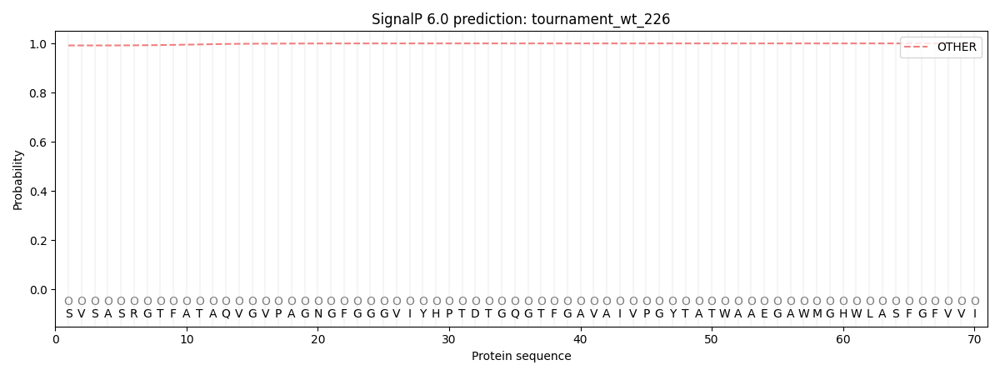 

 ***

#### tournament_wt_227

**Prediction:** Other

| Protein type   |   Other |   Signal Peptide (Sec/SPI) |   Lipoprotein signal peptide (Sec/SPII) |   TAT signal peptide (Tat/SPI) |   TAT Lipoprotein signal peptide (Tat/SPII) |   Pilin-like signal peptide (Sec/SPIII) |
|----------------|---------|----------------------------|-----------------------------------------|--------------------------------|---------------------------------------------|-----------------------------------------|
| Likelihood     |       1 |                     0.0001 |                                       0 |                              0 |                                           0 |                                       0 |
**Download: ** [PNG](output_tournament_wt_227_plot.png) / [EPS](output_tournament_wt_227_plot.eps) /  [Tabular](output_tournament_wt_227_plot.txt)

  

 ***

#### tournament_wt_228

**Prediction:** Other

| Protein type   |   Other |   Signal Peptide (Sec/SPI) |   Lipoprotein signal peptide (Sec/SPII) |   TAT signal peptide (Tat/SPI) |   TAT Lipoprotein signal peptide (Tat/SPII) |   Pilin-like signal peptide (Sec/SPIII) |
|----------------|---------|----------------------------|-----------------------------------------|--------------------------------|---------------------------------------------|-----------------------------------------|
| Likelihood     |  0.9984 |                     0.0015 |                                       0 |                              0 |                                           0 |                                       0 |
**Download: ** [PNG](output_tournament_wt_228_plot.png) / [EPS](output_tournament_wt_228_plot.eps) /  [Tabular](output_tournament_wt_228_plot.txt)

  

 ***

#### tournament_wt_229

**Prediction:** Other

| Protein type   |   Other |   Signal Peptide (Sec/SPI) |   Lipoprotein signal peptide (Sec/SPII) |   TAT signal peptide (Tat/SPI) |   TAT Lipoprotein signal peptide (Tat/SPII) |   Pilin-like signal peptide (Sec/SPIII) |
|----------------|---------|----------------------------|-----------------------------------------|--------------------------------|---------------------------------------------|-----------------------------------------|
| Likelihood     |  0.9802 |                     0.0196 |                                  0.0001 |                              0 |                                           0 |                                       0 |
**Download: ** [PNG](output_tournament_wt_229_plot.png) / [EPS](output_tournament_wt_229_plot.eps) /  [Tabular](output_tournament_wt_229_plot.txt)

  

 ***

#### tournament_wt_230

**Prediction:** Other

| Protein type   |   Other |   Signal Peptide (Sec/SPI) |   Lipoprotein signal peptide (Sec/SPII) |   TAT signal peptide (Tat/SPI) |   TAT Lipoprotein signal peptide (Tat/SPII) |   Pilin-like signal peptide (Sec/SPIII) |
|----------------|---------|----------------------------|-----------------------------------------|--------------------------------|---------------------------------------------|-----------------------------------------|
| Likelihood     |  0.9999 |                     0.0001 |                                       0 |                              0 |                                           0 |                                       0 |
**Download: ** [PNG](output_tournament_wt_230_plot.png) / [EPS](output_tournament_wt_230_plot.eps) /  [Tabular](output_tournament_wt_230_plot.txt)

  

 ***

#### tournament_wt_231

**Prediction:** Other

| Protein type   |   Other |   Signal Peptide (Sec/SPI) |   Lipoprotein signal peptide (Sec/SPII) |   TAT signal peptide (Tat/SPI) |   TAT Lipoprotein signal peptide (Tat/SPII) |   Pilin-like signal peptide (Sec/SPIII) |
|----------------|---------|----------------------------|-----------------------------------------|--------------------------------|---------------------------------------------|-----------------------------------------|
| Likelihood     |  1.0001 |                          0 |                                       0 |                              0 |                                           0 |                                       0 |
**Download: ** [PNG](output_tournament_wt_231_plot.png) / [EPS](output_tournament_wt_231_plot.eps) /  [Tabular](output_tournament_wt_231_plot.txt)

  

 ***

#### tournament_wt_232

**Prediction:** Other

| Protein type   |   Other |   Signal Peptide (Sec/SPI) |   Lipoprotein signal peptide (Sec/SPII) |   TAT signal peptide (Tat/SPI) |   TAT Lipoprotein signal peptide (Tat/SPII) |   Pilin-like signal peptide (Sec/SPIII) |
|----------------|---------|----------------------------|-----------------------------------------|--------------------------------|---------------------------------------------|-----------------------------------------|
| Likelihood     |       1 |                          0 |                                       0 |                              0 |                                           0 |                                       0 |
**Download: ** [PNG](output_tournament_wt_232_plot.png) / [EPS](output_tournament_wt_232_plot.eps) /  [Tabular](output_tournament_wt_232_plot.txt)

  

 ***

#### tournament_wt_233

**Prediction:** Other

| Protein type   |   Other |   Signal Peptide (Sec/SPI) |   Lipoprotein signal peptide (Sec/SPII) |   TAT signal peptide (Tat/SPI) |   TAT Lipoprotein signal peptide (Tat/SPII) |   Pilin-like signal peptide (Sec/SPIII) |
|----------------|---------|----------------------------|-----------------------------------------|--------------------------------|---------------------------------------------|-----------------------------------------|
| Likelihood     |  1.0001 |                          0 |                                       0 |                              0 |                                           0 |                                       0 |
**Download: ** [PNG](output_tournament_wt_233_plot.png) / [EPS](output_tournament_wt_233_plot.eps) /  [Tabular](output_tournament_wt_233_plot.txt)

  

 ***

#### tournament_wt_234

**Prediction:** Other

| Protein type   |   Other |   Signal Peptide (Sec/SPI) |   Lipoprotein signal peptide (Sec/SPII) |   TAT signal peptide (Tat/SPI) |   TAT Lipoprotein signal peptide (Tat/SPII) |   Pilin-like signal peptide (Sec/SPIII) |
|----------------|---------|----------------------------|-----------------------------------------|--------------------------------|---------------------------------------------|-----------------------------------------|
| Likelihood     |   0.999 |                      0.001 |                                       0 |                              0 |                                           0 |                                       0 |
**Download: ** [PNG](output_tournament_wt_234_plot.png) / [EPS](output_tournament_wt_234_plot.eps) /  [Tabular](output_tournament_wt_234_plot.txt)

 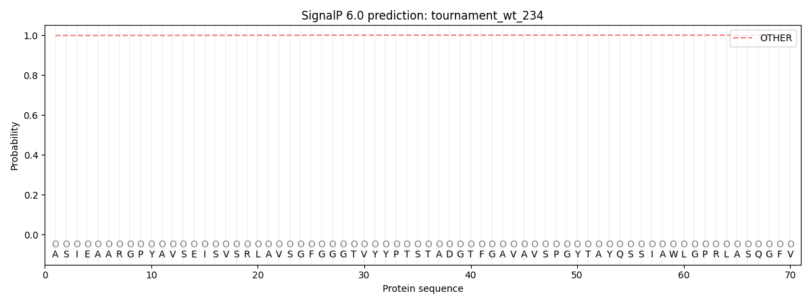 

 ***

#### tournament_wt_235

**Prediction:** Other

| Protein type   |   Other |   Signal Peptide (Sec/SPI) |   Lipoprotein signal peptide (Sec/SPII) |   TAT signal peptide (Tat/SPI) |   TAT Lipoprotein signal peptide (Tat/SPII) |   Pilin-like signal peptide (Sec/SPIII) |
|----------------|---------|----------------------------|-----------------------------------------|--------------------------------|---------------------------------------------|-----------------------------------------|
| Likelihood     |  0.9815 |                     0.0181 |                                  0.0002 |                         0.0001 |                                           0 |                                  0.0001 |
**Download: ** [PNG](output_tournament_wt_235_plot.png) / [EPS](output_tournament_wt_235_plot.eps) /  [Tabular](output_tournament_wt_235_plot.txt)

 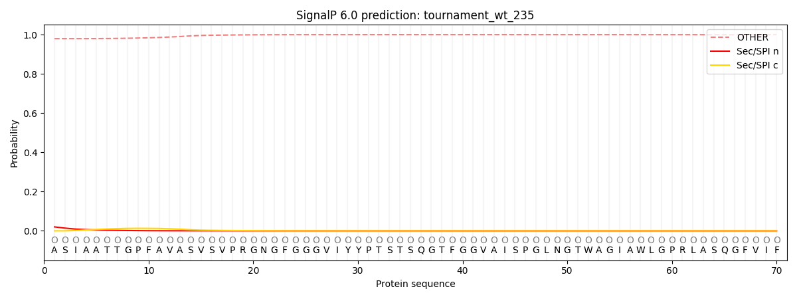 

 ***

#### tournament_wt_236

**Prediction:** Other

| Protein type   |   Other |   Signal Peptide (Sec/SPI) |   Lipoprotein signal peptide (Sec/SPII) |   TAT signal peptide (Tat/SPI) |   TAT Lipoprotein signal peptide (Tat/SPII) |   Pilin-like signal peptide (Sec/SPIII) |
|----------------|---------|----------------------------|-----------------------------------------|--------------------------------|---------------------------------------------|-----------------------------------------|
| Likelihood     |   0.999 |                     0.0009 |                                  0.0001 |                              0 |                                           0 |                                       0 |
**Download: ** [PNG](output_tournament_wt_236_plot.png) / [EPS](output_tournament_wt_236_plot.eps) /  [Tabular](output_tournament_wt_236_plot.txt)

  

 ***

#### tournament_wt_237

**Prediction:** Other

| Protein type   |   Other |   Signal Peptide (Sec/SPI) |   Lipoprotein signal peptide (Sec/SPII) |   TAT signal peptide (Tat/SPI) |   TAT Lipoprotein signal peptide (Tat/SPII) |   Pilin-like signal peptide (Sec/SPIII) |
|----------------|---------|----------------------------|-----------------------------------------|--------------------------------|---------------------------------------------|-----------------------------------------|
| Likelihood     |  0.9905 |                     0.0094 |                                  0.0001 |                              0 |                                           0 |                                       0 |
**Download: ** [PNG](output_tournament_wt_237_plot.png) / [EPS](output_tournament_wt_237_plot.eps) /  [Tabular](output_tournament_wt_237_plot.txt)

  

 ***

#### tournament_wt_238

**Prediction:** Other

| Protein type   |   Other |   Signal Peptide (Sec/SPI) |   Lipoprotein signal peptide (Sec/SPII) |   TAT signal peptide (Tat/SPI) |   TAT Lipoprotein signal peptide (Tat/SPII) |   Pilin-like signal peptide (Sec/SPIII) |
|----------------|---------|----------------------------|-----------------------------------------|--------------------------------|---------------------------------------------|-----------------------------------------|
| Likelihood     |  1.0001 |                          0 |                                       0 |                              0 |                                           0 |                                       0 |
**Download: ** [PNG](output_tournament_wt_238_plot.png) / [EPS](output_tournament_wt_238_plot.eps) /  [Tabular](output_tournament_wt_238_plot.txt)

  

 ***

#### tournament_wt_239

**Prediction:** Other

| Protein type   |   Other |   Signal Peptide (Sec/SPI) |   Lipoprotein signal peptide (Sec/SPII) |   TAT signal peptide (Tat/SPI) |   TAT Lipoprotein signal peptide (Tat/SPII) |   Pilin-like signal peptide (Sec/SPIII) |
|----------------|---------|----------------------------|-----------------------------------------|--------------------------------|---------------------------------------------|-----------------------------------------|
| Likelihood     |  0.9967 |                     0.0033 |                                       0 |                              0 |                                           0 |                                       0 |
**Download: ** [PNG](output_tournament_wt_239_plot.png) / [EPS](output_tournament_wt_239_plot.eps) /  [Tabular](output_tournament_wt_239_plot.txt)

  

 ***

#### tournament_wt_240

**Prediction:** Other

| Protein type   |   Other |   Signal Peptide (Sec/SPI) |   Lipoprotein signal peptide (Sec/SPII) |   TAT signal peptide (Tat/SPI) |   TAT Lipoprotein signal peptide (Tat/SPII) |   Pilin-like signal peptide (Sec/SPIII) |
|----------------|---------|----------------------------|-----------------------------------------|--------------------------------|---------------------------------------------|-----------------------------------------|
| Likelihood     |  0.9993 |                     0.0006 |                                  0.0001 |                              0 |                                           0 |                                       0 |
**Download: ** [PNG](output_tournament_wt_240_plot.png) / [EPS](output_tournament_wt_240_plot.eps) /  [Tabular](output_tournament_wt_240_plot.txt)

  

 ***

#### tournament_wt_241

**Prediction:** Other

| Protein type   |   Other |   Signal Peptide (Sec/SPI) |   Lipoprotein signal peptide (Sec/SPII) |   TAT signal peptide (Tat/SPI) |   TAT Lipoprotein signal peptide (Tat/SPII) |   Pilin-like signal peptide (Sec/SPIII) |
|----------------|---------|----------------------------|-----------------------------------------|--------------------------------|---------------------------------------------|-----------------------------------------|
| Likelihood     |  0.9992 |                     0.0008 |                                       0 |                              0 |                                           0 |                                       0 |
**Download: ** [PNG](output_tournament_wt_241_plot.png) / [EPS](output_tournament_wt_241_plot.eps) /  [Tabular](output_tournament_wt_241_plot.txt)

  

 ***

#### tournament_wt_242

**Prediction:** Other

| Protein type   |   Other |   Signal Peptide (Sec/SPI) |   Lipoprotein signal peptide (Sec/SPII) |   TAT signal peptide (Tat/SPI) |   TAT Lipoprotein signal peptide (Tat/SPII) |   Pilin-like signal peptide (Sec/SPIII) |
|----------------|---------|----------------------------|-----------------------------------------|--------------------------------|---------------------------------------------|-----------------------------------------|
| Likelihood     |  0.9995 |                     0.0005 |                                       0 |                              0 |                                           0 |                                       0 |
**Download: ** [PNG](output_tournament_wt_242_plot.png) / [EPS](output_tournament_wt_242_plot.eps) /  [Tabular](output_tournament_wt_242_plot.txt)

  

 ***

#### tournament_wt_243

**Prediction:** Other

| Protein type   |   Other |   Signal Peptide (Sec/SPI) |   Lipoprotein signal peptide (Sec/SPII) |   TAT signal peptide (Tat/SPI) |   TAT Lipoprotein signal peptide (Tat/SPII) |   Pilin-like signal peptide (Sec/SPIII) |
|----------------|---------|----------------------------|-----------------------------------------|--------------------------------|---------------------------------------------|-----------------------------------------|
| Likelihood     |  0.9992 |                     0.0008 |                                       0 |                              0 |                                           0 |                                       0 |
**Download: ** [PNG](output_tournament_wt_243_plot.png) / [EPS](output_tournament_wt_243_plot.eps) /  [Tabular](output_tournament_wt_243_plot.txt)

  

 ***

#### tournament_wt_244

**Prediction:** Other

| Protein type   |   Other |   Signal Peptide (Sec/SPI) |   Lipoprotein signal peptide (Sec/SPII) |   TAT signal peptide (Tat/SPI) |   TAT Lipoprotein signal peptide (Tat/SPII) |   Pilin-like signal peptide (Sec/SPIII) |
|----------------|---------|----------------------------|-----------------------------------------|--------------------------------|---------------------------------------------|-----------------------------------------|
| Likelihood     |  0.9992 |                     0.0008 |                                       0 |                              0 |                                           0 |                                       0 |
**Download: ** [PNG](output_tournament_wt_244_plot.png) / [EPS](output_tournament_wt_244_plot.eps) /  [Tabular](output_tournament_wt_244_plot.txt)

 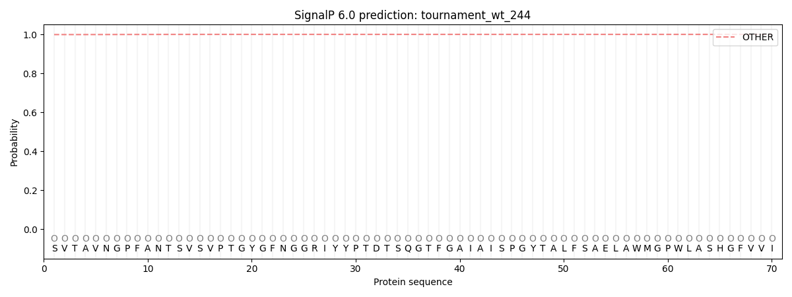 

 ***

#### tournament_wt_245

**Prediction:** Other

| Protein type   |   Other |   Signal Peptide (Sec/SPI) |   Lipoprotein signal peptide (Sec/SPII) |   TAT signal peptide (Tat/SPI) |   TAT Lipoprotein signal peptide (Tat/SPII) |   Pilin-like signal peptide (Sec/SPIII) |
|----------------|---------|----------------------------|-----------------------------------------|--------------------------------|---------------------------------------------|-----------------------------------------|
| Likelihood     |  0.9979 |                      0.002 |                                  0.0001 |                              0 |                                           0 |                                       0 |
**Download: ** [PNG](output_tournament_wt_245_plot.png) / [EPS](output_tournament_wt_245_plot.eps) /  [Tabular](output_tournament_wt_245_plot.txt)

  

 ***

#### tournament_wt_246

**Prediction:** Other

| Protein type   |   Other |   Signal Peptide (Sec/SPI) |   Lipoprotein signal peptide (Sec/SPII) |   TAT signal peptide (Tat/SPI) |   TAT Lipoprotein signal peptide (Tat/SPII) |   Pilin-like signal peptide (Sec/SPIII) |
|----------------|---------|----------------------------|-----------------------------------------|--------------------------------|---------------------------------------------|-----------------------------------------|
| Likelihood     |  0.9959 |                     0.0038 |                                  0.0002 |                              0 |                                           0 |                                  0.0001 |
**Download: ** [PNG](output_tournament_wt_246_plot.png) / [EPS](output_tournament_wt_246_plot.eps) /  [Tabular](output_tournament_wt_246_plot.txt)

  

 ***

#### tournament_wt_247

**Prediction:** Other

| Protein type   |   Other |   Signal Peptide (Sec/SPI) |   Lipoprotein signal peptide (Sec/SPII) |   TAT signal peptide (Tat/SPI) |   TAT Lipoprotein signal peptide (Tat/SPII) |   Pilin-like signal peptide (Sec/SPIII) |
|----------------|---------|----------------------------|-----------------------------------------|--------------------------------|---------------------------------------------|-----------------------------------------|
| Likelihood     |  1.0001 |                          0 |                                       0 |                              0 |                                           0 |                                       0 |
**Download: ** [PNG](output_tournament_wt_247_plot.png) / [EPS](output_tournament_wt_247_plot.eps) /  [Tabular](output_tournament_wt_247_plot.txt)

  

 ***

#### tournament_wt_248

**Prediction:** Other

| Protein type   |   Other |   Signal Peptide (Sec/SPI) |   Lipoprotein signal peptide (Sec/SPII) |   TAT signal peptide (Tat/SPI) |   TAT Lipoprotein signal peptide (Tat/SPII) |   Pilin-like signal peptide (Sec/SPIII) |
|----------------|---------|----------------------------|-----------------------------------------|--------------------------------|---------------------------------------------|-----------------------------------------|
| Likelihood     |  0.9999 |                     0.0002 |                                       0 |                              0 |                                           0 |                                       0 |
**Download: ** [PNG](output_tournament_wt_248_plot.png) / [EPS](output_tournament_wt_248_plot.eps) /  [Tabular](output_tournament_wt_248_plot.txt)

  

 ***

#### tournament_wt_249

**Prediction:** Other

| Protein type   |   Other |   Signal Peptide (Sec/SPI) |   Lipoprotein signal peptide (Sec/SPII) |   TAT signal peptide (Tat/SPI) |   TAT Lipoprotein signal peptide (Tat/SPII) |   Pilin-like signal peptide (Sec/SPIII) |
|----------------|---------|----------------------------|-----------------------------------------|--------------------------------|---------------------------------------------|-----------------------------------------|
| Likelihood     |  0.9993 |                     0.0007 |                                       0 |                              0 |                                           0 |                                       0 |
**Download: ** [PNG](output_tournament_wt_249_plot.png) / [EPS](output_tournament_wt_249_plot.eps) /  [Tabular](output_tournament_wt_249_plot.txt)

  

 ***

#### tournament_wt_250

**Prediction:** Other

| Protein type   |   Other |   Signal Peptide (Sec/SPI) |   Lipoprotein signal peptide (Sec/SPII) |   TAT signal peptide (Tat/SPI) |   TAT Lipoprotein signal peptide (Tat/SPII) |   Pilin-like signal peptide (Sec/SPIII) |
|----------------|---------|----------------------------|-----------------------------------------|--------------------------------|---------------------------------------------|-----------------------------------------|
| Likelihood     |       1 |                          0 |                                       0 |                              0 |                                           0 |                                       0 |
**Download: ** [PNG](output_tournament_wt_250_plot.png) / [EPS](output_tournament_wt_250_plot.eps) /  [Tabular](output_tournament_wt_250_plot.txt)

  

 ***

#### tournament_wt_251

**Prediction:** Other

| Protein type   |   Other |   Signal Peptide (Sec/SPI) |   Lipoprotein signal peptide (Sec/SPII) |   TAT signal peptide (Tat/SPI) |   TAT Lipoprotein signal peptide (Tat/SPII) |   Pilin-like signal peptide (Sec/SPIII) |
|----------------|---------|----------------------------|-----------------------------------------|--------------------------------|---------------------------------------------|-----------------------------------------|
| Likelihood     |  0.9993 |                     0.0007 |                                       0 |                              0 |                                           0 |                                       0 |
**Download: ** [PNG](output_tournament_wt_251_plot.png) / [EPS](output_tournament_wt_251_plot.eps) /  [Tabular](output_tournament_wt_251_plot.txt)

  

 ***

#### tournament_wt_252

**Prediction:** Other

| Protein type   |   Other |   Signal Peptide (Sec/SPI) |   Lipoprotein signal peptide (Sec/SPII) |   TAT signal peptide (Tat/SPI) |   TAT Lipoprotein signal peptide (Tat/SPII) |   Pilin-like signal peptide (Sec/SPIII) |
|----------------|---------|----------------------------|-----------------------------------------|--------------------------------|---------------------------------------------|-----------------------------------------|
| Likelihood     |  0.9905 |                     0.0091 |                                  0.0003 |                         0.0001 |                                           0 |                                  0.0001 |
**Download: ** [PNG](output_tournament_wt_252_plot.png) / [EPS](output_tournament_wt_252_plot.eps) /  [Tabular](output_tournament_wt_252_plot.txt)

  

 ***

#### tournament_wt_253

**Prediction:** Other

| Protein type   |   Other |   Signal Peptide (Sec/SPI) |   Lipoprotein signal peptide (Sec/SPII) |   TAT signal peptide (Tat/SPI) |   TAT Lipoprotein signal peptide (Tat/SPII) |   Pilin-like signal peptide (Sec/SPIII) |
|----------------|---------|----------------------------|-----------------------------------------|--------------------------------|---------------------------------------------|-----------------------------------------|
| Likelihood     |  0.9934 |                     0.0061 |                                  0.0004 |                              0 |                                           0 |                                  0.0001 |
**Download: ** [PNG](output_tournament_wt_253_plot.png) / [EPS](output_tournament_wt_253_plot.eps) /  [Tabular](output_tournament_wt_253_plot.txt)

 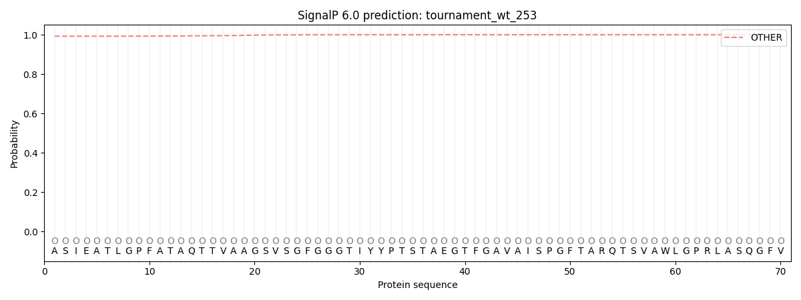 

 ***

#### tournament_wt_254

**Prediction:** Other

| Protein type   |   Other |   Signal Peptide (Sec/SPI) |   Lipoprotein signal peptide (Sec/SPII) |   TAT signal peptide (Tat/SPI) |   TAT Lipoprotein signal peptide (Tat/SPII) |   Pilin-like signal peptide (Sec/SPIII) |
|----------------|---------|----------------------------|-----------------------------------------|--------------------------------|---------------------------------------------|-----------------------------------------|
| Likelihood     |   0.996 |                     0.0038 |                                  0.0001 |                         0.0001 |                                           0 |                                       0 |
**Download: ** [PNG](output_tournament_wt_254_plot.png) / [EPS](output_tournament_wt_254_plot.eps) /  [Tabular](output_tournament_wt_254_plot.txt)

  

 ***

#### tournament_wt_255

**Prediction:** Other

| Protein type   |   Other |   Signal Peptide (Sec/SPI) |   Lipoprotein signal peptide (Sec/SPII) |   TAT signal peptide (Tat/SPI) |   TAT Lipoprotein signal peptide (Tat/SPII) |   Pilin-like signal peptide (Sec/SPIII) |
|----------------|---------|----------------------------|-----------------------------------------|--------------------------------|---------------------------------------------|-----------------------------------------|
| Likelihood     |  0.9992 |                     0.0008 |                                       0 |                              0 |                                           0 |                                       0 |
**Download: ** [PNG](output_tournament_wt_255_plot.png) / [EPS](output_tournament_wt_255_plot.eps) /  [Tabular](output_tournament_wt_255_plot.txt)

  

 ***

#### tournament_wt_256

**Prediction:** Other

| Protein type   |   Other |   Signal Peptide (Sec/SPI) |   Lipoprotein signal peptide (Sec/SPII) |   TAT signal peptide (Tat/SPI) |   TAT Lipoprotein signal peptide (Tat/SPII) |   Pilin-like signal peptide (Sec/SPIII) |
|----------------|---------|----------------------------|-----------------------------------------|--------------------------------|---------------------------------------------|-----------------------------------------|
| Likelihood     |  0.9996 |                     0.0004 |                                       0 |                              0 |                                           0 |                                       0 |
**Download: ** [PNG](output_tournament_wt_256_plot.png) / [EPS](output_tournament_wt_256_plot.eps) /  [Tabular](output_tournament_wt_256_plot.txt)

  

 ***

#### tournament_wt_257

**Prediction:** Other

| Protein type   |   Other |   Signal Peptide (Sec/SPI) |   Lipoprotein signal peptide (Sec/SPII) |   TAT signal peptide (Tat/SPI) |   TAT Lipoprotein signal peptide (Tat/SPII) |   Pilin-like signal peptide (Sec/SPIII) |
|----------------|---------|----------------------------|-----------------------------------------|--------------------------------|---------------------------------------------|-----------------------------------------|
| Likelihood     |  0.9964 |                     0.0035 |                                  0.0001 |                              0 |                                           0 |                                       0 |
**Download: ** [PNG](output_tournament_wt_257_plot.png) / [EPS](output_tournament_wt_257_plot.eps) /  [Tabular](output_tournament_wt_257_plot.txt)

  

 ***

#### tournament_wt_258

**Prediction:** Other

| Protein type   |   Other |   Signal Peptide (Sec/SPI) |   Lipoprotein signal peptide (Sec/SPII) |   TAT signal peptide (Tat/SPI) |   TAT Lipoprotein signal peptide (Tat/SPII) |   Pilin-like signal peptide (Sec/SPIII) |
|----------------|---------|----------------------------|-----------------------------------------|--------------------------------|---------------------------------------------|-----------------------------------------|
| Likelihood     |  0.9988 |                     0.0012 |                                       0 |                              0 |                                           0 |                                       0 |
**Download: ** [PNG](output_tournament_wt_258_plot.png) / [EPS](output_tournament_wt_258_plot.eps) /  [Tabular](output_tournament_wt_258_plot.txt)

  

 ***

#### tournament_wt_259

**Prediction:** Other

| Protein type   |   Other |   Signal Peptide (Sec/SPI) |   Lipoprotein signal peptide (Sec/SPII) |   TAT signal peptide (Tat/SPI) |   TAT Lipoprotein signal peptide (Tat/SPII) |   Pilin-like signal peptide (Sec/SPIII) |
|----------------|---------|----------------------------|-----------------------------------------|--------------------------------|---------------------------------------------|-----------------------------------------|
| Likelihood     |  0.9999 |                     0.0001 |                                       0 |                              0 |                                           0 |                                       0 |
**Download: ** [PNG](output_tournament_wt_259_plot.png) / [EPS](output_tournament_wt_259_plot.eps) /  [Tabular](output_tournament_wt_259_plot.txt)

  

 ***

#### tournament_wt_260

**Prediction:** Other

| Protein type   |   Other |   Signal Peptide (Sec/SPI) |   Lipoprotein signal peptide (Sec/SPII) |   TAT signal peptide (Tat/SPI) |   TAT Lipoprotein signal peptide (Tat/SPII) |   Pilin-like signal peptide (Sec/SPIII) |
|----------------|---------|----------------------------|-----------------------------------------|--------------------------------|---------------------------------------------|-----------------------------------------|
| Likelihood     |  0.9987 |                     0.0013 |                                  0.0001 |                              0 |                                           0 |                                       0 |
**Download: ** [PNG](output_tournament_wt_260_plot.png) / [EPS](output_tournament_wt_260_plot.eps) /  [Tabular](output_tournament_wt_260_plot.txt)

  

 ***

#### tournament_wt_261

**Prediction:** Other

| Protein type   |   Other |   Signal Peptide (Sec/SPI) |   Lipoprotein signal peptide (Sec/SPII) |   TAT signal peptide (Tat/SPI) |   TAT Lipoprotein signal peptide (Tat/SPII) |   Pilin-like signal peptide (Sec/SPIII) |
|----------------|---------|----------------------------|-----------------------------------------|--------------------------------|---------------------------------------------|-----------------------------------------|
| Likelihood     |  0.9966 |                     0.0033 |                                  0.0001 |                              0 |                                           0 |                                       0 |
**Download: ** [PNG](output_tournament_wt_261_plot.png) / [EPS](output_tournament_wt_261_plot.eps) /  [Tabular](output_tournament_wt_261_plot.txt)

  

 ***

#### tournament_wt_262

**Prediction:** Other

| Protein type   |   Other |   Signal Peptide (Sec/SPI) |   Lipoprotein signal peptide (Sec/SPII) |   TAT signal peptide (Tat/SPI) |   TAT Lipoprotein signal peptide (Tat/SPII) |   Pilin-like signal peptide (Sec/SPIII) |
|----------------|---------|----------------------------|-----------------------------------------|--------------------------------|---------------------------------------------|-----------------------------------------|
| Likelihood     |       1 |                          0 |                                       0 |                              0 |                                           0 |                                       0 |
**Download: ** [PNG](output_tournament_wt_262_plot.png) / [EPS](output_tournament_wt_262_plot.eps) /  [Tabular](output_tournament_wt_262_plot.txt)

  

 ***

#### tournament_wt_263

**Prediction:** Other

| Protein type   |   Other |   Signal Peptide (Sec/SPI) |   Lipoprotein signal peptide (Sec/SPII) |   TAT signal peptide (Tat/SPI) |   TAT Lipoprotein signal peptide (Tat/SPII) |   Pilin-like signal peptide (Sec/SPIII) |
|----------------|---------|----------------------------|-----------------------------------------|--------------------------------|---------------------------------------------|-----------------------------------------|
| Likelihood     |  0.9868 |                      0.013 |                                  0.0001 |                              0 |                                           0 |                                       0 |
**Download: ** [PNG](output_tournament_wt_263_plot.png) / [EPS](output_tournament_wt_263_plot.eps) /  [Tabular](output_tournament_wt_263_plot.txt)

  

 ***

#### tournament_wt_264

**Prediction:** Other

| Protein type   |   Other |   Signal Peptide (Sec/SPI) |   Lipoprotein signal peptide (Sec/SPII) |   TAT signal peptide (Tat/SPI) |   TAT Lipoprotein signal peptide (Tat/SPII) |   Pilin-like signal peptide (Sec/SPIII) |
|----------------|---------|----------------------------|-----------------------------------------|--------------------------------|---------------------------------------------|-----------------------------------------|
| Likelihood     |  0.9968 |                     0.0031 |                                  0.0001 |                              0 |                                           0 |                                       0 |
**Download: ** [PNG](output_tournament_wt_264_plot.png) / [EPS](output_tournament_wt_264_plot.eps) /  [Tabular](output_tournament_wt_264_plot.txt)

  

 ***

#### tournament_wt_265

**Prediction:** Other

| Protein type   |   Other |   Signal Peptide (Sec/SPI) |   Lipoprotein signal peptide (Sec/SPII) |   TAT signal peptide (Tat/SPI) |   TAT Lipoprotein signal peptide (Tat/SPII) |   Pilin-like signal peptide (Sec/SPIII) |
|----------------|---------|----------------------------|-----------------------------------------|--------------------------------|---------------------------------------------|-----------------------------------------|
| Likelihood     |  0.9988 |                     0.0011 |                                  0.0001 |                              0 |                                           0 |                                       0 |
**Download: ** [PNG](output_tournament_wt_265_plot.png) / [EPS](output_tournament_wt_265_plot.eps) /  [Tabular](output_tournament_wt_265_plot.txt)

  

 ***

#### tournament_wt_266

**Prediction:** Other

| Protein type   |   Other |   Signal Peptide (Sec/SPI) |   Lipoprotein signal peptide (Sec/SPII) |   TAT signal peptide (Tat/SPI) |   TAT Lipoprotein signal peptide (Tat/SPII) |   Pilin-like signal peptide (Sec/SPIII) |
|----------------|---------|----------------------------|-----------------------------------------|--------------------------------|---------------------------------------------|-----------------------------------------|
| Likelihood     |  0.9999 |                     0.0001 |                                       0 |                              0 |                                           0 |                                       0 |
**Download: ** [PNG](output_tournament_wt_266_plot.png) / [EPS](output_tournament_wt_266_plot.eps) /  [Tabular](output_tournament_wt_266_plot.txt)

  

 ***

#### tournament_wt_267

**Prediction:** Other

| Protein type   |   Other |   Signal Peptide (Sec/SPI) |   Lipoprotein signal peptide (Sec/SPII) |   TAT signal peptide (Tat/SPI) |   TAT Lipoprotein signal peptide (Tat/SPII) |   Pilin-like signal peptide (Sec/SPIII) |
|----------------|---------|----------------------------|-----------------------------------------|--------------------------------|---------------------------------------------|-----------------------------------------|
| Likelihood     |  0.9933 |                     0.0067 |                                       0 |                              0 |                                           0 |                                       0 |
**Download: ** [PNG](output_tournament_wt_267_plot.png) / [EPS](output_tournament_wt_267_plot.eps) /  [Tabular](output_tournament_wt_267_plot.txt)

  

 ***

#### tournament_wt_268

**Prediction:** Other

| Protein type   |   Other |   Signal Peptide (Sec/SPI) |   Lipoprotein signal peptide (Sec/SPII) |   TAT signal peptide (Tat/SPI) |   TAT Lipoprotein signal peptide (Tat/SPII) |   Pilin-like signal peptide (Sec/SPIII) |
|----------------|---------|----------------------------|-----------------------------------------|--------------------------------|---------------------------------------------|-----------------------------------------|
| Likelihood     |  0.9989 |                     0.0011 |                                       0 |                              0 |                                           0 |                                       0 |
**Download: ** [PNG](output_tournament_wt_268_plot.png) / [EPS](output_tournament_wt_268_plot.eps) /  [Tabular](output_tournament_wt_268_plot.txt)

  

 ***

#### tournament_wt_269

**Prediction:** Other

| Protein type   |   Other |   Signal Peptide (Sec/SPI) |   Lipoprotein signal peptide (Sec/SPII) |   TAT signal peptide (Tat/SPI) |   TAT Lipoprotein signal peptide (Tat/SPII) |   Pilin-like signal peptide (Sec/SPIII) |
|----------------|---------|----------------------------|-----------------------------------------|--------------------------------|---------------------------------------------|-----------------------------------------|
| Likelihood     |  0.9998 |                     0.0002 |                                       0 |                              0 |                                           0 |                                       0 |
**Download: ** [PNG](output_tournament_wt_269_plot.png) / [EPS](output_tournament_wt_269_plot.eps) /  [Tabular](output_tournament_wt_269_plot.txt)

  

 ***

#### tournament_wt_270

**Prediction:** Other

| Protein type   |   Other |   Signal Peptide (Sec/SPI) |   Lipoprotein signal peptide (Sec/SPII) |   TAT signal peptide (Tat/SPI) |   TAT Lipoprotein signal peptide (Tat/SPII) |   Pilin-like signal peptide (Sec/SPIII) |
|----------------|---------|----------------------------|-----------------------------------------|--------------------------------|---------------------------------------------|-----------------------------------------|
| Likelihood     |  0.9995 |                     0.0004 |                                  0.0001 |                              0 |                                           0 |                                       0 |
**Download: ** [PNG](output_tournament_wt_270_plot.png) / [EPS](output_tournament_wt_270_plot.eps) /  [Tabular](output_tournament_wt_270_plot.txt)

  

 ***

#### tournament_wt_271

**Prediction:** Other

| Protein type   |   Other |   Signal Peptide (Sec/SPI) |   Lipoprotein signal peptide (Sec/SPII) |   TAT signal peptide (Tat/SPI) |   TAT Lipoprotein signal peptide (Tat/SPII) |   Pilin-like signal peptide (Sec/SPIII) |
|----------------|---------|----------------------------|-----------------------------------------|--------------------------------|---------------------------------------------|-----------------------------------------|
| Likelihood     |  0.9899 |                     0.0098 |                                  0.0003 |                              0 |                                           0 |                                       0 |
**Download: ** [PNG](output_tournament_wt_271_plot.png) / [EPS](output_tournament_wt_271_plot.eps) /  [Tabular](output_tournament_wt_271_plot.txt)

  

 ***

#### tournament_wt_272

**Prediction:** Other

| Protein type   |   Other |   Signal Peptide (Sec/SPI) |   Lipoprotein signal peptide (Sec/SPII) |   TAT signal peptide (Tat/SPI) |   TAT Lipoprotein signal peptide (Tat/SPII) |   Pilin-like signal peptide (Sec/SPIII) |
|----------------|---------|----------------------------|-----------------------------------------|--------------------------------|---------------------------------------------|-----------------------------------------|
| Likelihood     |  1.0001 |                          0 |                                       0 |                              0 |                                           0 |                                       0 |
**Download: ** [PNG](output_tournament_wt_272_plot.png) / [EPS](output_tournament_wt_272_plot.eps) /  [Tabular](output_tournament_wt_272_plot.txt)

  

 ***

#### tournament_wt_273

**Prediction:** Other

| Protein type   |   Other |   Signal Peptide (Sec/SPI) |   Lipoprotein signal peptide (Sec/SPII) |   TAT signal peptide (Tat/SPI) |   TAT Lipoprotein signal peptide (Tat/SPII) |   Pilin-like signal peptide (Sec/SPIII) |
|----------------|---------|----------------------------|-----------------------------------------|--------------------------------|---------------------------------------------|-----------------------------------------|
| Likelihood     |  0.9979 |                      0.002 |                                       0 |                              0 |                                           0 |                                       0 |
**Download: ** [PNG](output_tournament_wt_273_plot.png) / [EPS](output_tournament_wt_273_plot.eps) /  [Tabular](output_tournament_wt_273_plot.txt)

  

 ***

#### tournament_wt_274

**Prediction:** Other

| Protein type   |   Other |   Signal Peptide (Sec/SPI) |   Lipoprotein signal peptide (Sec/SPII) |   TAT signal peptide (Tat/SPI) |   TAT Lipoprotein signal peptide (Tat/SPII) |   Pilin-like signal peptide (Sec/SPIII) |
|----------------|---------|----------------------------|-----------------------------------------|--------------------------------|---------------------------------------------|-----------------------------------------|
| Likelihood     |  0.9997 |                     0.0003 |                                       0 |                              0 |                                           0 |                                       0 |
**Download: ** [PNG](output_tournament_wt_274_plot.png) / [EPS](output_tournament_wt_274_plot.eps) /  [Tabular](output_tournament_wt_274_plot.txt)

  

 ***

#### tournament_wt_275

**Prediction:** Other

| Protein type   |   Other |   Signal Peptide (Sec/SPI) |   Lipoprotein signal peptide (Sec/SPII) |   TAT signal peptide (Tat/SPI) |   TAT Lipoprotein signal peptide (Tat/SPII) |   Pilin-like signal peptide (Sec/SPIII) |
|----------------|---------|----------------------------|-----------------------------------------|--------------------------------|---------------------------------------------|-----------------------------------------|
| Likelihood     |  0.9982 |                     0.0017 |                                  0.0001 |                              0 |                                           0 |                                       0 |
**Download: ** [PNG](output_tournament_wt_275_plot.png) / [EPS](output_tournament_wt_275_plot.eps) /  [Tabular](output_tournament_wt_275_plot.txt)

  

 ***

#### tournament_wt_276

**Prediction:** Other

| Protein type   |   Other |   Signal Peptide (Sec/SPI) |   Lipoprotein signal peptide (Sec/SPII) |   TAT signal peptide (Tat/SPI) |   TAT Lipoprotein signal peptide (Tat/SPII) |   Pilin-like signal peptide (Sec/SPIII) |
|----------------|---------|----------------------------|-----------------------------------------|--------------------------------|---------------------------------------------|-----------------------------------------|
| Likelihood     |  0.9911 |                     0.0082 |                                  0.0005 |                         0.0001 |                                           0 |                                  0.0002 |
**Download: ** [PNG](output_tournament_wt_276_plot.png) / [EPS](output_tournament_wt_276_plot.eps) /  [Tabular](output_tournament_wt_276_plot.txt)

  

 ***

#### tournament_wt_277

**Prediction:** Other

| Protein type   |   Other |   Signal Peptide (Sec/SPI) |   Lipoprotein signal peptide (Sec/SPII) |   TAT signal peptide (Tat/SPI) |   TAT Lipoprotein signal peptide (Tat/SPII) |   Pilin-like signal peptide (Sec/SPIII) |
|----------------|---------|----------------------------|-----------------------------------------|--------------------------------|---------------------------------------------|-----------------------------------------|
| Likelihood     |  0.9999 |                     0.0002 |                                       0 |                              0 |                                           0 |                                       0 |
**Download: ** [PNG](output_tournament_wt_277_plot.png) / [EPS](output_tournament_wt_277_plot.eps) /  [Tabular](output_tournament_wt_277_plot.txt)

 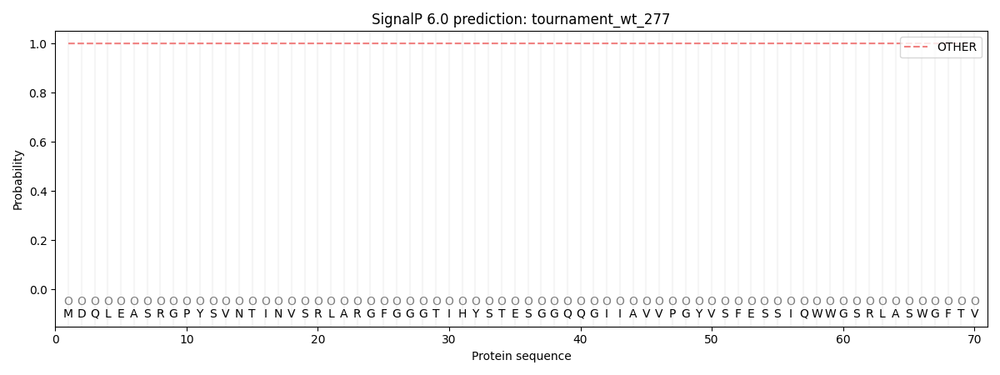 

 ***

#### tournament_wt_278

**Prediction:** Other

| Protein type   |   Other |   Signal Peptide (Sec/SPI) |   Lipoprotein signal peptide (Sec/SPII) |   TAT signal peptide (Tat/SPI) |   TAT Lipoprotein signal peptide (Tat/SPII) |   Pilin-like signal peptide (Sec/SPIII) |
|----------------|---------|----------------------------|-----------------------------------------|--------------------------------|---------------------------------------------|-----------------------------------------|
| Likelihood     |  0.9852 |                     0.0148 |                                       0 |                              0 |                                           0 |                                       0 |
**Download: ** [PNG](output_tournament_wt_278_plot.png) / [EPS](output_tournament_wt_278_plot.eps) /  [Tabular](output_tournament_wt_278_plot.txt)

 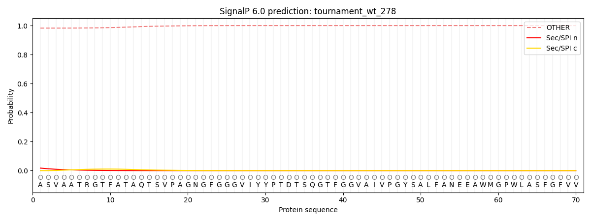 

 ***

#### tournament_wt_279

**Prediction:** Other

| Protein type   |   Other |   Signal Peptide (Sec/SPI) |   Lipoprotein signal peptide (Sec/SPII) |   TAT signal peptide (Tat/SPI) |   TAT Lipoprotein signal peptide (Tat/SPII) |   Pilin-like signal peptide (Sec/SPIII) |
|----------------|---------|----------------------------|-----------------------------------------|--------------------------------|---------------------------------------------|-----------------------------------------|
| Likelihood     |  0.9539 |                     0.0451 |                                  0.0008 |                         0.0001 |                                      0.0001 |                                  0.0001 |
**Download: ** [PNG](output_tournament_wt_279_plot.png) / [EPS](output_tournament_wt_279_plot.eps) /  [Tabular](output_tournament_wt_279_plot.txt)

  

 ***

#### tournament_wt_280

**Prediction:** Other

| Protein type   |   Other |   Signal Peptide (Sec/SPI) |   Lipoprotein signal peptide (Sec/SPII) |   TAT signal peptide (Tat/SPI) |   TAT Lipoprotein signal peptide (Tat/SPII) |   Pilin-like signal peptide (Sec/SPIII) |
|----------------|---------|----------------------------|-----------------------------------------|--------------------------------|---------------------------------------------|-----------------------------------------|
| Likelihood     |  0.9923 |                     0.0075 |                                  0.0002 |                              0 |                                           0 |                                       0 |
**Download: ** [PNG](output_tournament_wt_280_plot.png) / [EPS](output_tournament_wt_280_plot.eps) /  [Tabular](output_tournament_wt_280_plot.txt)

  

 ***

#### tournament_wt_281

**Prediction:** Other

| Protein type   |   Other |   Signal Peptide (Sec/SPI) |   Lipoprotein signal peptide (Sec/SPII) |   TAT signal peptide (Tat/SPI) |   TAT Lipoprotein signal peptide (Tat/SPII) |   Pilin-like signal peptide (Sec/SPIII) |
|----------------|---------|----------------------------|-----------------------------------------|--------------------------------|---------------------------------------------|-----------------------------------------|
| Likelihood     |  0.9998 |                     0.0002 |                                       0 |                              0 |                                           0 |                                       0 |
**Download: ** [PNG](output_tournament_wt_281_plot.png) / [EPS](output_tournament_wt_281_plot.eps) /  [Tabular](output_tournament_wt_281_plot.txt)

  

 ***

#### tournament_wt_282

**Prediction:** Other

| Protein type   |   Other |   Signal Peptide (Sec/SPI) |   Lipoprotein signal peptide (Sec/SPII) |   TAT signal peptide (Tat/SPI) |   TAT Lipoprotein signal peptide (Tat/SPII) |   Pilin-like signal peptide (Sec/SPIII) |
|----------------|---------|----------------------------|-----------------------------------------|--------------------------------|---------------------------------------------|-----------------------------------------|
| Likelihood     |  0.9976 |                     0.0024 |                                       0 |                              0 |                                           0 |                                       0 |
**Download: ** [PNG](output_tournament_wt_282_plot.png) / [EPS](output_tournament_wt_282_plot.eps) /  [Tabular](output_tournament_wt_282_plot.txt)

  

 ***

#### tournament_wt_283

**Prediction:** Other

| Protein type   |   Other |   Signal Peptide (Sec/SPI) |   Lipoprotein signal peptide (Sec/SPII) |   TAT signal peptide (Tat/SPI) |   TAT Lipoprotein signal peptide (Tat/SPII) |   Pilin-like signal peptide (Sec/SPIII) |
|----------------|---------|----------------------------|-----------------------------------------|--------------------------------|---------------------------------------------|-----------------------------------------|
| Likelihood     |  0.9981 |                     0.0018 |                                  0.0001 |                              0 |                                           0 |                                       0 |
**Download: ** [PNG](output_tournament_wt_283_plot.png) / [EPS](output_tournament_wt_283_plot.eps) /  [Tabular](output_tournament_wt_283_plot.txt)

  

 ***

#### tournament_wt_284

**Prediction:** Other

| Protein type   |   Other |   Signal Peptide (Sec/SPI) |   Lipoprotein signal peptide (Sec/SPII) |   TAT signal peptide (Tat/SPI) |   TAT Lipoprotein signal peptide (Tat/SPII) |   Pilin-like signal peptide (Sec/SPIII) |
|----------------|---------|----------------------------|-----------------------------------------|--------------------------------|---------------------------------------------|-----------------------------------------|
| Likelihood     |  0.9999 |                     0.0001 |                                       0 |                              0 |                                           0 |                                       0 |
**Download: ** [PNG](output_tournament_wt_284_plot.png) / [EPS](output_tournament_wt_284_plot.eps) /  [Tabular](output_tournament_wt_284_plot.txt)

  

 ***

#### tournament_wt_285

**Prediction:** Other

| Protein type   |   Other |   Signal Peptide (Sec/SPI) |   Lipoprotein signal peptide (Sec/SPII) |   TAT signal peptide (Tat/SPI) |   TAT Lipoprotein signal peptide (Tat/SPII) |   Pilin-like signal peptide (Sec/SPIII) |
|----------------|---------|----------------------------|-----------------------------------------|--------------------------------|---------------------------------------------|-----------------------------------------|
| Likelihood     |  0.9825 |                      0.017 |                                  0.0003 |                         0.0001 |                                           0 |                                  0.0001 |
**Download: ** [PNG](output_tournament_wt_285_plot.png) / [EPS](output_tournament_wt_285_plot.eps) /  [Tabular](output_tournament_wt_285_plot.txt)

  

 ***

#### tournament_wt_286

**Prediction:** Other

| Protein type   |   Other |   Signal Peptide (Sec/SPI) |   Lipoprotein signal peptide (Sec/SPII) |   TAT signal peptide (Tat/SPI) |   TAT Lipoprotein signal peptide (Tat/SPII) |   Pilin-like signal peptide (Sec/SPIII) |
|----------------|---------|----------------------------|-----------------------------------------|--------------------------------|---------------------------------------------|-----------------------------------------|
| Likelihood     |  0.9863 |                     0.0131 |                                  0.0003 |                         0.0001 |                                           0 |                                  0.0001 |
**Download: ** [PNG](output_tournament_wt_286_plot.png) / [EPS](output_tournament_wt_286_plot.eps) /  [Tabular](output_tournament_wt_286_plot.txt)

 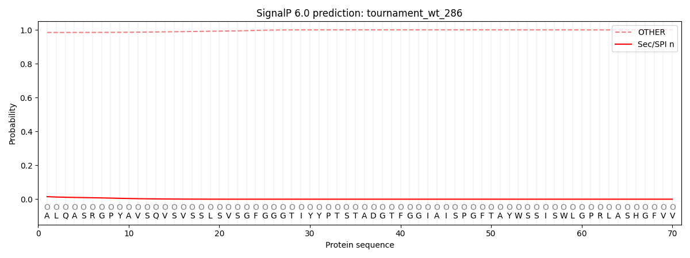 

 ***

#### tournament_wt_287

**Prediction:** Other

| Protein type   |   Other |   Signal Peptide (Sec/SPI) |   Lipoprotein signal peptide (Sec/SPII) |   TAT signal peptide (Tat/SPI) |   TAT Lipoprotein signal peptide (Tat/SPII) |   Pilin-like signal peptide (Sec/SPIII) |
|----------------|---------|----------------------------|-----------------------------------------|--------------------------------|---------------------------------------------|-----------------------------------------|
| Likelihood     |  0.9914 |                     0.0083 |                                  0.0002 |                              0 |                                           0 |                                  0.0001 |
**Download: ** [PNG](output_tournament_wt_287_plot.png) / [EPS](output_tournament_wt_287_plot.eps) /  [Tabular](output_tournament_wt_287_plot.txt)

 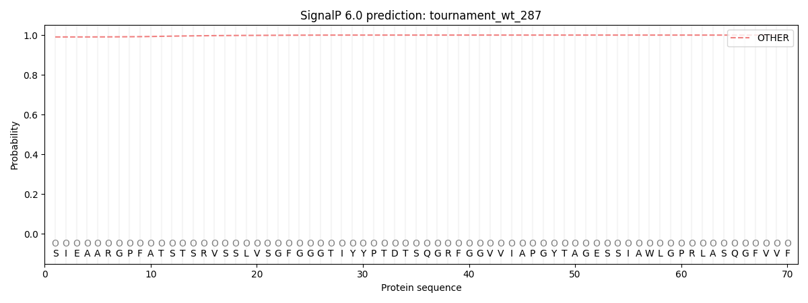 

 ***

#### tournament_wt_288

**Prediction:** Other

| Protein type   |   Other |   Signal Peptide (Sec/SPI) |   Lipoprotein signal peptide (Sec/SPII) |   TAT signal peptide (Tat/SPI) |   TAT Lipoprotein signal peptide (Tat/SPII) |   Pilin-like signal peptide (Sec/SPIII) |
|----------------|---------|----------------------------|-----------------------------------------|--------------------------------|---------------------------------------------|-----------------------------------------|
| Likelihood     |       1 |                     0.0001 |                                       0 |                              0 |                                           0 |                                       0 |
**Download: ** [PNG](output_tournament_wt_288_plot.png) / [EPS](output_tournament_wt_288_plot.eps) /  [Tabular](output_tournament_wt_288_plot.txt)

  

 ***

#### tournament_wt_289

**Prediction:** Other

| Protein type   |   Other |   Signal Peptide (Sec/SPI) |   Lipoprotein signal peptide (Sec/SPII) |   TAT signal peptide (Tat/SPI) |   TAT Lipoprotein signal peptide (Tat/SPII) |   Pilin-like signal peptide (Sec/SPIII) |
|----------------|---------|----------------------------|-----------------------------------------|--------------------------------|---------------------------------------------|-----------------------------------------|
| Likelihood     |  0.9924 |                     0.0074 |                                  0.0001 |                              0 |                                           0 |                                       0 |
**Download: ** [PNG](output_tournament_wt_289_plot.png) / [EPS](output_tournament_wt_289_plot.eps) /  [Tabular](output_tournament_wt_289_plot.txt)

  

 ***

#### tournament_wt_290

**Prediction:** Other

| Protein type   |   Other |   Signal Peptide (Sec/SPI) |   Lipoprotein signal peptide (Sec/SPII) |   TAT signal peptide (Tat/SPI) |   TAT Lipoprotein signal peptide (Tat/SPII) |   Pilin-like signal peptide (Sec/SPIII) |
|----------------|---------|----------------------------|-----------------------------------------|--------------------------------|---------------------------------------------|-----------------------------------------|
| Likelihood     |  0.9992 |                     0.0008 |                                       0 |                              0 |                                           0 |                                       0 |
**Download: ** [PNG](output_tournament_wt_290_plot.png) / [EPS](output_tournament_wt_290_plot.eps) /  [Tabular](output_tournament_wt_290_plot.txt)

  

 ***

#### tournament_wt_291

**Prediction:** Other

| Protein type   |   Other |   Signal Peptide (Sec/SPI) |   Lipoprotein signal peptide (Sec/SPII) |   TAT signal peptide (Tat/SPI) |   TAT Lipoprotein signal peptide (Tat/SPII) |   Pilin-like signal peptide (Sec/SPIII) |
|----------------|---------|----------------------------|-----------------------------------------|--------------------------------|---------------------------------------------|-----------------------------------------|
| Likelihood     |  0.9994 |                     0.0007 |                                       0 |                              0 |                                           0 |                                       0 |
**Download: ** [PNG](output_tournament_wt_291_plot.png) / [EPS](output_tournament_wt_291_plot.eps) /  [Tabular](output_tournament_wt_291_plot.txt)

  

 ***

#### tournament_wt_292

**Prediction:** Other

| Protein type   |   Other |   Signal Peptide (Sec/SPI) |   Lipoprotein signal peptide (Sec/SPII) |   TAT signal peptide (Tat/SPI) |   TAT Lipoprotein signal peptide (Tat/SPII) |   Pilin-like signal peptide (Sec/SPIII) |
|----------------|---------|----------------------------|-----------------------------------------|--------------------------------|---------------------------------------------|-----------------------------------------|
| Likelihood     |       1 |                          0 |                                       0 |                              0 |                                           0 |                                       0 |
**Download: ** [PNG](output_tournament_wt_292_plot.png) / [EPS](output_tournament_wt_292_plot.eps) /  [Tabular](output_tournament_wt_292_plot.txt)

 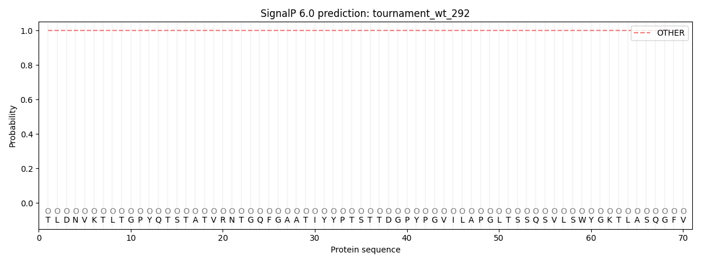 

 ***

#### tournament_wt_293

**Prediction:** Other

| Protein type   |   Other |   Signal Peptide (Sec/SPI) |   Lipoprotein signal peptide (Sec/SPII) |   TAT signal peptide (Tat/SPI) |   TAT Lipoprotein signal peptide (Tat/SPII) |   Pilin-like signal peptide (Sec/SPIII) |
|----------------|---------|----------------------------|-----------------------------------------|--------------------------------|---------------------------------------------|-----------------------------------------|
| Likelihood     |       1 |                          0 |                                       0 |                              0 |                                           0 |                                       0 |
**Download: ** [PNG](output_tournament_wt_293_plot.png) / [EPS](output_tournament_wt_293_plot.eps) /  [Tabular](output_tournament_wt_293_plot.txt)

  

 ***

#### tournament_wt_294

**Prediction:** Other

| Protein type   |   Other |   Signal Peptide (Sec/SPI) |   Lipoprotein signal peptide (Sec/SPII) |   TAT signal peptide (Tat/SPI) |   TAT Lipoprotein signal peptide (Tat/SPII) |   Pilin-like signal peptide (Sec/SPIII) |
|----------------|---------|----------------------------|-----------------------------------------|--------------------------------|---------------------------------------------|-----------------------------------------|
| Likelihood     |  1.0001 |                          0 |                                       0 |                              0 |                                           0 |                                       0 |
**Download: ** [PNG](output_tournament_wt_294_plot.png) / [EPS](output_tournament_wt_294_plot.eps) /  [Tabular](output_tournament_wt_294_plot.txt)

  

 ***

#### tournament_wt_295

**Prediction:** Other

| Protein type   |   Other |   Signal Peptide (Sec/SPI) |   Lipoprotein signal peptide (Sec/SPII) |   TAT signal peptide (Tat/SPI) |   TAT Lipoprotein signal peptide (Tat/SPII) |   Pilin-like signal peptide (Sec/SPIII) |
|----------------|---------|----------------------------|-----------------------------------------|--------------------------------|---------------------------------------------|-----------------------------------------|
| Likelihood     |  0.9997 |                     0.0003 |                                       0 |                              0 |                                           0 |                                       0 |
**Download: ** [PNG](output_tournament_wt_295_plot.png) / [EPS](output_tournament_wt_295_plot.eps) /  [Tabular](output_tournament_wt_295_plot.txt)

  

 ***

#### tournament_wt_296

**Prediction:** Other

| Protein type   |   Other |   Signal Peptide (Sec/SPI) |   Lipoprotein signal peptide (Sec/SPII) |   TAT signal peptide (Tat/SPI) |   TAT Lipoprotein signal peptide (Tat/SPII) |   Pilin-like signal peptide (Sec/SPIII) |
|----------------|---------|----------------------------|-----------------------------------------|--------------------------------|---------------------------------------------|-----------------------------------------|
| Likelihood     |  0.9998 |                     0.0002 |                                       0 |                              0 |                                           0 |                                       0 |
**Download: ** [PNG](output_tournament_wt_296_plot.png) / [EPS](output_tournament_wt_296_plot.eps) /  [Tabular](output_tournament_wt_296_plot.txt)

  

 ***

#### tournament_wt_297

**Prediction:** Other

| Protein type   |   Other |   Signal Peptide (Sec/SPI) |   Lipoprotein signal peptide (Sec/SPII) |   TAT signal peptide (Tat/SPI) |   TAT Lipoprotein signal peptide (Tat/SPII) |   Pilin-like signal peptide (Sec/SPIII) |
|----------------|---------|----------------------------|-----------------------------------------|--------------------------------|---------------------------------------------|-----------------------------------------|
| Likelihood     |   0.989 |                     0.0103 |                                  0.0004 |                         0.0001 |                                           0 |                                  0.0001 |
**Download: ** [PNG](output_tournament_wt_297_plot.png) / [EPS](output_tournament_wt_297_plot.eps) /  [Tabular](output_tournament_wt_297_plot.txt)

  

 ***

#### tournament_wt_298

**Prediction:** Other

| Protein type   |   Other |   Signal Peptide (Sec/SPI) |   Lipoprotein signal peptide (Sec/SPII) |   TAT signal peptide (Tat/SPI) |   TAT Lipoprotein signal peptide (Tat/SPII) |   Pilin-like signal peptide (Sec/SPIII) |
|----------------|---------|----------------------------|-----------------------------------------|--------------------------------|---------------------------------------------|-----------------------------------------|
| Likelihood     |  0.9957 |                     0.0041 |                                  0.0002 |                              0 |                                           0 |                                       0 |
**Download: ** [PNG](output_tournament_wt_298_plot.png) / [EPS](output_tournament_wt_298_plot.eps) /  [Tabular](output_tournament_wt_298_plot.txt)

 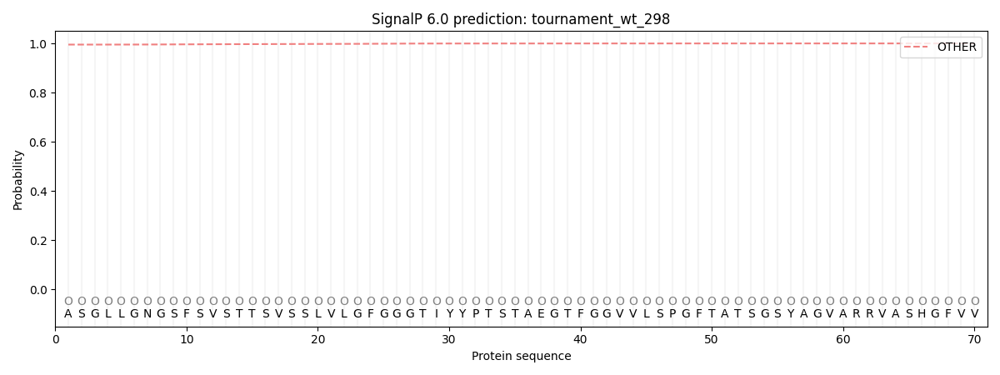 

 ***

#### tournament_wt_299

**Prediction:** Other

| Protein type   |   Other |   Signal Peptide (Sec/SPI) |   Lipoprotein signal peptide (Sec/SPII) |   TAT signal peptide (Tat/SPI) |   TAT Lipoprotein signal peptide (Tat/SPII) |   Pilin-like signal peptide (Sec/SPIII) |
|----------------|---------|----------------------------|-----------------------------------------|--------------------------------|---------------------------------------------|-----------------------------------------|
| Likelihood     |  1.0001 |                          0 |                                       0 |                              0 |                                           0 |                                       0 |
**Download: ** [PNG](output_tournament_wt_299_plot.png) / [EPS](output_tournament_wt_299_plot.eps) /  [Tabular](output_tournament_wt_299_plot.txt)

  

 ***

#### tournament_wt_300

**Prediction:** Other

| Protein type   |   Other |   Signal Peptide (Sec/SPI) |   Lipoprotein signal peptide (Sec/SPII) |   TAT signal peptide (Tat/SPI) |   TAT Lipoprotein signal peptide (Tat/SPII) |   Pilin-like signal peptide (Sec/SPIII) |
|----------------|---------|----------------------------|-----------------------------------------|--------------------------------|---------------------------------------------|-----------------------------------------|
| Likelihood     |  0.9971 |                     0.0029 |                                       0 |                              0 |                                           0 |                                       0 |
**Download: ** [PNG](output_tournament_wt_300_plot.png) / [EPS](output_tournament_wt_300_plot.eps) /  [Tabular](output_tournament_wt_300_plot.txt)

  

 ***

#### tournament_wt_301

**Prediction:** Other

| Protein type   |   Other |   Signal Peptide (Sec/SPI) |   Lipoprotein signal peptide (Sec/SPII) |   TAT signal peptide (Tat/SPI) |   TAT Lipoprotein signal peptide (Tat/SPII) |   Pilin-like signal peptide (Sec/SPIII) |
|----------------|---------|----------------------------|-----------------------------------------|--------------------------------|---------------------------------------------|-----------------------------------------|
| Likelihood     |  0.9965 |                     0.0034 |                                       0 |                              0 |                                           0 |                                       0 |
**Download: ** [PNG](output_tournament_wt_301_plot.png) / [EPS](output_tournament_wt_301_plot.eps) /  [Tabular](output_tournament_wt_301_plot.txt)

  

 ***

#### tournament_wt_302

**Prediction:** Other

| Protein type   |   Other |   Signal Peptide (Sec/SPI) |   Lipoprotein signal peptide (Sec/SPII) |   TAT signal peptide (Tat/SPI) |   TAT Lipoprotein signal peptide (Tat/SPII) |   Pilin-like signal peptide (Sec/SPIII) |
|----------------|---------|----------------------------|-----------------------------------------|--------------------------------|---------------------------------------------|-----------------------------------------|
| Likelihood     |  0.9986 |                     0.0014 |                                       0 |                              0 |                                           0 |                                       0 |
**Download: ** [PNG](output_tournament_wt_302_plot.png) / [EPS](output_tournament_wt_302_plot.eps) /  [Tabular](output_tournament_wt_302_plot.txt)

  

 ***

#### tournament_wt_303

**Prediction:** Other

| Protein type   |   Other |   Signal Peptide (Sec/SPI) |   Lipoprotein signal peptide (Sec/SPII) |   TAT signal peptide (Tat/SPI) |   TAT Lipoprotein signal peptide (Tat/SPII) |   Pilin-like signal peptide (Sec/SPIII) |
|----------------|---------|----------------------------|-----------------------------------------|--------------------------------|---------------------------------------------|-----------------------------------------|
| Likelihood     |  0.9986 |                     0.0013 |                                  0.0001 |                              0 |                                           0 |                                       0 |
**Download: ** [PNG](output_tournament_wt_303_plot.png) / [EPS](output_tournament_wt_303_plot.eps) /  [Tabular](output_tournament_wt_303_plot.txt)

  

 ***

#### tournament_wt_304

**Prediction:** Other

| Protein type   |   Other |   Signal Peptide (Sec/SPI) |   Lipoprotein signal peptide (Sec/SPII) |   TAT signal peptide (Tat/SPI) |   TAT Lipoprotein signal peptide (Tat/SPII) |   Pilin-like signal peptide (Sec/SPIII) |
|----------------|---------|----------------------------|-----------------------------------------|--------------------------------|---------------------------------------------|-----------------------------------------|
| Likelihood     |  0.9968 |                     0.0032 |                                       0 |                              0 |                                           0 |                                       0 |
**Download: ** [PNG](output_tournament_wt_304_plot.png) / [EPS](output_tournament_wt_304_plot.eps) /  [Tabular](output_tournament_wt_304_plot.txt)

  

 ***

#### tournament_wt_305

**Prediction:** Other

| Protein type   |   Other |   Signal Peptide (Sec/SPI) |   Lipoprotein signal peptide (Sec/SPII) |   TAT signal peptide (Tat/SPI) |   TAT Lipoprotein signal peptide (Tat/SPII) |   Pilin-like signal peptide (Sec/SPIII) |
|----------------|---------|----------------------------|-----------------------------------------|--------------------------------|---------------------------------------------|-----------------------------------------|
| Likelihood     |  0.7857 |                     0.2119 |                                   0.001 |                         0.0006 |                                      0.0003 |                                  0.0005 |
**Download: ** [PNG](output_tournament_wt_305_plot.png) / [EPS](output_tournament_wt_305_plot.eps) /  [Tabular](output_tournament_wt_305_plot.txt)

  

 ***

#### tournament_wt_306

**Prediction:** Other

| Protein type   |   Other |   Signal Peptide (Sec/SPI) |   Lipoprotein signal peptide (Sec/SPII) |   TAT signal peptide (Tat/SPI) |   TAT Lipoprotein signal peptide (Tat/SPII) |   Pilin-like signal peptide (Sec/SPIII) |
|----------------|---------|----------------------------|-----------------------------------------|--------------------------------|---------------------------------------------|-----------------------------------------|
| Likelihood     |  0.9988 |                     0.0011 |                                  0.0001 |                              0 |                                           0 |                                       0 |
**Download: ** [PNG](output_tournament_wt_306_plot.png) / [EPS](output_tournament_wt_306_plot.eps) /  [Tabular](output_tournament_wt_306_plot.txt)

  

 ***

#### tournament_wt_307

**Prediction:** Other

| Protein type   |   Other |   Signal Peptide (Sec/SPI) |   Lipoprotein signal peptide (Sec/SPII) |   TAT signal peptide (Tat/SPI) |   TAT Lipoprotein signal peptide (Tat/SPII) |   Pilin-like signal peptide (Sec/SPIII) |
|----------------|---------|----------------------------|-----------------------------------------|--------------------------------|---------------------------------------------|-----------------------------------------|
| Likelihood     |  0.9995 |                     0.0005 |                                       0 |                              0 |                                           0 |                                       0 |
**Download: ** [PNG](output_tournament_wt_307_plot.png) / [EPS](output_tournament_wt_307_plot.eps) /  [Tabular](output_tournament_wt_307_plot.txt)

  

 ***

#### tournament_wt_308

**Prediction:** Other

| Protein type   |   Other |   Signal Peptide (Sec/SPI) |   Lipoprotein signal peptide (Sec/SPII) |   TAT signal peptide (Tat/SPI) |   TAT Lipoprotein signal peptide (Tat/SPII) |   Pilin-like signal peptide (Sec/SPIII) |
|----------------|---------|----------------------------|-----------------------------------------|--------------------------------|---------------------------------------------|-----------------------------------------|
| Likelihood     |       1 |                          0 |                                       0 |                              0 |                                           0 |                                       0 |
**Download: ** [PNG](output_tournament_wt_308_plot.png) / [EPS](output_tournament_wt_308_plot.eps) /  [Tabular](output_tournament_wt_308_plot.txt)

 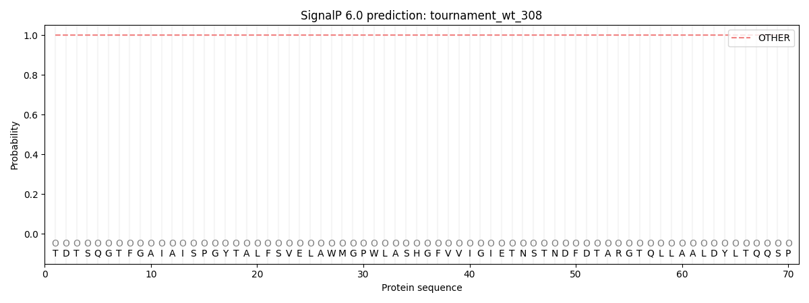 

 ***

#### tournament_wt_309

**Prediction:** Other

| Protein type   |   Other |   Signal Peptide (Sec/SPI) |   Lipoprotein signal peptide (Sec/SPII) |   TAT signal peptide (Tat/SPI) |   TAT Lipoprotein signal peptide (Tat/SPII) |   Pilin-like signal peptide (Sec/SPIII) |
|----------------|---------|----------------------------|-----------------------------------------|--------------------------------|---------------------------------------------|-----------------------------------------|
| Likelihood     |  0.9995 |                     0.0005 |                                       0 |                              0 |                                           0 |                                       0 |
**Download: ** [PNG](output_tournament_wt_309_plot.png) / [EPS](output_tournament_wt_309_plot.eps) /  [Tabular](output_tournament_wt_309_plot.txt)

  

 ***

#### tournament_wt_310

**Prediction:** Other

| Protein type   |   Other |   Signal Peptide (Sec/SPI) |   Lipoprotein signal peptide (Sec/SPII) |   TAT signal peptide (Tat/SPI) |   TAT Lipoprotein signal peptide (Tat/SPII) |   Pilin-like signal peptide (Sec/SPIII) |
|----------------|---------|----------------------------|-----------------------------------------|--------------------------------|---------------------------------------------|-----------------------------------------|
| Likelihood     |  0.9994 |                     0.0006 |                                       0 |                              0 |                                           0 |                                       0 |
**Download: ** [PNG](output_tournament_wt_310_plot.png) / [EPS](output_tournament_wt_310_plot.eps) /  [Tabular](output_tournament_wt_310_plot.txt)

  

 ***

#### tournament_wt_311

**Prediction:** Other

| Protein type   |   Other |   Signal Peptide (Sec/SPI) |   Lipoprotein signal peptide (Sec/SPII) |   TAT signal peptide (Tat/SPI) |   TAT Lipoprotein signal peptide (Tat/SPII) |   Pilin-like signal peptide (Sec/SPIII) |
|----------------|---------|----------------------------|-----------------------------------------|--------------------------------|---------------------------------------------|-----------------------------------------|
| Likelihood     |       1 |                          0 |                                       0 |                              0 |                                           0 |                                       0 |
**Download: ** [PNG](output_tournament_wt_311_plot.png) / [EPS](output_tournament_wt_311_plot.eps) /  [Tabular](output_tournament_wt_311_plot.txt)

 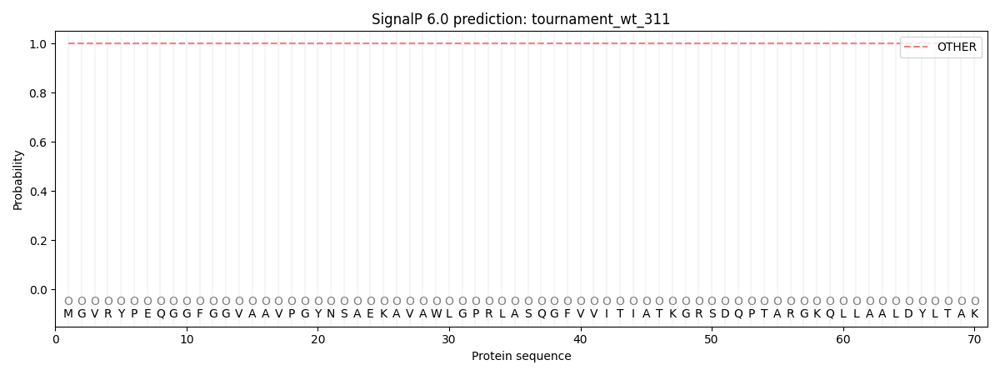 

 ***

#### tournament_wt_312

**Prediction:** Other

| Protein type   |   Other |   Signal Peptide (Sec/SPI) |   Lipoprotein signal peptide (Sec/SPII) |   TAT signal peptide (Tat/SPI) |   TAT Lipoprotein signal peptide (Tat/SPII) |   Pilin-like signal peptide (Sec/SPIII) |
|----------------|---------|----------------------------|-----------------------------------------|--------------------------------|---------------------------------------------|-----------------------------------------|
| Likelihood     |  0.9873 |                     0.0126 |                                  0.0001 |                              0 |                                           0 |                                       0 |
**Download: ** [PNG](output_tournament_wt_312_plot.png) / [EPS](output_tournament_wt_312_plot.eps) /  [Tabular](output_tournament_wt_312_plot.txt)

 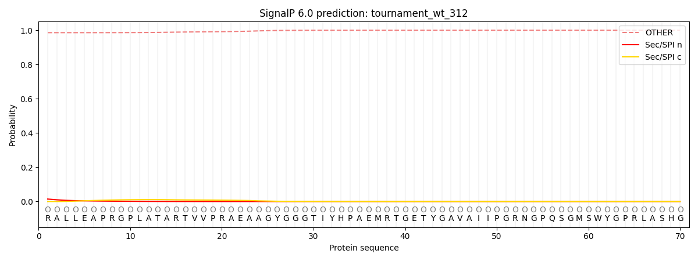 

 ***

#### tournament_wt_313

**Prediction:** Other

| Protein type   |   Other |   Signal Peptide (Sec/SPI) |   Lipoprotein signal peptide (Sec/SPII) |   TAT signal peptide (Tat/SPI) |   TAT Lipoprotein signal peptide (Tat/SPII) |   Pilin-like signal peptide (Sec/SPIII) |
|----------------|---------|----------------------------|-----------------------------------------|--------------------------------|---------------------------------------------|-----------------------------------------|
| Likelihood     |  0.9991 |                      0.001 |                                       0 |                              0 |                                           0 |                                       0 |
**Download: ** [PNG](output_tournament_wt_313_plot.png) / [EPS](output_tournament_wt_313_plot.eps) /  [Tabular](output_tournament_wt_313_plot.txt)

  

 ***

